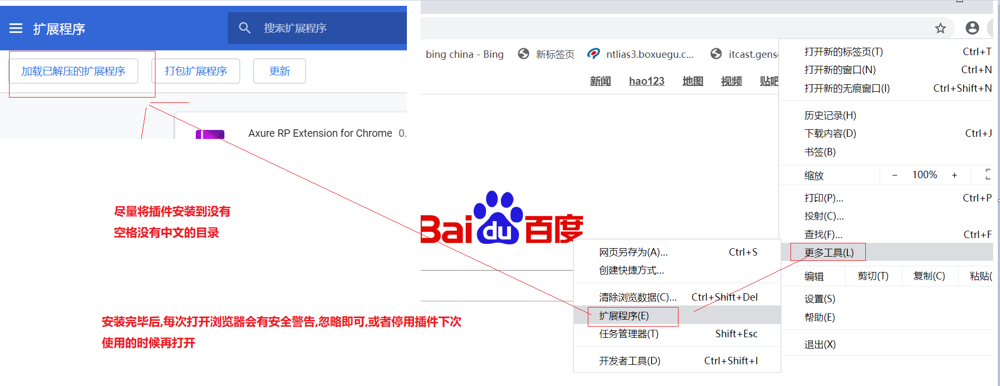

# 1. 插件安装

## 1.1  Chrome 插件安装

​	插件作用: 

​			能用 Chrome 浏览器打开 项目资源

```
day01\素材\需求设计\03-静态页面\index.html
注: 不安装该插件也可以需要使用 火狐浏览打开
```

​		

## 1.2)IE 浏览器插件安装

双击安装 附件中的IE插件

```
能使用IE 打开 day01\素材\需求设计\01-需求\流程图
右键打开方式选择IE 即可
```

# 2 项目介绍-按时间线介绍

## 2.1 IT公司那些事

```
1) 老板开公司干嘛的? 做慈善的?
	挣钱!挣钱!挣钱!,<<资本论>> 告诉我们 资本家以利益为第一原则
2) 我们未来入职的都是科技公司,科技公司的老板怎么挣钱? 
	做产品,做项目
3) 做什么项目/产品才能挣到钱?
	  游戏? 做购物网站买东西? 社交网站? 新闻网站? 搜索引擎? 
		这些东西固然可以挣到足够的money,但是几乎被BAT  (百度阿里腾旭)等大企业垄断,
4) 一般的企业怎么挣钱生活的?
	答案: "私人定制"
	
	比如我是银行,我要做一个客服系统,我自己没有专业的团队做,怎么办? 招标让别人帮我做,这里就是俗称的"外包" ,实际上每家银行/保险/证券,每家医院,每个地方政府/几乎每个机构都有这样的系统
	比如我是医院,我要做一个患者信息收集系统怎么办,每个医院都又自己独立的系统,每个医院都需要投标找外包团队开发项目
	这里就催生了很庞大的程序员军团服务于各个行业. 这类公司也许是大家未来大部分人要应聘的的公司类型
    这种私人定制的系统我们叫做  "项目" (狭隘上的)

5) 一类特殊的公司,
	以医院挂号系统为例,其实你会发现大多数医院的系统功能是相似的,医院如果私人定制一个挂号系统可能需要50万(不含设备费用)
	于是有一类商人看到了商机,既然这么多医院都需要挂号系统而且每家公司都很相似,我们不能提前开发好一个项目,功能包含市场上所有的挂号相关的业务,然后聘请一批销售人员上门销售,一个医院卖20万,UI 稍改一下即可,功能如果不够我单独找个程序员升级开发几天就满足要求了. 实际上这样医院省钱了,公多卖几家也能挣到签了,这就是双赢
	这个提前开发好的项目,我们就可以叫做"产品"  
```

## 2.2 传智健康项目的由来及说明

```
传智健康项目我们模拟了 上述问题中的 "私人定制业务"
某家体检中心需要开发一个项目,而我们的团队再我们开发之前已经和医院进行了一些接触.并留下了"丰富的文档"
(大多数对开发人员来讲可以看作瞎逼逼)
```

## 2.3 前期沟通留下的文档 

文档目录

```
\day01\素材\文档
```

### 2.3.1 前期沟通阶段

​	我方经过和医院领导的一些沟通,领导觉得我们公司还不错,很大意愿将此次项目交给我方开发,我方领导积极响应

注: 此时我们要知道,医院领导不知道未来系统长什么样子,他们智慧看病,不会想想系统长什么样需要我i们帮他们设计,帮他们想系统做成什么样,然后把样例拿给他们,问他们合适不,不合适再改)

 ```
1) 公司有精通医院行业的相关人员,分析现在市场上现在都有那些机构有体检系统他们有什么相似性,有什么差异
   于是留下了一些文档
   	1.1) <<功能对比.xlsx >>   这个是销售或者公司懂医院相关人员整理的比对各家公司的系统差异文档
   	1.2) <<功能列表.xlsx/医疗健康功能列表.doc >>分别是excl 和word 版本 ,用来说名我们未来做的系统包含那些功能(期间销售人员已经和医院领导做过沟通,那些功能要,那些不要)
   		随着微信的普及,预约挂号,医院领导希望我们开发微信版本的挂号功能,所以我们的功能中包含微信
   	1.3) <<xmind>>  这个是xmind 版本的系统功能说明
 ```

### 2.3.2  沟通第二阶段,留下良好印象

```
在开始做系统之前我们派遣专业的人员和医生沟通,现场看着医院的医生怎么给客户体检,甚至亲身体验体检过程
一方面体现了我们的专业,给医院领导留下了非常好的印象,另一方面也是为了调研,留下了非常宝贵的资源 

1) <<流程图>>  这个写文档是用专业的软件VISO 绘制的,描述了体检各个业务的流程图
2) <<体检机构专业词汇及知识>> 这里面有些词汇是最新收集的 有些是既往项目积累的
```

### 2.3.3 PPT 宣讲,签订意向合同

  ```
期间销售人员和医院相关领导们开过一次会议,我们的销售人员向医院领导用PPT 阐述了我们系统的特点,未来的一些功能等,(说白了就是 胡侃,反正后边都是程序员开发,他心里想的是我们和孙悟空一样都是猿类,上天入地无所不能)
过了一段时间,双方领导觉得上次开会非常满意,和我方签订了 正式的合作合同,并预付了30% 的款项给我们
  ```

2.3.4 签订完合同后,公司让项目经理等相关人员整理除了如下文档

```
1)<<传智医疗MRD v0.1.doc>> 
	为了应付客户,相关的各个领导我们整理出来了 市场需求文档，简称为MRD。（英文全称Market Requirement Document，MRD）。该文档在产品项目过程中属于“过程性”文档。是市场部门的产品经理或者(市场经理)编写的一个产品的说明需求的文档。
    在本项目中主要的作用是为了给领导看,证明我们做的项目完全能够满足市场要求,且在一定时间内不会落后于同类产品,无需担心今天开发完毕明天要再掏钱升级
2)<<  传智健康PRD文档.docx>> 
	为了满足开发要求 项目经理牵头撰写了 产品需求文档(Product Requirement Document，PRD)的英文简称。是将市场需求文档（MRD）用更加专业的语言进行描述。
   这个文档详细说明了每个功能应该包含那些内容,页面效果,精确到点击某个按钮,成功怎样,失败怎样,数据怎样在满足要求,怎样不满足要求..等等.... 越详细越好
   
3) <<健康管理产品计划_V1.1.xlsx>>
	为了按时完成项目,项目经理编写了开发计划书
```

## 2.4  项目组已经完成的工作

```
1) 我们项目组的美工已经设计出来了项目的效果图 jpg 格式  (详见第四阶段文档--设计初稿及版本\02_美工设计)
2) 我们的前端开发人员已经设计出来了我们项目的效果图  (详见健管系统后台-效果图)
3) 我们的 前端开发人已经完成了微信端静态页面的页面,等待服务器开发完成之后编写动态效果
4) 我们的 前端开发人刚完成了主页面静态页面的实现,工作尚未完成
```

## 2.5  恭喜你,你被录用了,来开发我们的项目吧

```
公司提供良好的晋升机制,广阔的发展空间,你看我来公司不到三年都已经是项目经理了只要你有能力有担当,一定给你涨工资涨职级
(BB 几句: 画大屏谁不会啊,项目经理,呵呵,大概是因为比你资历老的都离职了吧)
```

## 2.6)我们的前端离职了

```
前端开发人员因为个人原因离职了,项目经理告诉你因为你层用过vue 开发,所以需要你"但此大任",等这个项目完成给你丰厚的奖金(不会告诉你金额的,知识鼓励的话不要当真)
你果断答应了(心里在想,面试时说好的有能力有担当啊!不能怂!)
(实际上:项目组要招聘一个合适的前端人员工资可能是你的两倍,公司为了节约成本,需要你"勇于担当",你当然不能离职,必须面对,市场就这样,爷都是从孙子熬出来的)
```

## 2.7 课前说明

```
接下来我们将带着大家共同完成这个项目,加油!,不准放弃!不能放弃!
```


