##01-课程内容介绍.avi	02:39
```

小结内容: 概述当日内容
	1) 项目介绍
	2) 环境搭建
新知识:
	1)PowerDesigner 
	2)ElementUI  --(是一套基于VUE2.0的桌面端组件库)
```
##02-项目概述（项目介绍）.avi	04:28
```
小结内容:
	1) 本项目是给体检机构使用的系统
	2) RPD 文档有详细说明
```
##03-项目概述（原型展示）.avi	06:11
```
小结内容:
	1) 原型展示
	2) 4_1工作台是项目入口
	备注: index.html 虽然是入口但是包含整个项目的文档说明(干扰效果展示)
```
##04-项目概述（技术架构）.avi	03:36
```
小结内容:(写简历用)
	1)html,bootstrap,elementUI,vue,freemaker
	2)zookeeper,dubbo ,ssm,spring-security(权限控制框架)
	3)git,poi,Echarts,pdf
	4)mysql,redis
	5)阿里短信,七牛云,微信公共平台
```
##05-项目概述（功能架构）.avi	02:05
```
小结内容:
	项目使用dubbo 框架面向服务编程架构(SOA),前端分pc 端和微信公众号功能页面开发
	项目中共抽取如下服务:
		会员服务: 管理用户信息
		预约服务: 体检预约
		体检报告服务: 体检报告查看(在线预览.打印等服务)
		健康评估服务: 根据用户的日常行为习惯
		健康干预服务: 根据用户的当前身体状况各项指标给予 适当的生活或者医疗建议
```
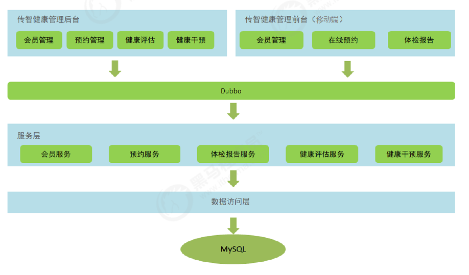

附件:

```
江油市精神病医院 健康干预工作流程
 1建立健康档案：
	医师根据所获取的数据建立详实的职工健康档案，以供评估和干预、跟踪服务。
2健康评估：
	对顾客目前的健康状况、影响健康的因素以及未来几年内可能会得某种疾病作出判断，并进行预警。
3健康方案：
	根据对职工的健康所进行的评估报告提供系列个性化健康管理方案，
	1）《营养改善方案》其中包括餐谱配制及营养补充等；
	2）《运动健身方案》其中包括日常运作方案和专门针对某疾病的专项健身方案；
	3）《环境改善方案》包括住家环境的改善，和相关材料的应用指导；
	4）《心理调节方案》
	5）《日常食疗方案》等等。
4评估及干预：
	定期对健康改善方案应用于顾客的实施效果进行评估和干预，并根据职工的个体实际情况不断的进行健康改善方案的优化和调整，最终达到以最小的投资、最少的时间使职工的健康达到最佳状态，从而使职工在工作中更具有竞争力，在生活中更加快乐地享受人生。
```


##06-项目概述（软件开发流程）.avi	04:23

```

小结内容: 概述了软件的基本开发流程(瀑布模型)
   1) 可行性研究
   2) 需求分析
   3) 设计
   4) 编码
   5) 测试
   6) 运行维护
其实并不是说上面的流程一旦结束永远结束了,当上线运行后 如果有bug,需要修复,测试上线再来一遍
```
补: 后续运维上线后迭代升级需求开发流程

```
1) 业务人员写需求 word
2) 分许需求
	1) word 写的内容
	2) 沟通  文档中是不是他的真实想法
	3) 分析现有代码长什么样,现在的功能是什么
3) 设计
	考虑程序的可扩展性,性能
=============	
4) 开发
===============
5) 开发测试   测报测试
6) 集成测试   (修改bug)
7) 业务人员 测试  (修改bug)
8) 上线
		检查代码
9) 处理bug
```

```
1)  写文档需求 (客户)
---------------------------
2)  分析需求
	1)能不能做
	2)设计
		1)现在有没有相似的,现在长什么样
		2)表.代码(可扩展性)
	3) 沟通
3)写代码
4)自己测试(报告)
5)测试组测试(报告)
6)上线
	bug  (修改)
----
```

##07-环境搭建（项目结构）.avi	06:42

```
小结内容:
项目代码的解构
1)health_common：
				通用模块，打包方式为jar，存放项目中使用到的一些工具类、实体类、返回结果和常量类
2)health_interface：
					打包方式为jar，存放服务接口
3)health_service_provider：Dubbo服务模块，打包方式为war，存放服务实现类、Dao接口、Mapper映射文						   件等，作为服务提供方，需要部署到tomcat运行
4)health_backend：传智健康管理后台，打包方式为war，作为Dubbo服务消费方，存放
				  Controller、HTML页面、js、css、spring配置文件等，需要部署到tomcat运行
5) health_mobile：移动端前台，打包方式为war，作为Dubbo服务消费方，存放
				  Controller、HTML页面、js、css、spring配置文件等，需要部署到tomcat运
```
```
总结:
	两个服务消费者,一个服务提供者,一个公共模块,一个公共接口
```

##08-环境搭建_maven项目搭建（health_parent）.avi	09:19

```
小结内容:
	创建health_parent，父工程，打包方式为pom，用于统一管理依赖版本
	注: 父工程的意义在于1)约束子工程的jar 版本  (dependencyManagement 只是约束,不导包)
	    			2) 可以对所有子工程进行统一编译打包
```
pom.xml

```xml
<?xml version="1.0" encoding="UTF-8"?>
<project xmlns="http://maven.apache.org/POM/4.0.0"
         xmlns:xsi="http://www.w3.org/2001/XMLSchema-instance"
         xsi:schemaLocation="http://maven.apache.org/POM/4.0.0 http://maven.apache.org/xsd/maven-4.0.0.xsd">
    <modelVersion>4.0.0</modelVersion>

    <groupId>com.itheima</groupId>
    <artifactId>health_parent</artifactId>
    <version>1.0-SNAPSHOT</version>
    <modules>
        <module>health_common</module>
        <module>health_interface</module>
        <module>health_service_provider</module>
        <module>health_backend</module>
    </modules>
    <packaging>pom</packaging>
    <!-- 集中定义依赖版本号 -->
    <properties>
        <junit.version>4.12</junit.version>
        <spring.version>5.0.5.RELEASE</spring.version>
        <pagehelper.version>4.1.4</pagehelper.version>
        <servlet-api.version>2.5</servlet-api.version>
        <dubbo.version>2.6.0</dubbo.version>
        <zookeeper.version>3.4.7</zookeeper.version>
        <zkclient.version>0.1</zkclient.version>
        <mybatis.version>3.4.5</mybatis.version>
        <mybatis.spring.version>1.3.1</mybatis.spring.version>
        <mybatis.paginator.version>1.2.15</mybatis.paginator.version>
        <mysql.version>5.1.32</mysql.version>
        <druid.version>1.0.9</druid.version>
        <commons-fileupload.version>1.3.1</commons-fileupload.version>
        <spring.security.version>5.0.5.RELEASE</spring.security.version>
        <poi.version>3.14</poi.version>
        <jedis.version>2.9.0</jedis.version>
        <quartz.version>2.2.1</quartz.version>
    </properties>
    <!-- 依赖管理标签  必须加 -->
    <dependencyManagement>
        <dependencies>
            <!-- Spring -->
            <dependency>
                <groupId>org.springframework</groupId>
                <artifactId>spring-context</artifactId>
                <version>${spring.version}</version>
            </dependency>
            <dependency>
                <groupId>org.springframework</groupId>
                <artifactId>spring-beans</artifactId>
                <version>${spring.version}</version>
            </dependency>
            <dependency>
                <groupId>org.springframework</groupId>
                <artifactId>spring-web</artifactId>
                <version>${spring.version}</version>
            </dependency>
            <dependency>
                <groupId>org.springframework</groupId>
                <artifactId>spring-webmvc</artifactId>
                <version>${spring.version}</version>
            </dependency>
            <dependency>
                <groupId>org.springframework</groupId>
                <artifactId>spring-jdbc</artifactId>
                <version>${spring.version}</version>
            </dependency>
            <dependency>
                <groupId>org.springframework</groupId>
                <artifactId>spring-aspects</artifactId>
                <version>${spring.version}</version>
            </dependency>
            <dependency>
                <groupId>org.springframework</groupId>
                <artifactId>spring-jms</artifactId>
                <version>${spring.version}</version>
            </dependency>
            <dependency>
                <groupId>org.springframework</groupId>
                <artifactId>spring-context-support</artifactId>
                <version>${spring.version}</version>
            </dependency>
            <dependency>
                <groupId>org.springframework</groupId>
                <artifactId>spring-test</artifactId>
                <version>${spring.version}</version>
            </dependency>
            <!-- dubbo相关 -->
            <dependency>
                <groupId>com.alibaba</groupId>
                <artifactId>dubbo</artifactId>
                <version>${dubbo.version}</version>
            </dependency>
            <dependency>
                <groupId>org.apache.zookeeper</groupId>
                <artifactId>zookeeper</artifactId>
                <version>${zookeeper.version}</version>
            </dependency>
            <dependency>
                <groupId>com.github.sgroschupf</groupId>
                <artifactId>zkclient</artifactId>
                <version>${zkclient.version}</version>
            </dependency>
            <dependency>
                <groupId>junit</groupId>
                <artifactId>junit</artifactId>
                <version>4.12</version>
            </dependency>
            <dependency>
                <groupId>com.alibaba</groupId>
                <artifactId>fastjson</artifactId>
                <version>1.2.47</version>
            </dependency>
            <dependency>
                <groupId>javassist</groupId>
                <artifactId>javassist</artifactId>
                <version>3.12.1.GA</version>
            </dependency>
            <dependency>
                <groupId>commons-codec</groupId>
                <artifactId>commons-codec</artifactId>
                <version>1.10</version>
            </dependency>
            <dependency>
                <groupId>com.github.pagehelper</groupId>
                <artifactId>pagehelper</artifactId>
                <version>${pagehelper.version}</version>
            </dependency>
            <!-- Mybatis -->
            <dependency>
                <groupId>org.mybatis</groupId>
                <artifactId>mybatis</artifactId>
                <version>${mybatis.version}</version>
            </dependency>
            <dependency>
                <groupId>org.mybatis</groupId>
                <artifactId>mybatis-spring</artifactId>
                <version>${mybatis.spring.version}</version>
            </dependency>
            <dependency>
                <groupId>com.github.miemiedev</groupId>
                <artifactId>mybatis-paginator</artifactId>
                <version>${mybatis.paginator.version}</version>
            </dependency>
            <!-- MySql -->
            <dependency>
                <groupId>mysql</groupId>
                <artifactId>mysql-connector-java</artifactId>
                <version>${mysql.version}</version>
            </dependency>
            <!-- 连接池 -->
            <dependency>
                <groupId>com.alibaba</groupId>
                <artifactId>druid</artifactId>
                <version>${druid.version}</version>
            </dependency>
            <!-- 文件上传组件 -->
            <dependency>
                <groupId>commons-fileupload</groupId>
                <artifactId>commons-fileupload</artifactId>
                <version>${commons-fileupload.version}</version>
            </dependency>
            <dependency>
                <groupId>org.quartz-scheduler</groupId>
                <artifactId>quartz</artifactId>
                <version>${quartz.version}</version>
            </dependency>
            <dependency>
                <groupId>org.quartz-scheduler</groupId>
                <artifactId>quartz-jobs</artifactId>
                <version>${quartz.version}</version>
            </dependency>
            <dependency>
                <groupId>com.sun.jersey</groupId>
                <artifactId>jersey-client</artifactId>
                <version>1.18.1</version>
            </dependency>
            <dependency>
                <groupId>com.qiniu</groupId>
                <artifactId>qiniu-java-sdk</artifactId>
                <version>7.2.0</version>
            </dependency>
            <!--POI报表-->
            <dependency>
                <groupId>org.apache.poi</groupId>
                <artifactId>poi</artifactId>
                <version>${poi.version}</version>
            </dependency>
            <dependency>
                <groupId>org.apache.poi</groupId>
                <artifactId>poi-ooxml</artifactId>
                <version>${poi.version}</version>
            </dependency>
            <dependency>
                <groupId>redis.clients</groupId>
                <artifactId>jedis</artifactId>
                <version>${jedis.version}</version>
            </dependency>
            <!-- 安全框架 -->
            <dependency>
                <groupId>org.springframework.security</groupId>
                <artifactId>spring-security-web</artifactId>
                <version>${spring.security.version}</version>
            </dependency>
            <dependency>
                <groupId>org.springframework.security</groupId>
                <artifactId>spring-security-config</artifactId>
                <version>${spring.security.version}</version>
            </dependency>
            <dependency>
                <groupId>org.springframework.security</groupId>
                <artifactId>spring-security-taglibs</artifactId>
                <version>${spring.security.version}</version>
            </dependency>
            <dependency>
                <groupId>com.github.penggle</groupId>
                <artifactId>kaptcha</artifactId>
                <version>2.3.2</version>
                <exclusions>
                    <exclusion>
                        <groupId>javax.servlet</groupId>
                        <artifactId>javax.servlet-api</artifactId>
                    </exclusion>
                </exclusions>
            </dependency>
            <dependency>
                <groupId>dom4j</groupId>
                <artifactId>dom4j</artifactId>
                <version>1.6.1</version>
            </dependency>
            <dependency>
                <groupId>xml-apis</groupId>
                <artifactId>xml-apis</artifactId>
                <version>1.4.01</version>
            </dependency>
        </dependencies>
    </dependencyManagement>
    <dependencies>
        <dependency>
            <groupId>javax.servlet</groupId>
            <artifactId>servlet-api</artifactId>
            <version>${servlet-api.version}</version>
            <scope>provided</scope>
        </dependency>
    </dependencies>
    <build>
        <plugins>
            <!-- java编译插件 -->
            <plugin>
                <groupId>org.apache.maven.plugins</groupId>
                <artifactId>maven-compiler-plugin</artifactId>
                <version>3.2</version>
                <configuration>
                    <source>1.8</source>
                    <target>1.8</target>
                    <encoding>UTF-8</encoding>
                </configuration>
            </plugin>
        </plugins>
    </build>
</project>
```

几个知识点：

   1.父工程的项目打包方式

```xml
<packaging>pom</packaging>
```

2. dependencyManagement标签中的坐标，只是用来锁定版本号，不会让子工程中都引入这些坐标。如果子模块需要使用，还是需要单独引入。

3. ```xml
   <dependencies>
         <dependency>
             <groupId>javax.servlet</groupId>
             <artifactId>servlet-api</artifactId>
             <version>${servlet-api.version}</version>
             <scope>provided</scope>
         </dependency>
     </dependencies>
   ```

   代表所有的子模块中都会引入servlet-api，但是由于范围是provided，所以只会在编译期使用，具体的jar包会由容器tomcat来提供。

##09-环境搭建_maven项目搭建（health_common）.avi	06:57

```
小结内容:
	1)common 主要配置公共的部分,比如发送短信工具类等,
    2)common 还有个职则是配置导入公共jar 包,其他模块直接依赖即可
```


```xml
<?xml version="1.0" encoding="UTF-8"?>
<project xmlns="http://maven.apache.org/POM/4.0.0"
         xmlns:xsi="http://www.w3.org/2001/XMLSchema-instance"
         xsi:schemaLocation="http://maven.apache.org/POM/4.0.0 http://maven.apache.org/xsd/maven-4.0.0.xsd">
    <parent>
        <artifactId>health_parent</artifactId>
        <groupId>com.itheima</groupId>
        <version>1.0-SNAPSHOT</version>
    </parent>
    <modelVersion>4.0.0</modelVersion>

    <artifactId>health_common</artifactId>
    <dependencies>
        <dependency>
            <groupId>com.github.pagehelper</groupId>
            <artifactId>pagehelper</artifactId>
        </dependency>
        <!-- Mybatis -->
        <dependency>
            <groupId>org.mybatis</groupId>
            <artifactId>mybatis</artifactId>
        </dependency>
        <dependency>
            <groupId>org.mybatis</groupId>
            <artifactId>mybatis-spring</artifactId>
        </dependency>
        <dependency>
            <groupId>com.github.miemiedev</groupId>
            <artifactId>mybatis-paginator</artifactId>
        </dependency>
        <!-- MySql -->
        <dependency>
            <groupId>mysql</groupId>
            <artifactId>mysql-connector-java</artifactId>
        </dependency>
        <!-- 连接池 -->
        <dependency>
            <groupId>com.alibaba</groupId>
            <artifactId>druid</artifactId>
        </dependency>
        <dependency>
            <groupId>commons-fileupload</groupId>
            <artifactId>commons-fileupload</artifactId>
        </dependency>
        <!-- Spring -->
        <dependency>
            <groupId>org.springframework</groupId>
            <artifactId>spring-context</artifactId>
        </dependency>
        <dependency>
            <groupId>org.springframework</groupId>
            <artifactId>spring-beans</artifactId>
        </dependency>
        <dependency>
            <groupId>org.springframework</groupId>
            <artifactId>spring-web</artifactId>
        </dependency>
        <dependency>
            <groupId>org.springframework</groupId>
            <artifactId>spring-webmvc</artifactId>
        </dependency>
        <dependency>
            <groupId>org.springframework</groupId>
            <artifactId>spring-jdbc</artifactId>
        </dependency>
        <dependency>
            <groupId>org.springframework</groupId>
            <artifactId>spring-aspects</artifactId>
        </dependency>
        <dependency>
            <groupId>org.springframework</groupId>
            <artifactId>spring-jms</artifactId>
        </dependency>
        <dependency>
            <groupId>org.springframework</groupId>
            <artifactId>spring-context-support</artifactId>
        </dependency>
        <dependency>
            <groupId>org.springframework</groupId>
            <artifactId>spring-test</artifactId>
        </dependency>
        <!-- dubbo相关 -->
        <dependency>
            <groupId>com.alibaba</groupId>
            <artifactId>dubbo</artifactId>
        </dependency>
        <dependency>
            <groupId>org.apache.zookeeper</groupId>
            <artifactId>zookeeper</artifactId>
        </dependency>
        <dependency>
            <groupId>com.github.sgroschupf</groupId>
            <artifactId>zkclient</artifactId>
        </dependency>
        <dependency>
            <groupId>junit</groupId>
            <artifactId>junit</artifactId>
        </dependency>
        <dependency>
            <groupId>com.alibaba</groupId>
            <artifactId>fastjson</artifactId>
        </dependency>
        <dependency>
            <groupId>javassist</groupId>
            <artifactId>javassist</artifactId>
        </dependency>
        <dependency>
            <groupId>commons-codec</groupId>
            <artifactId>commons-codec</artifactId>
        </dependency>
        <dependency>
            <groupId>org.apache.poi</groupId>
            <artifactId>poi</artifactId>
        </dependency>
        <dependency>
            <groupId>redis.clients</groupId>
            <artifactId>jedis</artifactId>
        </dependency>
        <dependency>
            <groupId>com.qiniu</groupId>
            <artifactId>qiniu-java-sdk</artifactId>
        </dependency>
        <dependency>
            <groupId>com.sun.jersey</groupId>
            <artifactId>jersey-client</artifactId>
        </dependency>
        <dependency>
            <groupId>org.apache.poi</groupId>
            <artifactId>poi-ooxml</artifactId>
        </dependency>
        <dependency>
            <groupId>org.springframework.security</groupId>
            <artifactId>spring-security-web</artifactId>
        </dependency>
        <dependency>
            <groupId>org.springframework.security</groupId>
            <artifactId>spring-security-config</artifactId>
        </dependency>
        <dependency>
            <groupId>org.springframework.security</groupId>
            <artifactId>spring-security-taglibs</artifactId>
        </dependency>
    </dependencies>

</project>
```


##10-环境搭建_maven项目搭建（health_interface）.avi	03:01

```
小结内容:
	接口模块依赖 common 
```
```xml
<?xml version="1.0" encoding="UTF-8"?>
<project xmlns="http://maven.apache.org/POM/4.0.0"
         xmlns:xsi="http://www.w3.org/2001/XMLSchema-instance"
         xsi:schemaLocation="http://maven.apache.org/POM/4.0.0 http://maven.apache.org/xsd/maven-4.0.0.xsd">
    <parent>
        <artifactId>health_parent</artifactId>
        <groupId>com.itheima</groupId>
        <version>1.0-SNAPSHOT</version>
    </parent>
    <modelVersion>4.0.0</modelVersion>

    <artifactId>health_interface</artifactId>
    <dependencies>
        <dependency>
            <groupId>com.itheima</groupId>
            <artifactId>health_common</artifactId>
            <version>1.0-SNAPSHOT</version>
        </dependency>
    </dependencies>

</project>
```


##11-环境搭建_maven项目搭建（health_service_provider）.avi	14:55

```
小结内容:
	service_provider 依赖 接口,打包方式是war
	1) 我们把dao,事务,和dubbo 相关配置分离开配置,
	2) web.xml 中的加载规则变为
			classpath*:applicationContext*.xml
```
#### pom.xml

```xml
<?xml version="1.0" encoding="UTF-8"?>

<project xmlns="http://maven.apache.org/POM/4.0.0" xmlns:xsi="http://www.w3.org/2001/XMLSchema-instance"
         xsi:schemaLocation="http://maven.apache.org/POM/4.0.0 http://maven.apache.org/xsd/maven-4.0.0.xsd">
    <parent>
        <artifactId>health_parent</artifactId>
        <groupId>com.itheima</groupId>
        <version>1.0-SNAPSHOT</version>
    </parent>
    <modelVersion>4.0.0</modelVersion>

    <artifactId>health_service_provider</artifactId>
    <packaging>war</packaging>

    <name>health_service_provider Maven Webapp</name>
    <!-- FIXME change it to the project's website -->
    <url>http://www.example.com</url>
    <dependencies>
        <dependency>
            <groupId>com.itheima</groupId>
            <artifactId>health_interface</artifactId>
            <version>1.0-SNAPSHOT</version>
        </dependency>
    </dependencies>

    <build>
        <plugins>
            <plugin>
                <groupId>org.apache.tomcat.maven</groupId>
                <artifactId>tomcat7-maven-plugin</artifactId>
                <version>2.2</version>
                <configuration>
                    <!-- 指定端口 -->
                    <port>81</port>
                    <!-- 请求路径 -->
                    <path>/</path>
                </configuration>
            </plugin>
        </plugins>
    </build>

</project>

```


#### log4j.properties

```properties
### direct log messages to stdout ###
log4j.appender.stdout=org.apache.log4j.ConsoleAppender
log4j.appender.stdout.Target=System.err
log4j.appender.stdout.layout=org.apache.log4j.PatternLayout
log4j.appender.stdout.layout.ConversionPattern=%d{ABSOLUTE} %5p %c{1}:%L - %m%n

### direct messages to file mylog.log ###
log4j.appender.file=org.apache.log4j.FileAppender
log4j.appender.file.File=c:\\mylog.log
log4j.appender.file.layout=org.apache.log4j.PatternLayout
log4j.appender.file.layout.ConversionPattern=%d{ABSOLUTE} %5p %c{1}:%L - %m%n

### set log levels - for more verbose logging change 'info' to 'debug' ###

log4j.rootLogger=debug, stdout
```

这里定义了，两个appender,stdout和file。

1.stdout会输出到控制台

2.file会输出到c盘下的mylog.log

但是由于log4j.rootLogger设置为debug等级，appender只有stdout，所以file不会被触发也就是不会输出到文件。

附：

```properties
 log4j.rootLogger = [ level ] , appenderName1, appenderName2, …
```


#### SqlMapConfig.xml

```xml
<?xml version="1.0" encoding="UTF-8" ?>
<!DOCTYPE configuration PUBLIC "-//mybatis.org//DTD Config 3.0//EN"
        "http://mybatis.org/dtd/mybatis-3-config.dtd">
<configuration>
    <plugins>
        <!-- com.github.pagehelper 为 PageHelper 类所在包名 -->
        <plugin interceptor="com.github.pagehelper.PageHelper">
            <!-- 设置数据库类型 Oracle,Mysql,MariaDB,SQLite,Hsqldb,PostgreSQL 六种数据库-->
            <property name="dialect" value="mysql"/>
        </plugin>
    </plugins>
</configuration>
```

参考资料：

https://pagehelper.github.io/


#### spring-dao.xml

```xml
<?xml version="1.0" encoding="UTF-8"?>
<beans xmlns="http://www.springframework.org/schema/beans"
       xmlns:context="http://www.springframework.org/schema/context"
       xmlns:p="http://www.springframework.org/schema/p"
       xmlns:aop="http://www.springframework.org/schema/aop"
       xmlns:tx="http://www.springframework.org/schema/tx"
       xmlns:xsi="http://www.w3.org/2001/XMLSchema-instance"
       xsi:schemaLocation="http://www.springframework.org/schema/beans
							http://www.springframework.org/schema/beans/spring-beans-4.2.xsd
							http://www.springframework.org/schema/context
							http://www.springframework.org/schema/context/spring-context.xsd
							http://www.springframework.org/schema/aop
							http://www.springframework.org/schema/aop/spring-aop.xsd
							http://www.springframework.org/schema/tx
							http://www.springframework.org/schema/tx/spring-tx.xsd
							http://www.springframework.org/schema/util
							http://www.springframework.org/schema/util/spring-util.xsd">

    <!--数据源-->
    <bean id="dataSource"
          class="com.alibaba.druid.pool.DruidDataSource" destroy-method="close">
        <property name="username" value="root" />
        <property name="password" value="root" />
        <property name="driverClassName" value="com.mysql.jdbc.Driver" />
        <property name="url" value="jdbc:mysql://localhost:3306/health" />
    </bean>
    <!--spring和mybatis整合的工厂bean-->
    <bean id="sqlSessionFactory" class="org.mybatis.spring.SqlSessionFactoryBean">
        <property name="dataSource" ref="dataSource" />
        <property name="configLocation" value="classpath:SqlMapConfig.xml" />
    </bean>
    <!--批量扫描接口生成代理对象-->
    <bean class="org.mybatis.spring.mapper.MapperScannerConfigurer">
        <!--指定接口所在的包-->
        <property name="basePackage" value="com.itheima.dao" />
    </bean>
</beans>
```

1.生成datasource

2.生成sqlSessionFactory,将dataSource和配置文件放入，配置文件为classpath:SqlMapConfig.xml

3.配置MapperScanner，扫描包路径com.itheima.dao，用于扫描mapper接口


#### spring-tx.xml

```xml
<?xml version="1.0" encoding="UTF-8"?>
<beans xmlns="http://www.springframework.org/schema/beans"
       xmlns:xsi="http://www.w3.org/2001/XMLSchema-instance"
       xmlns:context="http://www.springframework.org/schema/context"
       xmlns:tx="http://www.springframework.org/schema/tx"
       xmlns:mvc="http://www.springframework.org/schema/mvc"
       xsi:schemaLocation="http://www.springframework.org/schema/beans
                        http://www.springframework.org/schema/beans/spring-beans.xsd
                        http://www.springframework.org/schema/mvc
                        http://www.springframework.org/schema/mvc/spring-mvc.xsd
                        http://www.springframework.org/schema/tx
                        http://www.springframework.org/schema/tx/spring-tx.xsd
                        http://www.springframework.org/schema/context
                        http://www.springframework.org/schema/context/spring-context.xsd">
    <!-- 事务管理器  -->
    <bean id="transactionManager"
          class="org.springframework.jdbc.datasource.DataSourceTransactionManager">
        <property name="dataSource" ref="dataSource"/>
    </bean>
    <!--
        开启事务控制的注解支持
        注意：此处必须加入proxy-target-class="true"，
              需要进行事务控制，会由Spring框架产生代理对象，
              Dubbo需要将Service发布为服务，要求必须使用cglib创建代理对象。
    -->
    <tx:annotation-driven transaction-manager="transactionManager"
                          proxy-target-class="true"/>
</beans>
```

由于需要使用dubbo注解方式进行注入，事务控制需要采用cglib创建代理对象。


#### spring-service.xml

```xml
<?xml version="1.0" encoding="UTF-8"?>
<beans xmlns="http://www.springframework.org/schema/beans"
       xmlns:xsi="http://www.w3.org/2001/XMLSchema-instance"
       xmlns:context="http://www.springframework.org/schema/context"
       xmlns:dubbo="http://code.alibabatech.com/schema/dubbo"
       xmlns:mvc="http://www.springframework.org/schema/mvc"
       xsi:schemaLocation="http://www.springframework.org/schema/beans
                            http://www.springframework.org/schema/beans/spring-beans.xsd
                            http://www.springframework.org/schema/mvc
                            http://www.springframework.org/schema/mvc/spring-mvc.xsd
                            http://code.alibabatech.com/schema/dubbo
                            http://code.alibabatech.com/schema/dubbo/dubbo.xsd
                            http://www.springframework.org/schema/context
                            http://www.springframework.org/schema/context/spring-context.xsd">
    <!-- 指定应用名称 -->
    <dubbo:application name="health_service_provider"/>
    <!--指定暴露服务的端口，如果不指定默认为20880-->
    <dubbo:protocol name="dubbo" port="20887"/>
    <!--指定服务注册中心地址-->
    <dubbo:registry address="zookeeper://localhost:2181"/>
    <!--批量扫描，发布服务-->
    <dubbo:annotation package="com.itheima.service"/>
</beans>
```

采用注解方式进行dubbo服务的发布，扫描包路径为com.itheima.service。


#### web.xml

```xml
<!DOCTYPE web-app PUBLIC
 "-//Sun Microsystems, Inc.//DTD Web Application 2.3//EN"
 "http://java.sun.com/dtd/web-app_2_3.dtd" >

<web-app>
  <display-name>Archetype Created Web Application</display-name>
  <!-- 加载spring容器 -->
  <context-param>
    <param-name>contextConfigLocation</param-name>
    <param-value>classpath*:spring*.xml</param-value>
  </context-param>
  <listener>
    <listener-class>org.springframework.web.context.ContextLoaderListener</listener-class>
  </listener>
</web-app>
```


##12-环境搭建_maven项目搭建（health_backend）.avi	08:46

```
小结内容:
	创建health_backend，子工程，打包方式为war，单独部署，存放Controller、页面等
pom.xml
```
pom.xml

```xml
<?xml version="1.0" encoding="UTF-8"?>

<project xmlns="http://maven.apache.org/POM/4.0.0" xmlns:xsi="http://www.w3.org/2001/XMLSchema-instance"
         xsi:schemaLocation="http://maven.apache.org/POM/4.0.0 http://maven.apache.org/xsd/maven-4.0.0.xsd">
    <parent>
        <artifactId>health_parent</artifactId>
        <groupId>com.itheima</groupId>
        <version>1.0-SNAPSHOT</version>
    </parent>
    <modelVersion>4.0.0</modelVersion>

    <artifactId>health_backend</artifactId>
    <packaging>war</packaging>

    <name>health_backend Maven Webapp</name>
    <!-- FIXME change it to the project's website -->
    <url>http://www.example.com</url>
    <dependencies>
        <dependency>
            <groupId>com.itheima</groupId>
            <artifactId>health_interface</artifactId>
            <version>1.0-SNAPSHOT</version>
        </dependency>
    </dependencies>

    <build>
        <plugins>
            <plugin>
                <groupId>org.apache.tomcat.maven</groupId>
                <artifactId>tomcat7-maven-plugin</artifactId>
                <configuration>
                    <!-- 指定端口 -->
                    <port>82</port>
                    <!-- 请求路径 -->
                    <path>/</path>
                </configuration>
            </plugin>
        </plugins>
    </build>
</project>


```

注意端口不要和上面项目冲突。


#### log4j.properties

```properties
### direct log messages to stdout ###
log4j.appender.stdout=org.apache.log4j.ConsoleAppender
log4j.appender.stdout.Target=System.err
log4j.appender.stdout.layout=org.apache.log4j.PatternLayout
log4j.appender.stdout.layout.ConversionPattern=%d{ABSOLUTE} %5p %c{1}:%L - %m%n

### direct messages to file mylog.log ###
log4j.appender.file=org.apache.log4j.FileAppender
log4j.appender.file.File=c:\\mylog.log
log4j.appender.file.layout=org.apache.log4j.PatternLayout
log4j.appender.file.layout.ConversionPattern=%d{ABSOLUTE} %5p %c{1}:%L - %m%n

### set log levels - for more verbose logging change 'info' to 'debug' ###

log4j.rootLogger=debug, stdout
```


#### springmvc.xml

```xml
<?xml version="1.0" encoding="UTF-8"?>
<beans xmlns="http://www.springframework.org/schema/beans"
       xmlns:xsi="http://www.w3.org/2001/XMLSchema-instance"
       xmlns:context="http://www.springframework.org/schema/context"
       xmlns:dubbo="http://code.alibabatech.com/schema/dubbo"
       xmlns:mvc="http://www.springframework.org/schema/mvc"
       xsi:schemaLocation="http://www.springframework.org/schema/beans
						http://www.springframework.org/schema/beans/spring-beans.xsd
						http://www.springframework.org/schema/mvc
						http://www.springframework.org/schema/mvc/spring-mvc.xsd
						http://code.alibabatech.com/schema/dubbo
						http://code.alibabatech.com/schema/dubbo/dubbo.xsd
						http://www.springframework.org/schema/context
						http://www.springframework.org/schema/context/spring-context.xsd">
    <mvc:annotation-driven>
        <mvc:message-converters register-defaults="true">
            <bean class="com.alibaba.fastjson.support.spring.FastJsonHttpMessageConverter">
                <property name="supportedMediaTypes" value="application/json"/>
                <property name="features">
                    <list>
                        <value>WriteMapNullValue</value>
                        <value>WriteDateUseDateFormat</value>
                    </list>
                </property>
            </bean>
        </mvc:message-converters>
    </mvc:annotation-driven>
    <!-- 指定应用名称 -->
    <dubbo:application name="health_backend" />
    <!--指定服务注册中心地址-->
    <dubbo:registry address="zookeeper://127.0.0.1:2181"/>
    <!--批量扫描-->
    <dubbo:annotation package="com.itheima.controller" />
    <!--
        超时全局设置 10分钟
        check=false 不检查服务提供方，开发阶段建议设置为false
        check=true 启动时检查服务提供方，如果服务提供方没有启动则报错
    -->
    <dubbo:consumer timeout="600000" check="false"/>
    <!--文件上传组件-->
    <bean id="multipartResolver"
          class="org.springframework.web.multipart.commons.CommonsMultipartResolver">
        <property name="maxUploadSize" value="104857600" />
        <property name="maxInMemorySize" value="4096" />
        <property name="defaultEncoding" value="UTF-8"/>
    </bean>
</beans>
```


1.spring mvc默认使用jackson来转换进行http报文和对象的转换，如果要替换成fastjson，就需要手动指定FastJsonHttpMessageConverter。

maxUploadSize：单位字节  104857600 Byte = 100M

maxInMemorySize：此为阈值，低于此值，则保存在内存中，如高于此值，则生成硬盘上的临时文件

#### web.xml

```xml
<!DOCTYPE web-app PUBLIC
 "-//Sun Microsystems, Inc.//DTD Web Application 2.3//EN"
 "http://java.sun.com/dtd/web-app_2_3.dtd" >

<web-app>
  <display-name>Archetype Created Web Application</display-name>
  <!-- 解决post乱码 -->
  <filter>
    <filter-name>CharacterEncodingFilter</filter-name>
    <filter-class>org.springframework.web.filter.CharacterEncodingFilter</filter-class>
    <init-param>
      <param-name>encoding</param-name>
      <param-value>utf-8</param-value>
    </init-param>
    <init-param>
      <param-name>forceEncoding</param-name>
      <param-value>true</param-value>
    </init-param>
  </filter>
  <filter-mapping>
    <filter-name>CharacterEncodingFilter</filter-name>
    <url-pattern>/*</url-pattern>
  </filter-mapping>
  <servlet>
    <servlet-name>springmvc</servlet-name>
    <servlet-class>org.springframework.web.servlet.DispatcherServlet</servlet-class>
    <!-- 指定加载的配置文件 ，通过参数contextConfigLocation加载 -->
    <init-param>
      <param-name>contextConfigLocation</param-name>
      <param-value>classpath:springmvc.xml</param-value>
    </init-param>
    <load-on-startup>1</load-on-startup>
  </servlet>
  <servlet-mapping>
    <servlet-name>springmvc</servlet-name>
    <url-pattern>*.do</url-pattern>
  </servlet-mapping>
</web-app>

```


依赖关系

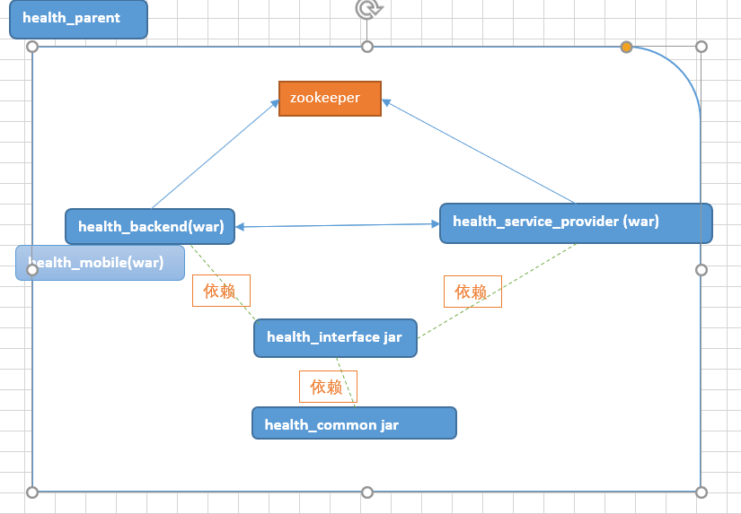

##13-环境搭建（小结）.avi	03:22

```
小结内容:
	简单总结
```
​	   疑问: 在讲解项目架构图的时候我们说有五个服务,为何只有一个

```
实际上我们系统如果性能要求不高没有必要抽取的很细,如果后续需要性能升级可以考虑抽取不同的服务模块
```


##14-PowerDesigner（介绍）.avi	02:16

```
小结内容:
  PD 是一款数据库表解构设计软件,非常流行
   DBA:  数据库管理员
   		 安装数据库,优化数据库,备份, 项目初始时设计表结构
```
##15-PowerDesigner使用（创建PDM）.avi	08:48
```
小结内容:
	创建表即创建表与表之间的外键关联关系
```
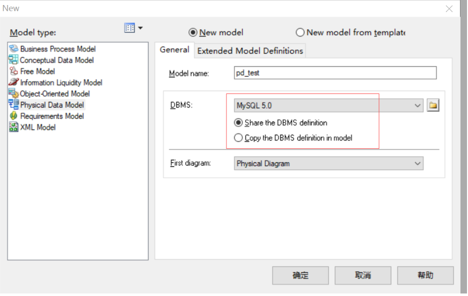

[6](img\6.png)


##16-PowerDesigner使用（导出SQL脚本）.avi	03:45

```
小结内容:
	如何导出sql
```
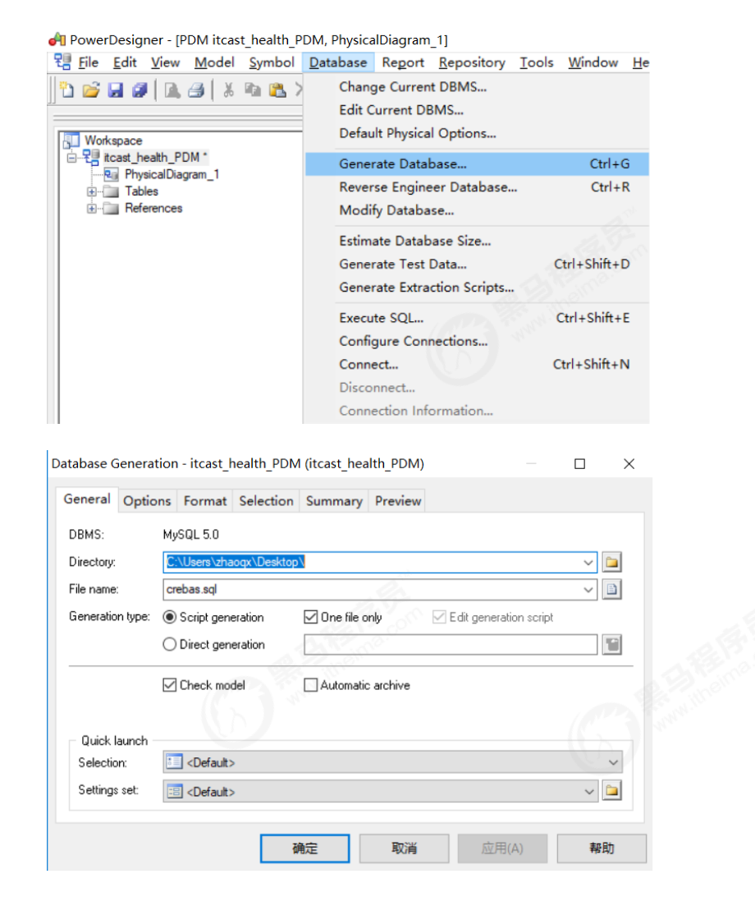

##17-PowerDesigner使用（逆向工程）.avi	03:20

```
小结内容:
	把sql文件转换为 pdm 文件,预览
```
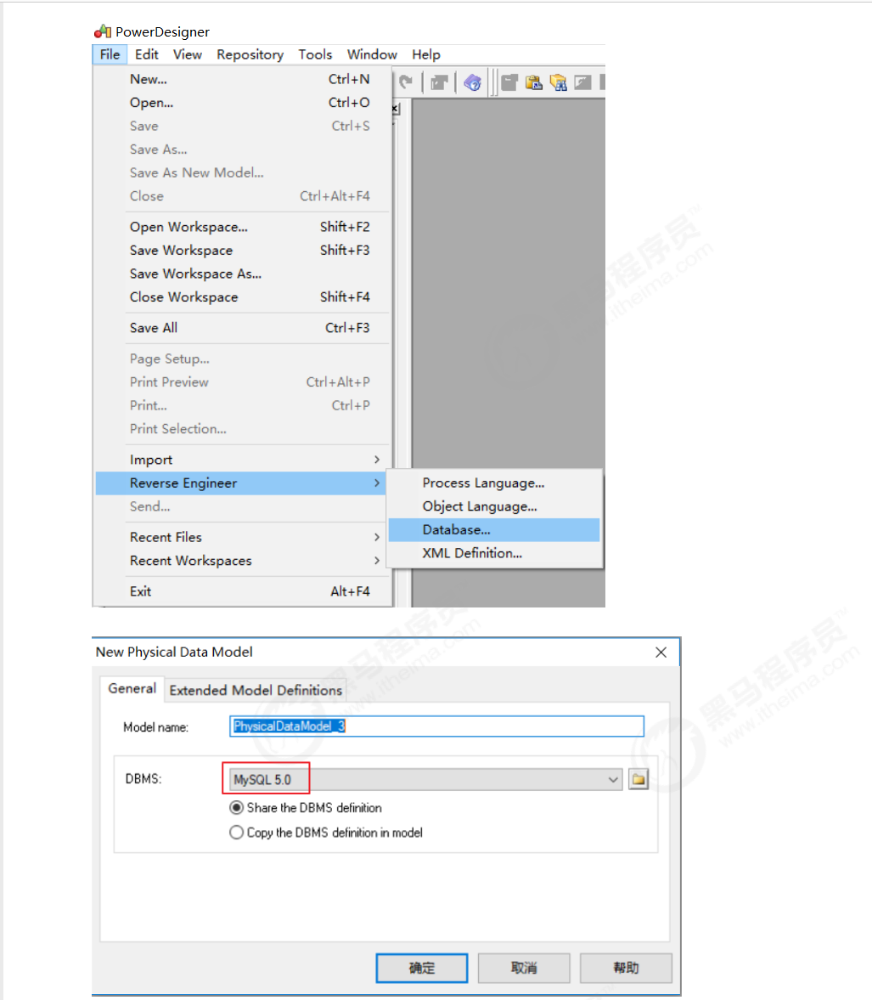


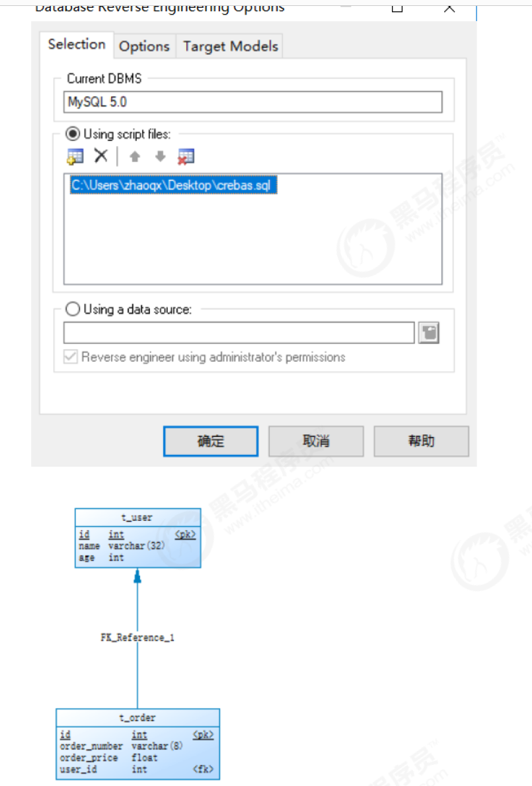

##18-PowerDesigner使用（生成数据库报表文件）.avi	04:13

```
小结内容:
	生成一个html 版本的项目表解构介绍
```
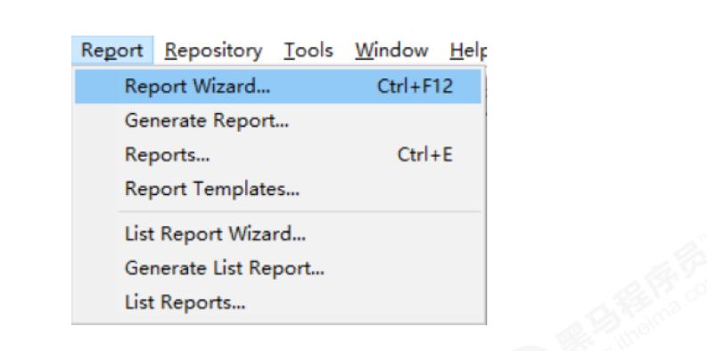

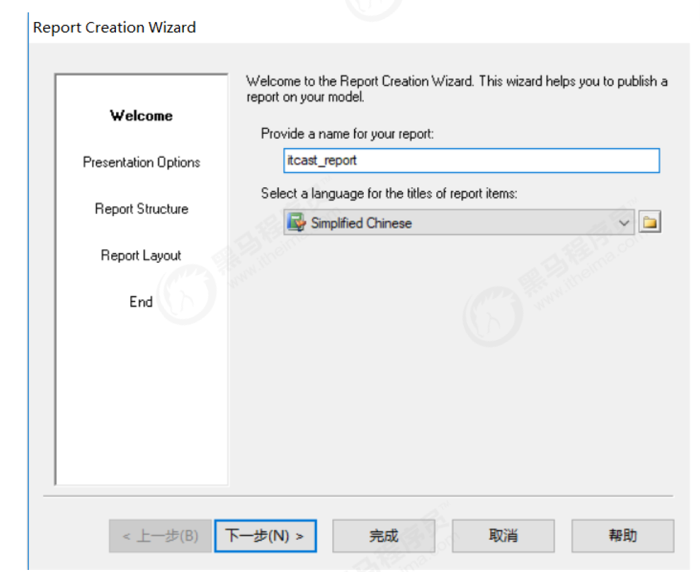

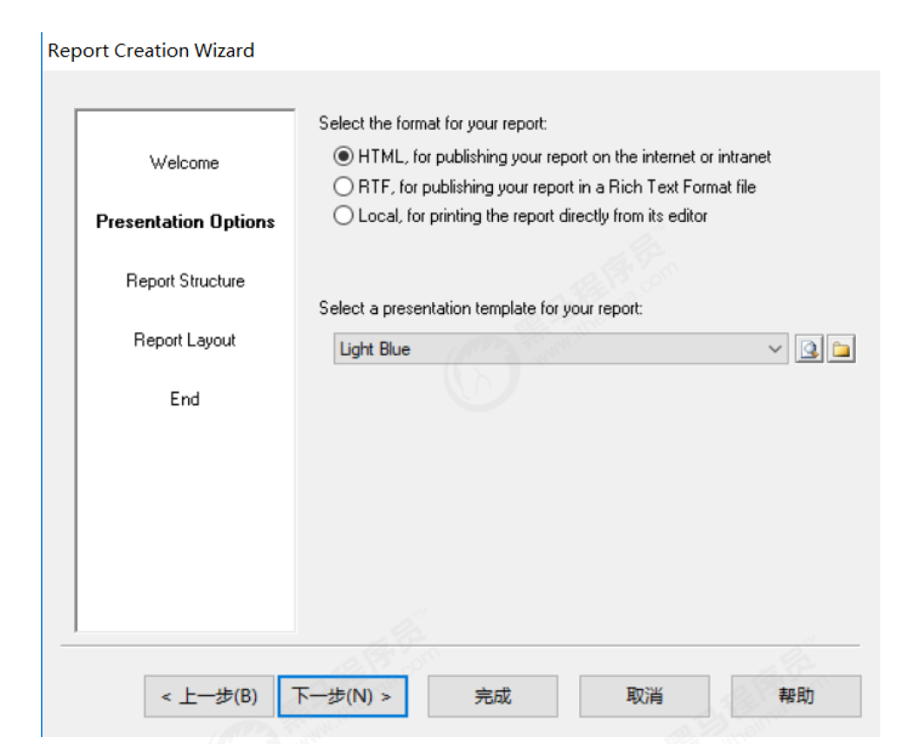

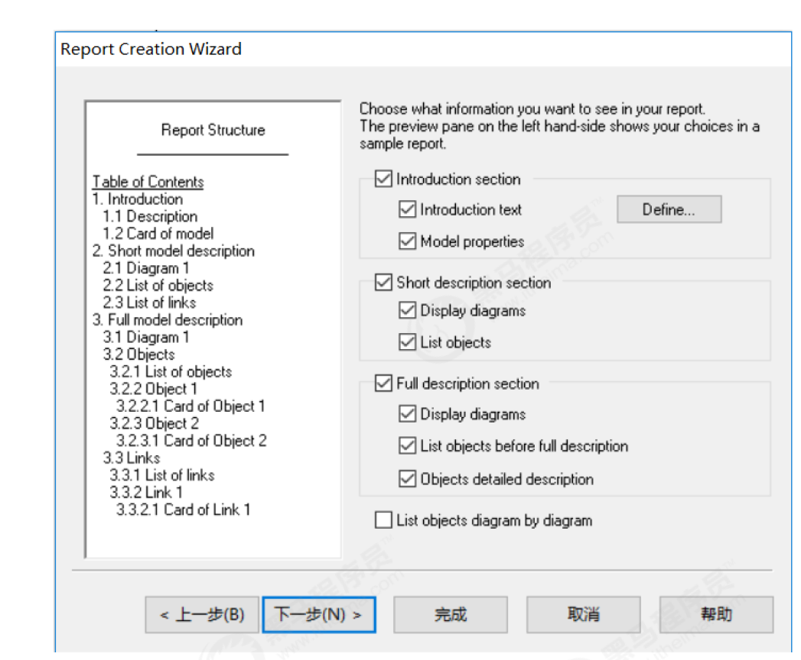

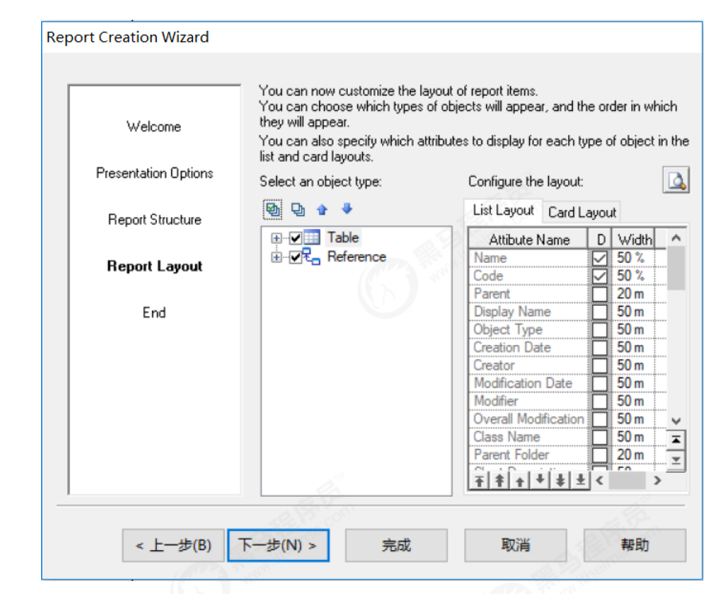

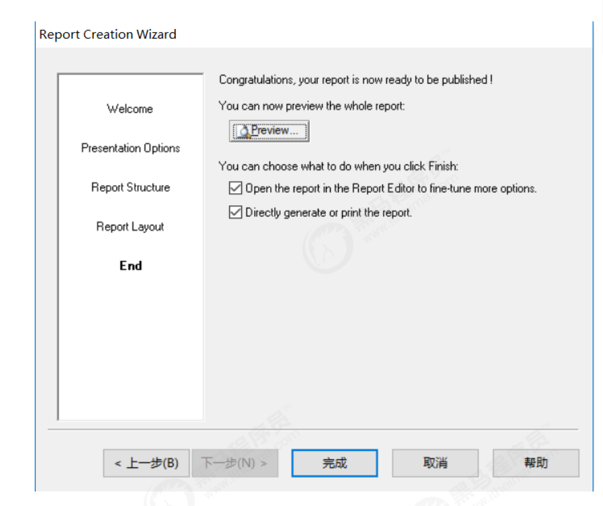

##19-ElementUI（介绍）.avi	03:53

```
小结内容:
	ElementUI 是一套基于 VUE 的UI ,
		就是"饿了么" 那个送外卖的公司的前端团队写的!
```
##20-ElementUI常用组件（Container布局容器）.avi	16:09
```
小结内容:
	<el-container>：外层容器。当子元素中包含 <el-header> 或 <el-footer> 时，全部子元素会垂直上下排列，否则会水平左右排列。
    <el-header>：顶栏容器。
    <el-aside>：侧边栏容器。
    <el-main>：主要区域容器。
    <el-footer>：底栏容器。
注意:
	<el-container> 的子元素只能是后四者，后四者的父元素也只能是 <el-container>。
```
关于样式

```
在 ElementUI 中每一个标签都默认会使用同名的css 样式,比如  el-container 实际上有个 class="el-container" 的引用
```

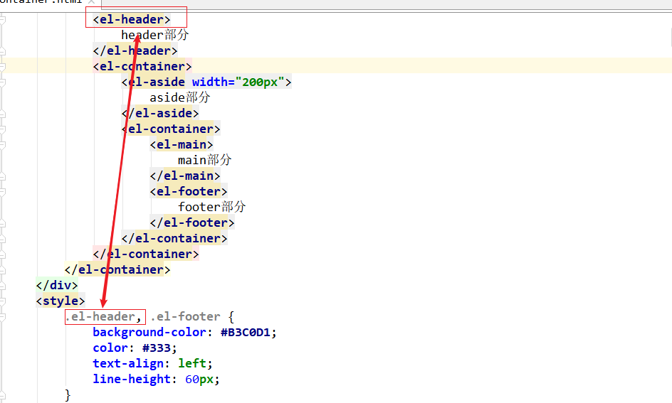


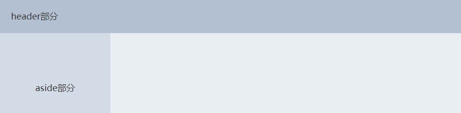

##21-ElementUI常用组件（Dropdown下拉菜单）.avi	08:37

```
小结内容:
	下拉菜单讲解:
	此部分内容需大家下课后自己捣鼓捣鼓才会深刻吸收
```


##22-ElementUI常用组件（NavMenu导航菜单）.avi	05:09

```
小结内容:
	导航栏
```
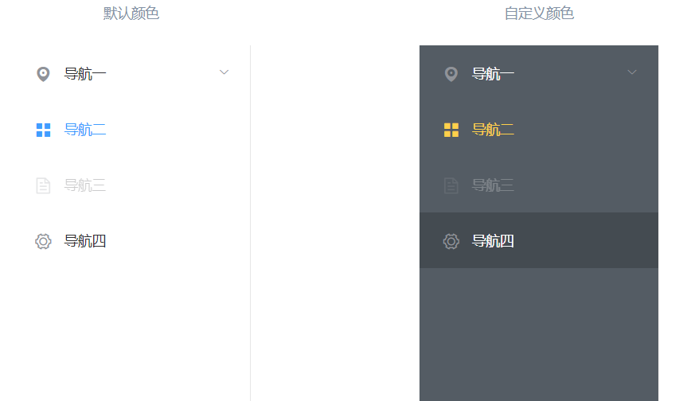

##23-ElementUI常用组件（Table表格）.avi	18:08

```
小结内容:
	表格
```
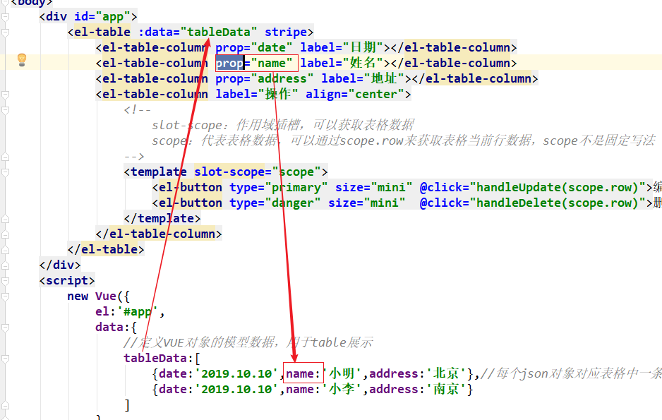

关于表格 插槽:

````
    你去参加一个会议, 大会需要提建议,建议如果被采纳有奖励,如何搜集建议呢,每个人发一张红色小卡片,卡片上有你的ID,  这个卡片就相当于 (template) ,而颜色相当于slot-scope 属性,不能变,固定的.
这样当别人拿到卡片阅读信息时(点击事件)就能获取你的所有信息
````

##24-ElementUI常用组件（Pagination分页）.avi	11:32

```
小结内容:
	前端分页效果
```
##25-ElementUI常用组件（Message消息提示）.avi	05:51
```
小结内容:
	提示消息
```
##26-ElementUI常用组件（Tabs标签页）.avi	05:43
```
小结内容:
	选项卡
```


##27-ElementUI常用组件（Form表单）.avi	16:05

```
小结内容:
	form 校验
```

ElementUI 整体感觉:

​	第一次学习ElementUI  可能会感觉标签很乱,,特别是看官网的源代码,是因为一次性导入了太多的标签,

学习建议:

```
1) 先不要看官方源代码,先把课堂上的代码弄明白,
2) 习惯标签带el- 前缀的的写法
3) elemementUI 中很多标签都是他自己定义的,html5 可以自定义标签,所以 标签的属性很多,不同的标签属性不一样.不要记忆,用到那个效果,粘贴看懂就行
```

