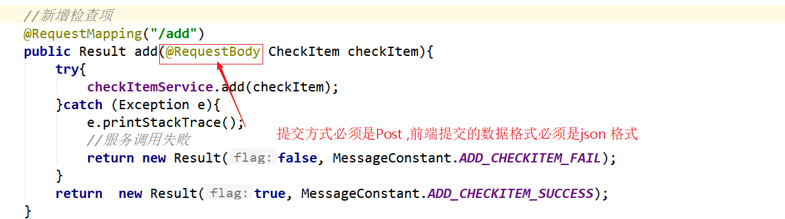

##01-需求分析.avi	09:23

```
新知识:
	无: 
功能:
	综合运用 ElementUI +VUE +dubbo +ssm+完成项目单表的增删改查
```


```
小结内容:
	当日内容: 检查项管理
----大家都去过体检----- 一般我们的体检如下
套餐1: 入职体检套餐
	1.1一般检查(组)
		视力
		体重/身高
		耳鼻喉
	1.2血常规
		乙肝
		HIV
		...
	1.3心电图
		心电图
	1.4:胃
		幽门螺杆菌
----------------------
可以看到 套餐包含多个 检擦项,而 每个检擦项又包含多个套餐
```
##02-基础环境搭建（导入数据表）.avi	08:12
```
小结内容:
	检查项:加检查组:套餐表之前的关联关系
	导入附件提供好的sql 即可
```


##03-基础环境搭建（导入实体类）.avi	04:44

```
小结内容:
	1)我们这里将所有公共的资源都放入了common 中,未来让各个模块引用
	2) 我们的pojo 类都实现了Serializable 接口 ,思考为什么?
		
		Serializable 序列化的作用是能够将我们new 的对象进行 二进制序列化,就可以进行网络传输了,我们进行网络, Dubbo 消费者和服务者之间是通过网络进行交互的,对象化必须序列化.否则无法传输
```
```
 * Serializable 序列化,
 * 当一个对象实现了该接口: 能够把new 的对象 二进制到磁盘
 * new CheckItem() A---磁盘  --网络--- new CheckItem() B

```


##04-基础环境搭建（导入公共资源）.avi	11:19

```
小结内容:
	1)MessageConstant 返回消息:
		思考为啥把所有的返回消息使用一个工具类进行封装:
		答: 方便统一管理,比如未来某个提示信息我们需要优化,可能好多地方都需要修改,我们未来可以快速的进行修改,方便统一管理
	2)Result  
		我们所有的一般结果返回都使用这个类进行封装,统一响应格式
    3) PageResult 
    	我们所有的分页查询都是用这个返回
    4) QueryPageBean
    	把前端提交的数据封装至该对象进行传递数据给服务端  
```
（1）返回消息常量类MessageConstant，放到health_common工程中。

```java
package com.itheima.constant;
/**
 * 消息常量
 */
public class MessageConstant {
    public static final String DELETE_CHECKITEM_FAIL = "删除检查项失败";
    public static final String DELETE_CHECKITEM_SUCCESS = "删除检查项成功";
    public static final String ADD_CHECKITEM_SUCCESS = "新增检查项成功";
    public static final String ADD_CHECKITEM_FAIL = "新增检查项失败";
    public static final String EDIT_CHECKITEM_FAIL = "编辑检查项失败";
    public static final String EDIT_CHECKITEM_SUCCESS = "编辑检查项成功";
    public static final String QUERY_CHECKITEM_SUCCESS = "查询检查项成功";
    public static final String QUERY_CHECKITEM_FAIL = "查询检查项失败";
    public static final String UPLOAD_SUCCESS = "上传成功";
    public static final String ADD_CHECKGROUP_FAIL = "新增检查组失败";
    public static final String ADD_CHECKGROUP_SUCCESS = "新增检查组成功";
    public static final String DELETE_CHECKGROUP_FAIL = "删除检查组失败";
    public static final String DELETE_CHECKGROUP_SUCCESS = "删除检查组成功";
    public static final String QUERY_CHECKGROUP_SUCCESS = "查询检查组成功";
    public static final String QUERY_CHECKGROUP_FAIL = "查询检查组失败";
    public static final String EDIT_CHECKGROUP_FAIL = "编辑检查组失败";
    public static final String EDIT_CHECKGROUP_SUCCESS = "编辑检查组成功";
    public static final String PIC_UPLOAD_SUCCESS = "图片上传成功";
    public static final String PIC_UPLOAD_FAIL = "图片上传失败";
    public static final String ADD_SETMEAL_FAIL = "新增套餐失败";
    public static final String ADD_SETMEAL_SUCCESS = "新增套餐成功";
    public static final String IMPORT_ORDERSETTING_FAIL = "批量导入预约设置数据失败";
    public static final String IMPORT_ORDERSETTING_SUCCESS = "批量导入预约设置数据成功";
    public static final String GET_ORDERSETTING_SUCCESS = "获取预约设置数据成功";
    public static final String GET_ORDERSETTING_FAIL = "获取预约设置数据失败";
    public static final String ORDERSETTING_SUCCESS = "预约设置成功";
    public static final String ORDERSETTING_FAIL = "预约设置失败";
    public static final String ADD_MEMBER_FAIL = "新增会员失败";
    public static final String ADD_MEMBER_SUCCESS = "新增会员成功";
    public static final String DELETE_MEMBER_FAIL = "删除会员失败";
    public static final String DELETE_MEMBER_SUCCESS = "删除会员成功";
    public static final String EDIT_MEMBER_FAIL = "编辑会员失败";
    public static final String EDIT_MEMBER_SUCCESS = "编辑会员成功";
    public static final String TELEPHONE_VALIDATECODE_NOTNULL = "手机号和验证码都不能为空";
    public static final String LOGIN_SUCCESS = "登录成功";
    public static final String VALIDATECODE_ERROR = "验证码输入错误";
    public static final String QUERY_ORDER_SUCCESS = "查询预约信息成功";
    public static final String QUERY_ORDER_FAIL = "查询预约信息失败";
    public static final String QUERY_SETMEALLIST_SUCCESS = "查询套餐列表数据成功";
    public static final String QUERY_SETMEALLIST_FAIL = "查询套餐列表数据失败";
    public static final String QUERY_SETMEAL_SUCCESS = "查询套餐数据成功";
    public static final String QUERY_SETMEAL_FAIL = "查询套餐数据失败";
    public static final String SEND_VALIDATECODE_FAIL = "验证码发送失败";
    public static final String SEND_VALIDATECODE_SUCCESS = "验证码发送成功";
    public static final String SELECTED_DATE_CANNOT_ORDER = "所选日期不能进行体检预约";
    public static final String ORDER_FULL = "预约已满";
    public static final String HAS_ORDERED = "已经完成预约，不能重复预约";
    public static final String ORDER_SUCCESS = "预约成功";
    public static final String GET_USERNAME_SUCCESS = "获取当前登录用户名称成功";
    public static final String GET_USERNAME_FAIL = "获取当前登录用户名称失败";
    public static final String GET_MENU_SUCCESS = "获取当前登录用户菜单成功";
    public static final String GET_MENU_FAIL = "获取当前登录用户菜单失败";
    public static final String GET_MEMBER_NUMBER_REPORT_SUCCESS = "获取会员统计数据成功";
    public static final String GET_MEMBER_NUMBER_REPORT_FAIL = "获取会员统计数据失败";
    public static final String GET_SETMEAL_COUNT_REPORT_SUCCESS = "获取套餐统计数据成功";
    public static final String GET_SETMEAL_COUNT_REPORT_FAIL = "获取套餐统计数据失败";
    public static final String GET_BUSINESS_REPORT_SUCCESS = "获取运营统计数据成功";
    public static final String GET_BUSINESS_REPORT_FAIL = "获取运营统计数据失败";
    public static final String GET_SETMEAL_LIST_SUCCESS = "查询套餐列表数据成功";
    public static final String GET_SETMEAL_LIST_FAIL = "查询套餐列表数据失败";
}
```

##05-分析页面结构.avi	12:17

```
小结内容:
	页面使用ElementUI <el-container>  布局,使用<el-menu> 展示左侧菜单
```
补:iframe 标签

​	iframe 元素会创建包含另外一个文档的内联框架（即行内框架）。说白了可以让两个互相无关的页面强制拼接在一起

```html
<html>
<body>
	<iframe src="https://www.baidu.com"  ></iframe>
	<iframe src="http://www.itcast.cn"></iframe>
</body>
</html>
```


##06-新增检查项_完善页面（弹出新增窗口）.avi	09:17

```
小结内容:
	点击新建弹出窗口,并重置表单数据
```
```js
回忆:
//1)@click   ---v-on:click  绑定点击事件
//2) :visible.sync="dialogFormVisible"   v-bind:visible.sync 绑定数据  
//3) 除非特别标明,否则 项目中的this 都指的是 vue  对象 下面蓝色字体那个

	var vue = new Vue({
            el: '#app',
            data:{}// 此处定义数据
             //钩子函数，VUE对象初始化完成后自动执行
            created() {} 初始化数据
             methods: {
             	此处用来定义函数
                
             }
}
```


1.在点击新建按钮时，弹出对话框

```javascript
               // 弹出添加窗口
                handleCreate() {
                    this.dialogFormVisible = true
                },
```

2.打开弹窗前，需要清空里边的数据

```javascript
                // 重置表单
                resetForm() {
                    this.formData = {}
                },
                // 弹出添加窗口
                handleCreate() {
                    this.resetForm()
                    this.dialogFormVisible = true
                },
```


##07-新增检查项_完善页面（输入校验）.avi	01:53

```
小结内容:
	使用的是ElementUI 校验规则
	回忆: ElenentUI表单校验规则
```
```json
rules: {//校验规则
                    code: [{ required: true, message: '项目编码为必填项', trigger: 'blur' }],
                    name: [{ required: true, message: '项目名称为必填项', trigger: 'blur' }]
                }
```


##08-新增检查项_完善页面（提交表单数据）.avi	18:11

```
小结内容:	
```


```js
     handleAdd () {
                //进行表单校验
                this.$refs['dataAddForm'].validate((valid) => {
                    if(valid){
                        //表单校验通过，发生ajax请求，将录入的数据提交到后台进行处理
                        console.log(this.formData);
                        axios.post("/checkitem/add.do",this.formData).then((res) => {
                            //关闭新增窗口
                            this.dialogFormVisible = false;
                            if(res.data.flag){//执行成功
                                //新增成功后，重新调用分页查询方法，查询出最新的数据
                                this.findPage();
                                //弹出提示信息
                                this.$message({
                                    message:res.data.message,
                                    type:'success'
                                });
                            }else{//执行失败
                                //弹出提示
                                this.$message.error(res.data.message);
                            }
                        });
                    }else{
                        //校验不通过
                        this.$message.error("数据校验失败，请检查你的输入信息是否正确！");
                        return false;
                    }
                });
            },
```
注意:

```javascript
this.$message.success(res.data.message)
```

可以使用简化的写法


##09-新增检查项_后台代码（Controller）.avi	09:54

```
小结内容:
```
​	

```java
/**
 * 体检检查项管理
 */
@RestController
@RequestMapping("/checkitem")
public class CheckItemController {
    private static Logger logger = Logger.getLogger(CheckItemController.class);
    
    @Reference
    private CheckItemService checkItemService;
    //新增
    @RequestMapping("/add")
    public Result add(@RequestBody CheckItem checkItem){
        try {
            checkItemService.add(checkItem);
        }catch (Exception e){
            logger.error(e);
            return new Result(false,MessageConstant.ADD_CHECKITEM_FAIL);
        }
        return new Result(true,MessageConstant.ADD_CHECKITEM_SUCCESS);
    }
}
```

```
日志优化：
private static Logger logger = Logger.getLogger(CheckItemController.class);
logger.error(e);

参数直接从json转换成CheckItem，通过http请求的RequestBody进行传递，@RequestBody可以直接进行转换。
	@RequestBody  1) 请求参数必须是post ,2) 请求数据必须是json,3) 反过来  求数据必须json时 @RequestBody 能自动帮助我们转换成 对象
```


##10-新增检查项_后台代码（Service、DAO）.avi	07:21

```
小结内容:
	
```


```
dao 层的注意事项:
	1) Mapper.xml文件中的namespace与mapper接口的全限定名相同
		2) Mapper接口方法名和Mapper.xml中定义的每个statement的id相同
		3) Mapper接口方法的输入参数类型和mapper.xml中定义的每个sql的parameterType的类型相同
		4) Mapper接口方法的输出参数类型和mapper.xml中定义的每个sql的resultType的类型相同
		5) 方法不能重载
		6) 要求配置文件的"目录"必须和接口所在的目录一致
		   要求配置文件的"名称"必须和接口名称一致
----------------
笔试要求:
	熟练编写 insert ,update,delete 语句
	掌握 查询中的多表关联查询
```

```java
package com.itheima.service.impl;

import com.alibaba.dubbo.config.annotation.Service;
import com.github.pagehelper.Page;
import com.github.pagehelper.PageHelper;
import com.itheima.dao.CheckItemDao;
import com.itheima.entity.PageResult;
import com.itheima.entity.QueryPageBean;
import com.itheima.pojo.CheckItem;
import com.itheima.service.CheckItemService;
import org.springframework.beans.factory.annotation.Autowired;
import org.springframework.transaction.annotation.Transactional;

import java.util.List;

/**
 * 检查项服务
 */
@Service(interfaceClass = CheckItemService.class)
@Transactional
public class CheckItemServiceImpl implements CheckItemService {
    //注入DAO对象
    @Autowired
    private CheckItemDao checkItemDao;
    public void add(CheckItem checkItem) {
        checkItemDao.add(checkItem);
    }
}

```


在health_service_provider工程中创建CheckItemDao接口，本项目是基于Mybatis的
Mapper代理技术实现持久层操作，故只需要提供接口和Mapper映射文件，无须提供实
现类

```java
package com.itheima.dao;

import com.github.pagehelper.Page;
import com.itheima.pojo.CheckItem;

public interface CheckItemDao {
    public void add(CheckItem checkItem);
}

```

在health_service_provider工程中创建CheckItemDao.xml映射文件，需要和
CheckItemDao接口在同一目录下

在resources下的com/itheima/dao下创建CheckItemDao.xml

```xml
<?xml version="1.0" encoding="UTF-8" ?>
<!DOCTYPE mapper PUBLIC "-//mybatis.org//DTD Mapper 3.0//EN"
        "http://mybatis.org/dtd/mybatis-3-mapper.dtd" >
<mapper namespace="com.itheima.dao.CheckItemDao">
    <!--插入检查项数据-->
    <insert id="add" parameterType="com.itheima.pojo.CheckItem">
        insert into t_checkitem(code,name,sex,age,price,type,remark,attention)
                      values
        (#{code},#{name},#{sex},#{age},#{price},#{type},#{remark},#{attention})
    </insert>
</mapper>
```

可以配置下别名：

```xml
 <!--spring和mybatis整合的工厂bean-->
    <bean id="sqlSessionFactory" class="org.mybatis.spring.SqlSessionFactoryBean">
        <property name="dataSource" ref="dataSource" />
        <property name="configLocation" value="classpath:SqlMapConfig.xml" />
        <property name="typeAliasesPackage" value="com.itheima.pojo"></property>
    </bean>
```

```xml
    <insert id="add" parameterType="checkItem">
        insert into t_checkitem(code,name,sex,age,price,type,remark,attention)
                      values
        (#{code},#{name},#{sex},#{age},#{price},#{type},#{remark},#{attention})
    </insert>
```

##11-新增检查项_测试.avi	08:07

```
启动顺序：

1.install所有项目

2.启动service_provider，使用tomcat7:run  debug方式启动。

3.启动backend,使用tomcat7:run  debug方式启动。因为在backend中设置了<dubbo:consumer timeout="600000" check="false"/>，所以service_provider不启动backend也能运行。


```
解决mysql中文乱码问题：

```xml
<property name="url" value="jdbc:mysql://localhost:3306/health?characterEncoding=UTF-8" />
```

##12-检查项分页_分析.avi	03:20

```
小结内容:
	1)本项目所有分页功能都是基于ajax的异步请求来完成的
	2)请求数据格式:
			{"currentPage":1,"pageSize":10,"queryString":null}
	3) 响应数据格式
	{
        "rows": [	{
                    "age": "0-100",
                    "attention": "无",
                    "code": "0010",
                    "id": 37,
                    "name": "色觉",
                    "price": 5.0,
                    "remark": "色觉",
                    "sex": "0",
                    "type": "1"
            		}
            	],
		"total": 65
}
```


##13-检查项分页_完善页面（定义模型数据和分页方法）.avi	09:44

```json
pagination: {//分页相关模型数据
currentPage: 1,//当前页码
pageSize:10,//每页显示的记录数
total:0,//总记录数
queryString:null//查询条件
},
dataList: [],//当前页要展示的分页列表数据
```

```javascript
 //发送ajax请求，提交分页相关请求参数（页码、每页显示记录数、查询条件）
                    var param = {
                        currentPage:this.pagination.currentPage,
                        pageSize:this.pagination.pageSize,
                        queryString: this.pagination.queryString
                    };
                    axios.post("/checkitem/findPage.do",param).then((res)=>{
                        //解析Controller响应回的数据，为模型数据赋值
                        this.pagination.total = res.data.total;
                        this.dataList = res.data.rows;
                    });
```

##14-检查项分页_完善页面（完善分页方法执行时机）.avi	08:12
```
小结内容:
	1)钩子函数,初始化调用
	2)查询按钮
	3)切换页码按钮
```
```html
<el‐button @click="findPage()" class="dalfBut">查询</el‐button>
```

由于输入框

```html
 <el-input placeholder="项目编码/项目名称" v-model="pagination.queryString" style="width: 200px;" class="filter-item"></el-input>
```

```html
<el‐pagination
class="pagiantion"
@current‐change="handleCurrentChange"
:current‐page="pagination.currentPage"
:page‐size="pagination.pageSize"
layout="total, prev, pager, next, jumper"
:total="pagination.total">
</el‐pagination>
```

```javascript
//切换页码
handleCurrentChange(currentPage) {
//currentPage为切换后的页码
this.pagination.currentPage = currentPage;
this.findPage();
}
```

##15-检查项分页_后台代码（Controller、服务接口）.avi	05:21

```
小结内容:
	注意: Controller 层的参数名称要和我们的JS提交的数据保持一致保持一致
```
```java
//分页查询
@RequestMapping("/findPage")
public PageResult findPage(@RequestBody QueryPageBean queryPageBean){
    PageResult pageResult = checkItemService.pageQuery(
    queryPageBean.getCurrentPage(),
    queryPageBean.getPageSize(),
    queryPageBean.getQueryString());
    return pageResult;
}
```

##16-检查项分页_后台代码（服务实现类、DAO）.avi	14:11

```
小结内容:
	dao 层查询
	
```
在CheckItemService服务接口中扩展分页查询方法

```java
public PageResult pageQuery(QueryPageBean queryPageBean);
```

在CheckItemServiceImpl服务实现类中实现分页查询方法，基于Mybatis分页助手插件
实现分页

```java
public PageResult pageQuery(Integer currentPage, Integer pageSize, String
queryString) {
    PageHelper.startPage(currentPage,pageSize);
    Page<CheckItem> page = checkItemDao.selectByCondition(queryString);
    return new PageResult(page.getTotal(),page.getResult());
}
```


补-,模糊查询:

​	我们的课程中使用的是等于号查询,必须完全匹配才可以,实际上,我们很多时候都需要使用模糊查询,改造如下

```xml

 <select id="selectByCondition" parameterType="String" resultType="com.itheima.pojo.CheckItem">
        select * from t_checkitem
        <!-- 一个值我们test 中必须使用 value -->
        <if test="value != null and value.length > 0">
            
 where code like CONCAT( CONCAT('%',#{value}) ,'%') or name  like CONCAT( CONCAT('%',#{value}) ,'%')
           </if>
       </select>


```


##17-检查项分页_测试.avi	06:45

```
小结内容:
```
##18-删除检查项_完善页面（为删除按钮绑定事件）.avi	06:05
```
小结内容:
	回忆ElementUI表格获取id 
```
需要为删除按钮绑定单击事件，并且将当前行数据作为参数传递给处理函数

```html
<el‐button size="mini" type="danger" @click="handleDelete(scope.row)">删
除</el‐button>
```

```javascript
// 删除
handleDelete(row) {
    console.log(row.id);
}
```


##19-删除检查项_完善页面（弹出确认框）.avi	05:53

示例代码：

```javascript
<template>
  <el-button type="text" @click="open">点击打开 Message Box</el-button>
</template>

<script>
  export default {
    methods: {
      open() {
        this.$confirm('此操作将永久删除该文件, 是否继续?', '提示', {
          confirmButtonText: '确定',
          cancelButtonText: '取消',
          type: 'warning'
        }).then(() => {
          this.$message({
            type: 'success',
            message: '删除成功!'
          });
        }).catch(() => {
          this.$message({
            type: 'info',
            message: '已取消删除'
          });          
        });
      }
    }
  }
</script>
```

```js
// 删除
handleDelete(row) {
//alert(row.id);
    this.$confirm("确认删除当前选中记录吗？","提示",
    {
        type:'warning'}).then(()=>{
        //点击确定按钮时只需此处代码
        alert('用户点击的是确定按钮');
        });
    }
}
```


##20-删除检查项_完善页面（发送请求）.avi	06:08

```
小结内容:
	
```


```javascript
                // 删除
                handleDelete(row) {//row其实是一个json对象，json对象的结构为{"age":"0-100","attention":"无","code":"0011","id":38,"name":"白细胞计数","price":10.0,"remark":"白细胞计数","sex":"0","type":"2"}
                    //alert(row.id);
                    this.$confirm("你确定要删除当前数据吗？","提示",{//确认框
                        type:'warning'
                    }).then(()=>{
                        //用户点击确定按钮，发送ajax请求，将检查项ID提交到Controller进行处理
                        axios.get("/checkitem/delete.do?id=" + row.id).then((res) => {
                            if(res.data.flag){
                                //执行成功
                                //弹出成功提示信息
                                this.$message({
                                    type:'success',
                                    message:res.data.message
                                });
                                //重新进行分页查询
                                this.findPage();
                            }else{
                                //执行失败
                                this.$message.error(res.data.message);
                            }
                        });
                    }).catch(()=>{
                        this.$message({
                            type:'info',
                            message:'操作已取消'
                        });
                    });
                }
```

>这里的接口时get请求，所以直接把参数拼合到url上即可，所以在编写后台接口的时候也要注意

##21-删除检查项_后台代码.avi	09:47

```
小结内容:
	controller 接收数据
	补充: 可以校验一下前端是否传递了 id=0;


```
在CheckItemController中增加删除方法

```java
    //删除检查项
    @RequestMapping("/delete")
    public Result delete(Integer id){
        try{
            checkItemService.deleteById(id);
        }catch (Exception e){
            e.printStackTrace();
            //服务调用失败
            return new Result(false, MessageConstant.DELETE_CHECKITEM_FAIL);
        }
        return  new Result(true, MessageConstant.DELETE_CHECKITEM_SUCCESS);
    }
```

在CheckItemService服务接口中扩展删除方法

```java
public void delete(Integer id);
```

注意：不能直接删除，需要判断当前检查项是否和检查组关联，如果已经和检查组进行
了关联则不允许删除

```java
//删除
public void delete(Integer id) throws RuntimeException{
    //查询当前检查项是否和检查组关联
    long count = checkItemDao.findCountByCheckItemId(id);
    if(count > 0){
    //当前检查项被引用，不能删除
    throw new RuntimeException("当前检查项被引用，不能删除");
    }
    checkItemDao.deleteById(id);
}
```

在CheckItemDao接口中扩展方法findCountByCheckItemId和deleteById

```java
public void deleteById(Integer id);
public long findCountByCheckItemId(Integer checkItemId);
```

在CheckItemDao.xml中扩展SQL语句

```xml
<!‐‐删除‐‐>
<delete id="deleteById" parameterType="int">
	delete from t_checkitem where id = #{id}
</delete>
<!‐‐根据检查项id查询中间关系表‐‐>
<select id="findCountByCheckItemId" resultType="long"
parameterType="int">
	select count(*) from t_checkgroup_checkitem where checkitem_id = #
	{checkitem_id}
</select>
```

##22-删除检查项_测试.avi	03:19

```
小结内容:
	
```
##23-编辑检查项_完善页面（弹出编辑窗口并回显数据）.avi	08:47
```
小结内容:
	
```
```html
<el‐button type="primary" size="mini" @click="handleUpdate(scope.row)">编
辑</el‐button>
```

```javascript
 // 弹出编辑窗口
  handleUpdate(row) {
                    //弹出编辑窗口
                    this.dialogFormVisible4Edit = true;
                    //回显数据，发送ajax请求根据ID查询当前检查项数据
                    axios.get("/checkitem/findById.do?id=" + row.id).then((res) => {
                        //res是http请求内容，response body、status（404 200）...
                        //response body = Result
                        if(res.data.flag){
                            //进行回显，基于VUE的数据绑定实现
                            //检查项的数据
                            this.formData = res.data.data;
                        }else{
                            //查询失败，弹出提示
                            this.$message.error(res.data.message);
                        }
                    });
                },
```

```js
 小结内容:
	handleUpdate(row) {
                    //弹出编辑窗口
                    this.dialogFormVisible4Edit = true;
                    let _row  ={};
                    Object.assign(_row,row)//  对象的复制   ES6
                    this.formData=_row;
                   
                    // });
                },
                    
注意: 对象的复制   ES6
```


##24-编辑检查项_完善页面（发送请求）.avi	08:35

```

```
在编辑窗口中修改完成后，点击确定按钮需要提交请求，所以需要为确定按钮绑定事件
并提供处理函数handleEdit

```html
<el‐button type="primary" @click="handleEdit()">确定</el‐button>
```

```javascript
              handleEdit() {
                    //进行表单校验
                    this.$refs['dataEditForm'].validate((valid) => {
                        if(valid){
                            //表单校验通过，可以提交数据
                            axios.post("/checkitem/edit.do",this.formData).then((res) => {
                                if(res.data.flag){
                                    //弹出成功提示信息
                                    this.$message({
                                        type:'success',
                                        message:res.data.message
                                    });
                                }else{
                                    //执行失败
                                    this.$message.error(res.data.message);
                                }
                            }).finally(() => {
                                //不管成功还是失败，都调用分页查询方法
                                this.findPage();
                                //隐藏编辑窗口
                                this.dialogFormVisible4Edit = false;
                            });
                        }else{
                            //表单校验不通过
                            this.$message.error("表单数据校验失败!");
                            return false;
                        }
                    });
                }
```

> 为什么这里在finally里要调用findPage?
>
> 其实由于我们对编辑数据是进行了拷贝或者发送请求进行获取，所以编辑成功进行刷新即可，失败的情况下可以不刷新。

```
   this.$message.success(res.data.message);
```


##25-编辑检查项_后台代码（根据ID编辑数据）.avi	07:45

```
小结内容:	
```
在CheckItemController中增加编辑方法

```java
    //编辑检查项
    @RequestMapping("/edit")
    public Result edit(@RequestBody CheckItem checkItem){
        try{
            checkItemService.edit(checkItem);
        }catch (Exception e){
            e.printStackTrace();
            //服务调用失败
            return new Result(false, MessageConstant.EDIT_CHECKITEM_FAIL);
        }
        return  new Result(true, MessageConstant.EDIT_CHECKITEM_SUCCESS);
    }
```

在CheckItemService服务接口中扩展编辑方法

```java
 public void edit(CheckItem checkItem);
```

在CheckItemServiceImpl实现类中实现编辑方法

```java
    public void edit(CheckItem checkItem) {
        checkItemDao.edit(checkItem);
    }
```

在CheckItemDao.xml中扩展SQL语句

```xml
<update id="edit" parameterType="com.itheima.pojo.CheckItem">
        update t_checkitem
        <set>
            <if test="name != null">
                name = #{name},
            </if>
            <if test="sex != null">
                sex = #{sex},
            </if>
            <if test="code != null">
                code = #{code},
            </if>
            <if test="age != null">
                age = #{age},
            </if>
            <if test="price != null">
                price = #{price},
            </if>
            <if test="type != null">
                type = #{type},
            </if>
            <if test="attention != null">
                attention = #{attention},
            </if>
            <if test="remark != null">
                remark = #{remark},
            </if>
        </set>
        where id = #{id}
    </update>

```

##26-编辑检查项_后台代码（根据ID查询用于数据回显）.avi	05:12

```
小结内容:
	
```
在CheckItemController中增加编辑方法

```java
	@RequestMapping("/findById")
    public Result findById(Integer id){
        try{
            CheckItem checkItem = checkItemService.findById(id);
            return  new Result(true, MessageConstant.QUERY_CHECKITEM_SUCCESS,checkItem);
        }catch (Exception e){
            e.printStackTrace();
            //服务调用失败
            return new Result(false, MessageConstant.QUERY_CHECKITEM_FAIL);
        }
    }

```

在CheckItemService服务接口中扩展编辑方法

```java
 public CheckItem findById(Integer id);
```

在CheckItemServiceImpl实现类中实现编辑方法

```java
	public CheckItem findById(Integer id) {
        return checkItemDao.findById(id);
    }
```

在CheckItemDao.xml中扩展SQL语句

```xml
	 <select id="findById" parameterType="int" resultType="com.itheima.pojo.CheckItem">
        select * from t_checkitem where id = #{id}
    </select>
```

##27-编辑检查项_测试.avi	02:12

```
小结内容:
```

代码中其实存在问题，比如编辑时把价格去掉，保存之后是不会生效的，因为在mapper中指定了只对不为null的数据进行保存。

解决方法是：

mapper不用校验，保存全量数据。

## 28 - 分页 BUG 修复

分页查询bug修复 
问题描述：

​	在检查项和检查组页面进行分页查询时，如果不是在第一页，此时在查询输入框中输入过滤 条件并点击查询按钮，无法查询到对应数据。
原因：

​	因为页面不在第一页，所以导致点击查询按钮时根据条件进行分页查询，此时发送的ajax请求中 currentPage不是1，导致查询不到对应记录。 

解决思路：

​	当点击查询按钮时需要将currentPage设置为1，再发送ajax请求根据条件进行分页查询。由 于在页面中有多个地方都会调用到findPage方法，为了不对其他地方造成影响，需要为查询按钮单独扩 展一个方法_findPage，在此方法中进行相应处理。

```js
_findPage(){ 
	this.pagination.currentPage = 1; 
	this.findPage();
}
<el-button @click="_findPage()" class="dalfBut">查询</el-button>
```

##29 mybatis -- 自动生成代码

mybatis-generator是一款在使用mybatis框架时，自动生成model、dao和mapper的工具，很大程度 上减少了业务开发人员的手动编码时间。
使用方式：
第一步：创建maven工程，导入代码生成插件

```xml
<?xml version="1.0" encoding="UTF-8"?>
<project xmlns="http://maven.apache.org/POM/4.0.0"
         xmlns:xsi="http://www.w3.org/2001/XMLSchema-instance"
         xsi:schemaLocation="http://maven.apache.org/POM/4.0.0
         http://maven.apache.org/xsd/maven-4.0.0.xsd">
    <modelVersion>4.0.0</modelVersion>
    <groupId>com.itheima</groupId>
    <artifactId>geneter</artifactId>
    <version>1.0-SNAPSHOT</version>
    <dependencies>
        <dependency>
            <groupId>org.mybatis.generator</groupId>
            <artifactId>mybatis-generator-core</artifactId>
            <version>1.3.2</version>
        </dependency>
    </dependencies>
    <build>
        <plugins>
            <plugin>
                <groupId>org.mybatis.generator</groupId>
                <artifactId>mybatis-generator-maven-plugin</artifactId>
                 <version>1.3.2</version>
                <configuration>
                    <configurationFile>
                        src/main/resources/generatorConfig.xml
                    </configurationFile>
                </configuration>
            </plugin>
        </plugins>
    </build>
</project>
```

第二步：在maven工程的resources目录下提供generatorConfig.xml文件

```xml
<?xml version="1.0" encoding="UTF-8"?>
<!DOCTYPE generatorConfiguration
        PUBLIC "-//mybatis.org//DTD MyBatis Generator Configuration 1.0//EN"
        "http://mybatis.org/dtd/mybatis-generator-config_1_0.dtd">

<generatorConfiguration>
    <classPathEntry location="D:/mysql-connector-java-5.1.46.jar" />

    <context id="testTables" targetRuntime="MyBatis3">
        <commentGenerator>
            <!-- 是否去除自动生成的注释 true：是 ： false:否 -->
            <property name="suppressAllComments" value="true" />
        </commentGenerator>
        <!--数据库连接的信息：驱动类、连接地址、用户名、密码 -->
        <jdbcConnection driverClass="com.mysql.jdbc.Driver"
                        connectionURL="jdbc:mysql://localhost:3306/health"
                        userId="root"
                        password="root">
        </jdbcConnection>
        <javaTypeResolver>
            <property name="forceBigDecimals" value="false" />
        </javaTypeResolver>

        <!-- targetProject:生成POJO类的位置 -->
        <javaModelGenerator targetPackage="com.itheima.domain"
                            targetProject="src\main\java">
            <!-- enableSubPackages:是否让schema作为包的后缀 -->
            <property name="enableSubPackages" value="false" />
            <!-- 从数据库返回的值被清理前后的空格 -->
            <property name="trimStrings" value="true" />
        </javaModelGenerator>
        <!-- targetProject:mapper映射文件生成的位置 -->
        <sqlMapGenerator targetPackage="com.itheima.mapper"
                         targetProject="src\main\resources">
            <!-- enableSubPackages:是否让schema作为包的后缀 -->
            <property name="enableSubPackages" value="false" />
        </sqlMapGenerator>
        <!-- targetPackage：mapper接口生成的位置 -->
        <javaClientGenerator type="XMLMAPPER"
                             targetPackage="com.itheima.mapper"
                             targetProject="src\main\java">
            <!-- enableSubPackages:是否让schema作为包的后缀 -->
            <property name="enableSubPackages" value="false" />
        </javaClientGenerator>
        <!-- 指定数据库表 -->
          <table tableName="t_checkitem" domainObjectName="CheckItem"
               enableDeleteByExample="false"   enableUpdateByExample="false"
               enableSelectByExample="false"   enableCountByExample="false"
               selectByExampleQueryId="false"  />

    </context>
</generatorConfiguration>
```

执行插件


