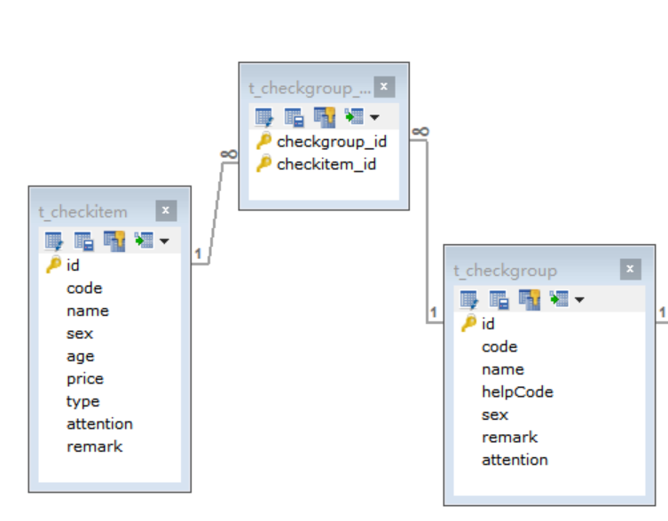
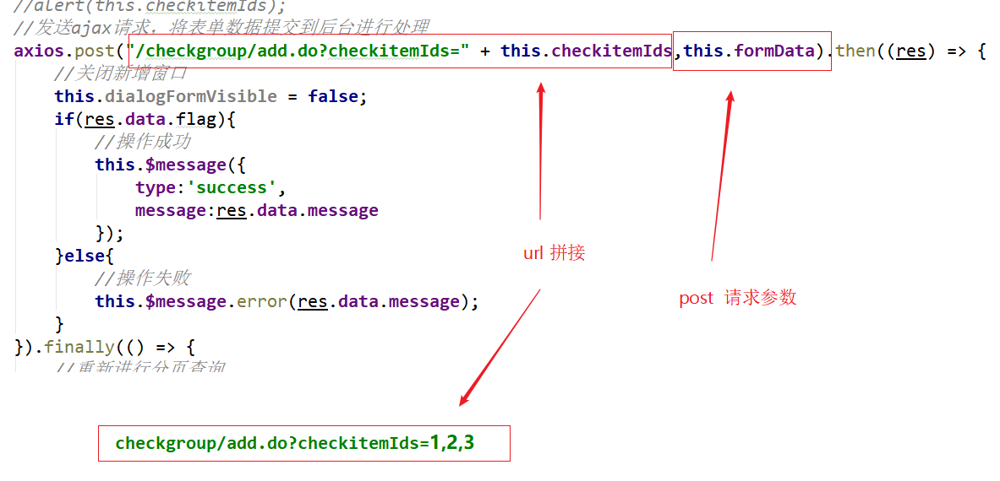

##01-需求分析.avi	02:01

```
新知识:
	无: 
功能:
	综合运用 ElementUI +VUE +dubbo +ssm+完成项目多表的关联操作
```


```
小结内容:
	一个检查组包含多个检查项
	涉及到的表
	SELECT * FROM t_checkitem;
	SELECT * FROM t_checkgroup;
	SELECT * FROM t_checkgroup_checkitem;
```
表与表之间的关系为多对多



##02-新增检查组_完善页面（弹出新增窗口）.avi	05:41

```js
小结内容:
	修改标记,弹出窗口,每次清空窗口
```
检查组管理页面对应的是checkgroup.html页面，根据产品设计的原型已经完成了页面基
本结构的编写，现在需要完善页面动态效果。

新建按钮绑定单击事件，对应的处理函数为handleCreate

```html
<el‐button type="primary" class="butT" @click="handleCreate()">新建</elbutton>
```

```javascript
// 重置表单
resetForm() {
	this.formData = {};
},
// 弹出添加窗口
handleCreate() {
    this.resetForm();
    this.dialogFormVisible = true;
}
```

##03-新增检查组_完善页面（发送ajax请求查询所有检查项数据）.avi	06:40

```
小结内容:
	发送ajax请求查询所有检查项数据
```
（1）定义模型数据

```javascript
tableData:[],//新增和编辑表单中对应的检查项列表数据
```

（2）发送ajax请求

```javascript
                // 弹出添加窗口
                handleCreate() {
                    this.resetForm()
                    this.dialogFormVisible = true
                    axios.get("/checkitem/findAll.do").then((res)=>{
                        if(res.data.flag){
                            this.tableData = res.data.data
                        }else{
                            this.$message.error(res.data.message)
                        }
                    })
                },
```

##04-新增检查组_完善页面（后台查询检查项数据）.avi	05:22

```
小结内容:
	后台查询检查项数据,发送 服务器返回list 集合
```
CheckItemController：

```java
//查询所有
@RequestMapping("/findAll")
public Result findAll(){
List<CheckItem> checkItemList = checkItemService.findAll();
    if(checkItemList != null && checkItemList.size() > 0){
        Result result = new Result(true,
        MessageConstant.QUERY_CHECKITEM_SUCCESS);
        result.setData(checkItemList);
        return result;
    }
	return new Result(false,MessageConstant.QUERY_CHECKITEM_FAIL);
}
```

CheckItemService：

```java
public List<CheckItem> findAll();
```

CheckItemServiceImpl：

```java
public List<CheckItem> findAll() {
	return checkItemDao.findAll();
}
```

CheckItemDao：

```java
public List<CheckItem> findAll();
```

CheckItemDao.xml：

```xml
<select id="findAll" resultType="com.itheima.pojo.CheckItem">
	select * from t_checkitem
</select>
```

##05-新增检查组_完善页面（提交表单数据）.avi	15:03

```
小结内容:
	
```
1）定义模型数据

```javascript
checkitemIds:[],//新增和编辑表单中检查项对应的复选框，基于双向绑定可以进行回显
和数据提交
```

（2）发送ajax请求

```javascript
//添加
                handleAdd () {
                    axios.post("/checkgroup/add.do?checkitemIds=" + 	 this.checkitemIds,this.formData).then((res)=>{
                        this.dialogFormVisible = false
                        if(res.data.flag){
                            this.$message.success(res.data.message)
                        }else{
                            this.$message.error(res.data.message)
                        }
                    }).finally(()=>{
                        this.findPage()
                    })
                },
```


补充内容

````html
lable 标签是html 提供的功能,详见:
 https://www.w3school.com.cn/tiy/t.asp?f=html_label

<html>
<body>

<form>
<label for="male">Male</label>
<input type="radio" name="sex" id="male" />
<br />
<label for="female">Female</label>
<input type="radio" name="sex" id="female" />
</form>

</body>
</html>
````

这里我们发送的数据是 url 携带参数+ post携带参数两种混合携带数据 




##06-新增检查组_完善页面（重置复选框勾选效果）.avi	04:43

```
小结内容:
	1) this.activeName = 'first';//默认选中first对应的tab,回忆第一天的tabs 标签页
    2) this.checkitemIds = [];//重置复选框
```
```javascript
 			    // 重置表单
                resetForm() {
                    this.formData = {}   //重置第一个tab页基本信息
                    this.checkitemIds = [] //重置第二个tab页检查项信息
                    this.activeName = 'first'  //选中第一个tab页
                },
```

##07-新增检查组_后台代码（Controller、服务接口）.avi	07:50

```
小结内容:
	CheckItemController
```
```java
    //新增检查组
    @RequestMapping("/add")
    public Result add(@RequestBody CheckGroup checkGroup,Integer[] checkitemIds){
        try{
            checkGroupService.add(checkGroup,checkitemIds);
        }catch (Exception e){
            e.printStackTrace();
            return new Result(false, MessageConstant.ADD_CHECKGROUP_FAIL);//新增失败
        }
        return new Result(true,MessageConstant.ADD_CHECKGROUP_SUCCESS);//新增成功
    }
```

>checkGroup是从RequestBody中传入，所以需要加入@RequestBody注解
>
>checkitemIds要跟前端请求的URL中的参数名一致，就能自动解析

CheckGroupService:

```java
package com.itheima.service;

import com.itheima.entity.PageResult;
import com.itheima.entity.QueryPageBean;
import com.itheima.pojo.CheckGroup;

import java.util.List;

public interface CheckGroupService {
    public void add(CheckGroup checkGroup, Integer[] checkitemIds);
}

```

##08-新增检查组_后台代码（服务实现类、DAO）.avi	17:11

```
小结内容:
	1) service 
		1.1)先插入group 表 ,再插入中间表
		1.2)插入中间表,需要获取 group 表自增的主键ID
		1.3)事务问题
	2) dao 层获取主键ID
	    <!--插入检查组数据-->
    <insert id="add" parameterType="com.itheima.pojo.CheckGroup">
        <!--通过mybatis框架提供的selectKey标签获得自增产生的ID值-->
        <selectKey resultType="java.lang.Integer" order="AFTER" keyProperty="id">
            select LAST_INSERT_ID()
        </selectKey>
        insert into t_checkgroup(code,name,sex,helpCode,remark,attention)
                      values
        (#{code},#{name},#{sex},#{helpCode},#{remark},#{attention})
    </insert>

		
```
在health_service_provider工程中创建CheckGroupServiceImpl实现类:

```java
package com.itheima.service.impl;

import com.alibaba.dubbo.config.annotation.Service;
import com.github.pagehelper.Page;
import com.github.pagehelper.PageHelper;
import com.itheima.dao.CheckGroupDao;
import com.itheima.entity.PageResult;
import com.itheima.entity.QueryPageBean;
import com.itheima.pojo.CheckGroup;
import com.itheima.service.CheckGroupService;
import org.springframework.beans.factory.annotation.Autowired;
import org.springframework.transaction.annotation.Transactional;

import java.util.HashMap;
import java.util.List;
import java.util.Map;

/**
 * 检查组服务
 */

@Service(interfaceClass = CheckGroupService.class)
@Transactional
public class CheckGroupServiceImpl implements CheckGroupService {
    @Autowired
    private CheckGroupDao checkGroupDao;
    //新增检查组，同时需要让检查组关联检查项
    public void add(CheckGroup checkGroup, Integer[] checkitemIds) {
        //新增检查组，操作t_checkgroup表
        checkGroupDao.add(checkGroup);
        //设置检查组和检查项的多对多的关联关系，操作t_checkgroup_checkitem表
        Integer checkGroupId = checkGroup.getId();
        this.setCheckGroupAndCheckItem(checkGroupId,checkitemIds);
    }

        //建立检查组和检查项多对多关系
    	//批量提交 baidu
    public void setCheckGroupAndCheckItem(Integer checkGroupId,Integer[] checkitemIds){
        if(checkitemIds != null && checkitemIds.length > 0){
            for (Integer checkitemId : checkitemIds) {
                Map<String,Integer> map = new HashMap<>();
                map.put("checkgroupId",checkGroupId);
                map.put("#{checkitemId",checkitemId);
                checkGroupDao.setCheckGroupAndCheckItem(map);
            }
        }
    }
   
}

```

创建CheckGroupDao接口

```java
package com.itheima.dao;

import com.github.pagehelper.Page;
import com.itheima.pojo.CheckGroup;

import java.util.List;
import java.util.Map;

public interface CheckGroupDao {
    public void add(CheckGroup checkGroup);
    public void setCheckGroupAndCheckItem(Map map);
}

```

创建CheckGroupDao.xml映射文件

```xml
<?xml version="1.0" encoding="UTF-8" ?>
<!DOCTYPE mapper PUBLIC "-//mybatis.org//DTD Mapper 3.0//EN"
        "http://mybatis.org/dtd/mybatis-3-mapper.dtd" >
<mapper namespace="com.itheima.dao.CheckGroupDao">
    <!--插入检查组数据-->
    <insert id="add" parameterType="com.itheima.pojo.CheckGroup">
        <!--通过mybatis框架提供的selectKey标签获得自增产生的ID值-->
        <selectKey resultType="java.lang.Integer" order="AFTER" keyProperty="id">
            select LAST_INSERT_ID()
        </selectKey>
        insert into t_checkgroup(code,name,sex,helpCode,remark,attention)
                      values
        (#{code},#{name},#{sex},#{helpCode},#{remark},#{attention})
    </insert>

    <!--设置检查组和检查项多对多关系-->
    <insert id="setCheckGroupAndCheckItem" parameterType="map">
        insert into t_checkgroup_checkitem(checkgroup_id,checkitem_id)
        values
        (#{checkgroupId},#{checkitemId})
    </insert>

</mapper>
```

拓展：

更简单的方式：

```xml
    <insert id="add" parameterType="com.itheima.pojo.CheckGroup" useGeneratedKeys="true" keyProperty="id">
        <!--通过mybatis框架提供的selectKey标签获得自增产生的ID值-->
        insert into t_checkgroup(code,name,sex,helpCode,remark,attention)
        values
        (#{code},#{name},#{sex},#{helpCode},#{remark},#{attention})
    </insert>
```

>useGeneratedKeys使用JDBC获取自动生成出来的ID值
>
>keyProperty赋值到实体对象中的哪个字段

##09-新增检查组_测试.avi	02:37

```
小结内容:
test
```
> 1.先install所有项目
>
> 2.启动service_provider
>
> 3.启动backend

##10-检查组分页_完善页面.avi	08:32

```
小结内容:
	1) 分页数据封装
	2) 查询方法
	3) 什么时候调用
```


定义分页相关模型数据

```javascript
pagination: {//分页相关模型数据
    currentPage: 1,//当前页码
    pageSize:10,//每页显示的记录数
    total:0,//总记录数
    queryString:null//查询条件
},
dataList: [],//当前页要展示的分页列表数据
```

定义分页方法

```javascript
//钩子函数，VUE对象初始化完成后自动执行
created() {
	this.findPage();
}
```

分页查询

```javascript
				//分页查询
                findPage() {
                    var param = {
                        currentPage : this.pagination.currentPage,
                        pageSize  : this.pagination.pageSize,
                        queryString : this.pagination.queryString
                    }
                    axios.post("/checkgroup/findPage.do",param).then((res)=>{
                        this.pagination.total = res.data.total
                        this.dataList = res.data.rows
                    })
                },
```


##11-检查组分页_测试页面发送的请求.avi	04:14

```
小结内容:
	测试出分页条没有改造,并修复
```
除了在created钩子函数中调用findPage方法查询分页数据之外，当用户点击查询按钮或
者点击分页条中的页码时也需要调用findPage方法重新发起查询请求。
为查询按钮绑定单击事件，调用findPage方法

```html
<el‐button @click="findPage()" class="dalfBut">查询</el‐button>
```

为分页条组件绑定current-change事件，此事件是分页条组件自己定义的事件，当页码
改变时触发，对应的处理函数为handleCurrentChange

```html
<el‐pagination
class="pagiantion"
@current‐change="handleCurrentChange"
:current‐page="pagination.currentPage"
:page‐size="pagination.pageSize"
layout="total, prev, pager, next, jumper"
:total="pagination.total">
</el‐pagination>
```

定义handleCurrentChange方法

```javascript
//切换页码
handleCurrentChange(currentPage) {
    //currentPage为切换后的页码
    this.pagination.currentPage = currentPage;
    this.findPage();
}
```

##12-检查组分页_后台代码（Controller、服务接口）.avi	04:30

```
小结内容:
	我们发送的数据时json 所以后台接收数据时用 @RequsetBody
	1) @RequsetBody 作用  json 转对象  ,如果请求数据不是json   就不用添加该注解
	2)  @RequsetBody  要求 1)数据必须是json不能为 "" ,也不能为null  但是可以是 {} /[]
	                      2)post 请求
  @RequestMapping("/findPage")  斜杠 可加可不加
```
在CheckGroupController中增加分页查询方法

```java
    //分页查询
    @RequestMapping("/findPage")
    public PageResult findPage(@RequestBody QueryPageBean queryPageBean){
        return checkGroupService.pageQuery(queryPageBean);
    }
```

在CheckGroupService服务接口中扩展分页查询方法

```java
public PageResult pageQuery(QueryPageBean queryPageBean);
```

##13-检查组分页_后台代码（服务实现类、DAO）.avi	09:30

```
小结内容:
	1) 处理参数
	2) 分页查询
	3) 结果处理封装
```
在CheckGroupServiceImpl服务实现类中实现分页查询方法，基于Mybatis分页助手插件实现分页

```java
//分页查询
    public PageResult pageQuery(QueryPageBean queryPageBean) {
        Integer currentPage = queryPageBean.getCurrentPage();
        Integer pageSize = queryPageBean.getPageSize();
        String queryString = queryPageBean.getQueryString();
        // 设置分页参数,当我们设置完,第一个查询有效,后续查询无效 
        // 返回值 Page 是ArrayList的子类
        PageHelper.startPage(currentPage,pageSize);
        Page<CheckGroup> page = checkGroupDao.findByCondition(queryString);
        return new PageResult(page.getTotal(),page.getResult());
    }
```

在CheckGroupDao接口中扩展分页查询方法

```java
public Page<CheckGroup> selectByCondition(String queryString);
```

在CheckGroupDao.xml文件中增加SQL定义

```xml
<!-- 当我们的 参数只有一个时  if test 中 必须使用  value  -->

<select id="selectByCondition" parameterType="string"
resultType="com.itheima.pojo.CheckGroup">
select * from t_checkgroup
<if test="value != null and value.length > 0">
where code =#{value} or name = #{value} or helpCode = #{value}
</if>
</select>
```


##14-检查组分页_测试.avi	03:10

```
小结内容:
	
```
补:

​	https://pagehelper.github.io/docs/howtouse/

##15-编辑检查组_完善页面（弹出编辑窗口）.avi	03:59

编辑 

​	1) 弹窗

​    2)基本信息的回显

​    3) 列出所有的检查项

​    4) 检查项勾选

​    5) 提交数据

​		   中间表: 先删除后插入

```
小结内容:
	修改显示标记,弹出编辑窗口
```
```javascript
			// 弹出编辑窗口
                handleUpdate(row) {
                    // row 包含表格中展示的数据和未展示的隐藏数据
                    this.dialogFormVisible4Edit = true;
                }
```

##16-编辑检查组_完善页面（发送请求回显检查组基本信息）.avi	04:03

```
小结内容:
	基本信息回显
```
```javascript
//  res.data.flag 有些时候有flag 有时无,是因为服务器返回结果不一样	
handleUpdate(row) {
                    //弹出编辑窗口
                    this.dialogFormVisible4Edit = true;
                    this.activeName = 'first';
                    //发送ajax请求，根据检查组ID查询当前检查组数据，用于基本信息的回显
                    axios.get("/checkgroup/findById.do?id=" + row.id).then((res) => {
                        if(res.data.flag){
                            //查询到数据
                            this.formData = res.data.data;
                        }else{
                            //查询数据失败
                            this.$message.error(res.data.message);
                        }
                    });
                 
                }
```

##17-编辑检查组_完善页面（发送请求回显检查项信息）.avi	13:49

```
小结内容:
	服务器返回的数据 [31,32,33] 所以我们直接赋值即可
```
```javascript
  // 弹出编辑窗口
                handleUpdate(row) {
                    //弹出编辑窗口
                    this.dialogFormVisible4Edit = true;
                    this.activeName = 'first';
                    //发送ajax请求，根据检查组ID查询当前检查组数据，用于基本信息的回显
                    axios.get("/checkgroup/findById.do?id=" + row.id).then((res) => {
                        if(res.data.flag){
                            //查询到数据
                            this.formData = res.data.data;
                        }else{
                            //查询数据失败
                            this.$message.error(res.data.message);
                        }
                    });
                    //发送ajax请求，查询所有的检查项数据，用于展示检查项列表
                    axios.get("/checkitem/findAll.do").then((res) => {
                        if(res.data.flag){
                            //查询检查项数据成功
                            this.tableData = res.data.data;
                            //发送ajax请求，根据检查组ID查询当前检查组包含的检查项ID，用于页面复选框回显
                            axios.get("/checkgroup/findCheckItemIdsByCheckGroupId.do?id=" + row.id).then((res) => {
                                if(res.data.flag){
                                    this.checkitemIds = res.data.data;
                                }else{
                                    this.$message.error(res.data.message);
                                }
                            });
                        }else{
                            //查询检查项数据失败
                            this.$message.error(res.data.message);
                        }
                    });

                }
```

##18-编辑检查组_后台代码（根据ID查询检查组）.avi	05:52

```
小结内容:
	完善服务器信息,查询基本的服务器端代码 
```
在CheckGroupController中增加方法

```java
//根据id查询
@RequestMapping("/findById")
public Result findById(Integer id){
    CheckGroup checkGroup = checkGroupService.findById(id);
    if(checkGroup != null){
        Result result = new Result(true,
        MessageConstant.QUERY_CHECKGROUP_SUCCESS);
        result.setData(checkGroup);
        return result;
    }
    return new Result(false,MessageConstant.QUERY_CHECKGROUP_FAIL);
}
```

在CheckGroupService服务接口中扩展方法

```java
CheckGroup findById(Integer id);
```

在CheckGroupServiceImpl实现类中实现编辑方法

```java
public CheckGroup findById(Integer id) {
	return checkGroupDao.findById(id);
}
```

在CheckGroupDao接口中扩展方法

```java
CheckGroup findById(Integer id);
```

在CheckGroupDao.xml中扩展SQL语句

```xml
<select id="findById" parameterType="int"
resultType="com.itheima.pojo.CheckGroup">
select * from t_checkgroup where id = #{id}
</select>

<select id="findCheckItemIdsByCheckGroupId" parameterType="int"
resultType="int">
select checkitem_id from t_checkgroup_checkitem where checkgroup_id = #{id}
</select>
```

##19-编辑检查组_测试检查组基本信息回显.avi	01:49

```
小结内容:
	1)common 和interface 变化,需要clean install  重启
	2)controller 层 java 或者 配置 变化了 重启
	3)service/dao  层 java 或者 配置 变化了 重启
	4)如果只是html 变化,清缓存刷新即可
```
##20-编辑检查组_后台代码（根据检查组ID查询检查组关联的检查项ID）.avi	08:51
```
小结内容:
	根据检查组ID查询检查组关联的检查项ID
```
在CheckGroupController中增加方法

```java
//根据检查组合id查询对应的所有检查项id
@RequestMapping("/findCheckItemIdsByCheckGroupId")
public Result findCheckItemIdsByCheckGroupId(Integer id){
try{
        List<Integer> checkitemIds =
        checkGroupService.findCheckItemIdsByCheckGroupId(id);
        return new
        Result(true,MessageConstant.QUERY_CHECKITEM_SUCCESS,checkitemIds);
    }catch (Exception e){
        e.printStackTrace();
        return new Result(false, MessageConstant.QUERY_CHECKITEM_FAIL);
    }
}
```

在CheckGroupService服务接口中扩展方法

```java
List<Integer> findCheckItemIdsByCheckGroupId(Integer id);
```

在CheckGroupServiceImpl实现类中实现编辑方法

```java
public List<Integer> findCheckItemIdsByCheckGroupId(Integer id) {
	return checkGroupDao.findCheckItemIdsByCheckGroupId(id);
}
```

在CheckGroupDao接口中扩展方法

```java
List<Integer> findCheckItemIdsByCheckGroupId(Integer id);
```

在CheckGroupDao.xml中扩展SQL语句

```xml
<select id="findCheckItemIdsByCheckGroupId" parameterType="int"
resultType="int">
select checkitem_id from t_checkgroup_checkitem where checkgroup_id = #{id}
</select>
```

##21-编辑检查组_测试检查项复选框回显.avi	03:29

```
小结内容:
	
```
```javascript
//切换到第一页
this.activeName = 'first';
```

​	

##22-编辑检查组_完善页面（发送请求提交修改后的数据）.avi	06:49

```
小结内容:
	
```
```javascript
 				//编辑
                handleEdit() {
                    //发送ajax请求，提交模型数据
                    axios.post("/checkgroup/edit.do?checkitemIds="+this.checkitemIds,this.formData).
                    then((response)=> {
                    //隐藏编辑窗口
                        this.dialogFormVisible4Edit = false;
                        if(response.data.flag){
                            this.$message({
                                message: response.data.message,
                                type: 'success'
                            });
                        }else{
                            this.$message.error(response.data.message);
                        }
                    }).finally(()=> {
                        this.findPage();
                    });
                },
```

##23-编辑检查组_后台代码（Controller、服务接口、实现类、DAO）.avi	15:28

```
小结内容:
	先删除关联的中间表信息,再插入中间表 
```
在CheckGroupController中增加方法

```java
//编辑
@RequestMapping("/edit")
public Result edit(@RequestBody CheckGroup checkGroup,Integer[]
checkitemIds){
    try {
    	checkGroupService.edit(checkGroup,checkitemIds);
    }catch (Exception e){
   		 return new Result(false,MessageConstant.EDIT_CHECKGROUP_FAIL);
    }
    return new Result(true,MessageConstant.EDIT_CHECKGROUP_SUCCESS);
}
```

在CheckGroupService服务接口中扩展方法

```java
public void edit(CheckGroup checkGroup,Integer[] checkitemIds);
```

在CheckGroupServiceImpl实现类中实现编辑方法

```java
//编辑检查组，同时需要更新和检查项的关联关系
public void edit(CheckGroup checkGroup, Integer[] checkitemIds) {
//根据检查组id删除中间表数据（清理原有关联关系）
	checkGroupDao.deleteAssociation(checkGroup.getId());
//向中间表(t_checkgroup_checkitem)插入数据（建立检查组和检查项关联关系）
	setCheckGroupAndCheckItem(checkGroup.getId(),checkitemIds);
//更新检查组基本信息
	checkGroupDao.edit(checkGroup);
}

//麻烦的业务逻辑
// 新提交的数据 循环判断  是否存在
	如果存在不处理
        如果不存在 插入
  //  
//已有的老数据 循环判断  是否存在
	如果存在不处理
        如果不存在 删除
```

在CheckGroupDao接口中扩展方法

```java
void deleteAssociation(Integer id);
void edit(CheckGroup checkGroup);
```

在CheckGroupDao.xml中扩展SQL语句

```xml
<!‐‐根据检查组id删除中间表数据（清理原有关联关系）‐‐>
<delete id="deleteAssociation" parameterType="int">
delete from t_checkgroup_checkitem where checkgroup_id = #{id}
</delete>
<!‐‐编辑‐‐>
<update id="edit" parameterType="com.itheima.pojo.CheckGroup">
update t_checkgroup
<set>
<if test="name != null">
name = #{name},
</if>
<if test="sex != null">
sex = #{sex},
</if>
<if test="code != null">
code = #{code},
</if>
<if test="helpCode != null">
helpCode = #{helpCode},
</if>
<if test="attention != null">
attention = #{attention},
</if>
<if test="remark != null">
remark = #{remark},
</if>
</set>
where id = #{id}
</update>
```

##24-编辑检查组_测试.avi	02:00

```
小结内容:
   测试
```

  删除比较简单，留给同学们自行实现	