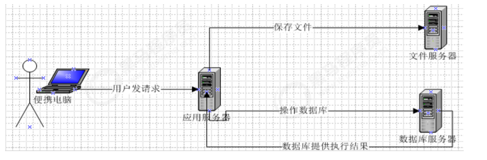
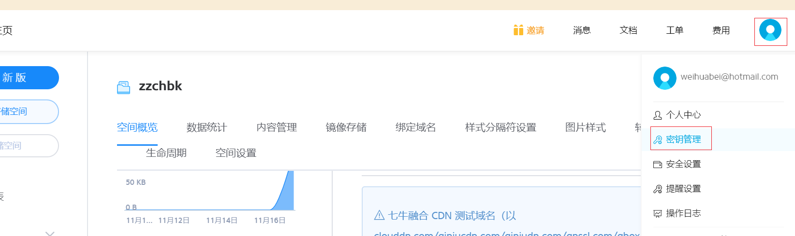
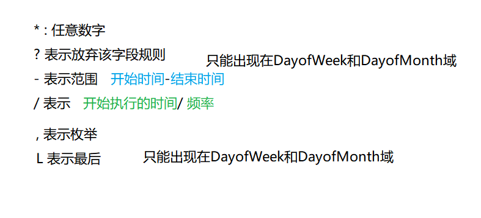

##01-本章内容介绍.avi	02:22
```
小结内容:
	今日新知识:	 1)七牛云存储
			    2)定时任务处理框 Quartz 
    功能 :
                1)新增套餐 ,分页查询套餐表
                2)定时清理垃圾图片
```
##02-图片存储方案（介绍）.avi	05:18
```
小结内容:
	在实际开发中，我们会有很多处理不同功能的服务器。例如：
    应用服务器：负责部署我们的应用
    数据库服务器：运行我们的数据库
    文件服务器：负责存储用户上传文件的服务器
```
在实际开发中，我们会有很多处理不同功能的服务器。例如：
应用服务器：负责部署我们的应用
数据库服务器：运行我们的数据库
文件服务器：负责存储用户上传文件的服务器



分服务器处理的目的是让服务器各司其职，从而提高我们项目的运行效率。


思考:

​	我们的文件存储要考虑哪些问题?

```
1) 文件涉及IO 操作,一单处理不好,涉及性能问题
2) 数据备份(灾备) ,要保证即使导弹袭击了机房,我们的数据依旧不丢失
```

方案:

```
方案一：使用nginx搭建图片服务器(思考为啥推荐使用nginx而不是tomcat:答:静态资源部署nginx性能是tomcat 的100倍 )
方案二：使用开源的分布式文件存储系统，例如Fastdfs、HDFS等
方案三：使用云存储，例如阿里云、七牛云等  (不是很贵,对中小型企业来讲是最便宜的方案)
		大型企业一般不用这些服务,一般会选择自己搭建服务器存储自己的数据(保密)

隐私不要求
业务量小   
能联网
```


##03图片存储方案_七牛云存储（注册、登录、实名认证）.avi	05:20

```
小结内容:
	官网注册,认证,认证后才能使用上传
```
七牛云（隶属于上海七牛信息技术有限公司）是国内领先的以视觉智能和数据智能为核
心的企业级云计算服务商，同时也是国内知名智能视频云服务商，累计为 70 多万家企业
提供服务，覆盖了国内80%网民。围绕富媒体场景推出了对象存储、融合 CDN 加速、容
器云、大数据平台、深度学习平台等产品、并提供一站式智能视频云解决方案。为各行
业及应用提供可持续发展的智能视频云生态，帮助企业快速上云，创造更广阔的商业价
值。
官网：https://www.qiniu.com/
通过七牛云官网介绍我们可以知道其提供了多种服务，我们主要使用的是七牛云提供的
对象存储服务来存储图片。

1.要使用七牛云的服务，首先需要注册成为会员。地址：https://portal.qiniu.com/signup

注册完成后就可以使用刚刚注册的邮箱和密码登录到七牛云。

2.登录成功后点击页面右上角管理控制台,注意：登录成功后还需要进行实名认证才能进行相关操作。

##04-图片存储方案_七牛云存储（新建、查看存储空间）.avi	04:06

```
小结内容:
	要进行图片存储，我们需要在七牛云管理控制台新建存储空间。点击管理控制台首页对
象存储下的立即添加按钮，页面跳转到新建存储空间页面。
```
##05-图片存储方案_七牛云存储（鉴权）.avi	05:51
```
小结内容:
	
```
可以通过七牛云提供的开发者中心学习如何操作七牛云服务，地
址：https://developer.qiniu.com/

点击对象存储，跳转到对象存储开发页面，地址：https://developer.qiniu.com/kodo
七牛云提供了多种方式操作对象存储服务，本项目采用Java SDK方式，地
址：		

https://developer.qiniu.com/kodo/sdk/1239/java

使用Java SDK操作七牛云需要导入如下maven坐标：

```xml
<dependency>
<groupId>com.qiniu</groupId>
<artifactId>qiniu‐java‐sdk</artifactId>
<version>7.2.0</version>
</dependency>
```


```xml
<dependency>
  <groupId>com.qiniu</groupId>
  <artifactId>qiniu-java-sdk</artifactId>
  <version>[7.2.0, 7.2.99]</version>
</dependency>
```

这里的`version`指定了一个版本范围，每次更新`pom.xml`的时候会尝试去下载`7.2.x`版本中的最新版本，你可以手动指定一个固定的版本。


### 手动下载


Java SDK的所有的功能，都需要合法的授权。授权凭证的签算需要七牛账号下的一对有
效的Access Key和Secret Key，这对密钥可以在七牛云管理控制台的个人中心
（https://portal.qiniu.com/user/key）获得，如下图：




##06-图片存储方案_七牛云存储（使用七牛云提供的SDK实现文件上传）.avi	12:52

```java
小结内容:
@Test
    public void test1(){
        //构造一个带指定Zone对象的配置类
        Configuration cfg = new Configuration(Zone.zone0());
        //...其他参数参考类注释
        UploadManager uploadManager = new UploadManager(cfg);
        //...生成上传凭证，然后准备上传
        // http://q39xc57ab.bkt.clouddn.com/

      String accessKey = "Cew_rMz52hX6r0jwJJCz47D-cJIue8_tv-mZcfYV";
     String secretKey = "g-acIZBq-jKTORq3fytjnLsv4iCJP0PZJdOkUZAO";
     String bucket = "zzczbk";
        //如果是Windows情况下，格式是 D:\\qiniu\\test.png
        String localFilePath = "C:\\Users\\huabei\\Desktop\\001.png";
        //默认不指定key的情况下，以文件内容的hash值作为文件名
        String key = "1";// 文件名称
        Auth auth = Auth.create(accessKey, secretKey);
        String upToken = auth.uploadToken(bucket);
        try {
            Response response = uploadManager.put(localFilePath, key, upToken);
            //解析上传成功的结果
            DefaultPutRet putRet = new Gson().fromJson(response.bodyString(), DefaultPutRet.class);
            System.out.println(putRet.key);
            System.out.println(putRet.hash);
        } catch (QiniuException ex) {
            Response r = ex.response;
            System.err.println(r.toString());
            try {
                System.err.println(r.bodyString());
            } catch (QiniuException ex2) {
                //ignore
            }
        }
    }

http://q14fwff8e.bkt.clouddn.com/

```
特别注意zone的选择：

| 机房   | Zone对象         |
| :----- | :--------------- |
| 华东   | `Zone.zone0()`   |
| 华北   | `Zone.zone1()`   |
| 华南   | `Zone.zone2()`   |
| 北美   | `Zone.zoneNa0()` |
| 东南亚 | `Zone.zoneAs0()` |


##07-图片存储方案_七牛云存储（使用七牛云提供的SDK实现文件删除）.avi	03:16

```java
    //删除七牛云服务器中的图片
    @Test
    public void test2(){
        //构造一个带指定Zone对象的配置类
        Configuration cfg = new Configuration(Zone.zone0());
        //...其他参数参考类注释
        String accessKey = "3wF512DyU1BeEQYELU0HBqct01Pfmlbvcq4B72Pm";
        String secretKey = "QosDLK40caH1fyr4Sw7iC-XOkrK4RkHJqBhNK3Tv";
        String bucket = "zzczbk";
        String key = "Fsln3Hf-mu0oi7A_M8XENG7zA9mC";
        Auth auth = Auth.create(accessKey, secretKey);
        BucketManager bucketManager = new BucketManager(auth, cfg);
        try {
            bucketManager.delete(bucket, key);
        } catch (QiniuException ex) {
            //如果遇到异常，说明删除失败
            System.err.println(ex.code());
            System.err.println(ex.response.toString());
        }
    }小结内容:
	
```
##08-图片存储方案_七牛云存储（封装工具类）.avi	02:43
```
小结内容:
	
```
## 

```java
package com.itheima.utils;

import com.google.gson.Gson;
import com.qiniu.common.QiniuException;
import com.qiniu.common.Zone;
import com.qiniu.http.Response;
import com.qiniu.storage.BucketManager;
import com.qiniu.storage.Configuration;
import com.qiniu.storage.UploadManager;
import com.qiniu.storage.model.DefaultPutRet;
import com.qiniu.util.Auth;
import java.io.File;
import java.io.FileInputStream;
import java.io.InputStream;

/**
 * 七牛云工具类
 */
public class QiniuUtils {
    public  static String accessKey = "dulF9Wze9bxujtuRvu3yyYb9JX1Sp23jzd3tO708";
    public  static String secretKey = "vZkhW7iot3uWwcWz9vXfbaP4JepdWADFDHVLMZOe";
    public  static String bucket = "itcasthealth_space_1";

    public static void upload2Qiniu(String filePath,String fileName){
        //构造一个带指定Zone对象的配置类
        Configuration cfg = new Configuration(Zone.zone0());
        UploadManager uploadManager = new UploadManager(cfg);
        Auth auth = Auth.create(accessKey, secretKey);
        String upToken = auth.uploadToken(bucket);
        try {
            Response response = uploadManager.put(filePath, fileName, upToken);
            //解析上传成功的结果
            DefaultPutRet putRet = new Gson().fromJson(response.bodyString(), DefaultPutRet.class);
        } catch (QiniuException ex) {
            Response r = ex.response;
            try {
                System.err.println(r.bodyString());
            } catch (QiniuException ex2) {
                //ignore
            }
        }
    }

    //上传文件
    public static void upload2Qiniu(byte[] bytes, String fileName){
        //构造一个带指定Zone对象的配置类
        Configuration cfg = new Configuration(Zone.zone0());
        //...其他参数参考类注释
        UploadManager uploadManager = new UploadManager(cfg);

        //默认不指定key的情况下，以文件内容的hash值作为文件名
        String key = fileName;
        Auth auth = Auth.create(accessKey, secretKey);
        String upToken = auth.uploadToken(bucket);
        try {
            Response response = uploadManager.put(bytes, key, upToken);
            //解析上传成功的结果
            DefaultPutRet putRet = new Gson().fromJson(response.bodyString(), DefaultPutRet.class);
            System.out.println(putRet.key);
            System.out.println(putRet.hash);
        } catch (QiniuException ex) {
            Response r = ex.response;
            System.err.println(r.toString());
            try {
                System.err.println(r.bodyString());
            } catch (QiniuException ex2) {
                //ignore
            }
        }
    }

    //删除文件
    public static void deleteFileFromQiniu(String fileName){
        //构造一个带指定Zone对象的配置类
        Configuration cfg = new Configuration(Zone.zone0());
        String key = fileName;
        Auth auth = Auth.create(accessKey, secretKey);
        BucketManager bucketManager = new BucketManager(auth, cfg);
        try {
            bucketManager.delete(bucket, key);
        } catch (QiniuException ex) {
            //如果遇到异常，说明删除失败
            System.err.println(ex.code());
            System.err.println(ex.response.toString());
        }
    }
}

```

##09-新增套餐（需求分析）.avi	02:03

```
小结内容:
	 套餐其实就是检查组的集合
```
​	套餐其实就是检查组的集合，例如有一个套餐为“入职体检套餐”，这个体检套餐可以包括
多个检查组：一般检查、血常规、尿常规、肝功三项等。所以在添加套餐时需要选择这
个套餐包括的检查组。
套餐对应的实体类为Setmeal，对应的数据表为t_setmeal。套餐和检查组为多对多关
系，所以需要中间表t_setmeal_checkgroup进行关联。


##10-新增套餐_页面调整（弹出新增窗口）.avi	06:15

```
小结内容:
	和之前的弹出窗口一致	
	\资源\页面\setmeal-blank.html
```
```js
	// 重置表单
                resetForm() {
                    this.formData = {}
                    this.activeName = 'first'
                    //1.重置检查组数据
                    //2.重置检查组选中的信息
                    //3.重置图片
                },
                // 弹出添加窗口
                handleCreate() {
                    this.resetForm()
                    this.dialogFormVisible = true
                },
```

CheckGroupController：

```java
//查询所有
@RequestMapping("/findAll")
public Result findAll(){
    List<CheckGroup> checkGroupList = checkGroupService.findAll();
    if(checkGroupList != null && checkGroupList.size() > 0){
    Result result = new Result(true,
    MessageConstant.QUERY_CHECKGROUP_SUCCESS);
    result.setData(checkGroupList);
    return result;
}
	return new Result(false,MessageConstant.QUERY_CHECKGROUP_FAIL);
}
```

CheckGroupService：

```java
List<CheckGroup> findAll();
```

CheckGroupServiceImpl：

```JAVA
public List<CheckGroup> findAll() {
	return checkGroupDao.findAll();
}
```

CheckGroupDao：

```java
List<CheckGroup> findAll();
```

CheckGroupDao.xml：

```java
<select id="findAll" resultType="com.itheima.pojo.CheckGroup">
	select * from t_checkgroup
</select>
```


##11-新增套餐_页面调整（动态展示检查组列表）.avi	11:04

```
小结内容:
	发送ajax 请求,controller,service,dao   ,书写时注意各个层的代码编写注意事项
	controller:接受参数注意事项
	service: 事务
	dao: 六点注意事项
```


##12-新增套餐_页面调整（ElementUI提供的上传组件使用方法）.avi	12:36

参考资料：https://element.eleme.cn/#/zh-CN/component/upload

（1）定义模型数据，用于后面上传文件的图片预览：

```javascript
imageUrl:null,//模型数据，用于上传图片完成后图片预览
```

（2）定义上传组件：

```html
<!‐‐
el‐upload：上传组件
action：上传的提交地址
auto‐upload：选中文件后是否自动上传
name：上传文件的名称，服务端可以根据名称获得上传的文件对象
show‐file‐list：是否显示已上传文件列表
on‐success：文件上传成功时的钩子
before‐upload：上传文件之前的钩子
‐‐>
<el‐upload
class="avatar‐uploader"
action="/setmeal/upload.do"
:auto‐upload="autoUpload"
name="imgFile"
:show‐file‐list="false"
:on‐success="handleAvatarSuccess"
:before‐upload="beforeAvatarUpload">
<!‐‐用于上传图片预览‐‐>

<!‐‐用于展示上传图标‐‐>
<i v‐else class="el‐icon‐plus avatar‐uploader‐icon"></i>
</el‐upload>
```

```javascript
 
  //  // === 和 == 的区别
                        //   ===  值和类型要一致  1==='1'  false
                        //   == 只比较值  1=='1'  true
//上传图片之前执行
                beforeAvatarUpload(file) {
				  const isJPG = file.type === 'image/jpeg';
				  const isLt2M = file.size / 1024 / 1024 < 2;
				  if (!isJPG) {
					this.$message.error('上传套餐图片只能是 JPG 格式!');
				  }
				  if (!isLt2M) {
					this.$message.error('上传套餐图片大小不能超过 2MB!');
				  }
				  return isJPG && isLt2M;
                },
```

>当图片未上传是imageUrl为null，所以会触发v‐else分支，展示上传图片图标。如果上传成功imageUrl有值，那就显示图片预览


##13-新增套餐_页面调整（使用ElementUI提供的上传组件进行上传）.avi	08:19

```js
小结内容:
	//文件上传成功后的钩子，response为服务端返回的值，file为当前上传的文件封装成的js对象
 handleAvatarSuccess(response, file) {
      //为模型数据imageUrl赋值，用于页面图片预览
      this.imageUrl = 'http://q14fwff8e.bkt.clouddn.com/' + response.data;
      this.$message({
      					type:response.flag ? 'success':'error',
                        message:response.message
                    });
       //设置模型数据（图片名称），后续提交ajax请求时会提交到后台最终保存到数据库
     
       // 放入 formData 提交后台存储数据库用的
 // formData  对象,在js  中对象扩展属性只需要直接添加即可, this.formData.abc而且随时可变
     
      this.formData.img = response.data;
 },
```
##14-新增套餐_后台代码（将文件上传到七牛云服务器）.avi	15:18

文件上传表单三要素:

```
1)  form表单  提交方式必须是post
2)  form表单  enctype=多部分表单形式
3)  input type='file' ; 因为普通属性无法访问本地磁盘文件
```

```java
小结内容:
	   //文件上传
    @RequestMapping("/upload")
    public Result upload(@RequestParam("imgFile") MultipartFile imgFile){
        System.out.println(imgFile);
        String originalFilename = imgFile.getOriginalFilename();//原始文件名 3bd90d2c-4e82-42a1-a401-882c88b06a1a2.jpg
        int index = originalFilename.lastIndexOf(".");
        String extention = originalFilename.substring(index - 1);//.jpg  无需 "-1 "
        String fileName = UUID.randomUUID().toString() + extention;//	FuM1Sa5TtL_ekLsdkYWcf5pyjKGu.jpg
        try {
            //将文件上传到七牛云服务器
            QiniuUtils.upload2Qiniu(imgFile.getBytes(),fileName);
        } catch (IOException e) {
            e.printStackTrace();
            return new Result(false, MessageConstant.PIC_UPLOAD_FAIL);
        }
        return new Result(true, MessageConstant.PIC_UPLOAD_SUCCESS,fileName);
    }
```
```
使用随机生成的UUID防止文件名重复，在七牛云中会自动覆盖
```

注意：别忘了在spring配置文件中配置文件上传组件

```XML
<!‐‐文件上传组件‐‐>
<bean id="multipartResolver"
class="org.springframework.web.multipart.commons.CommonsMultipartResolver
">
<property name="maxUploadSize" value="104857600" />
<property name="maxInMemorySize" value="4096" />
<property name="defaultEncoding" value="UTF‐8"/>
</bean>
```


##15-新增套餐_测试文件上传并预览.avi	03:33

1.上传文件

2.调用后端上传文件接口，上传至七牛云，返回文件名

3.上传钩子函数获取文件名进行展示

​	

##16-新增套餐_页面调整（发送请求提交表单数据）.avi	08:32
```
小结内容:
	其他项目的前端效果实现及数据提交
```
```js
// 重置表单
            resetForm() {
                this.formData = {}
                this.activeName = 'first'
                this.imageUrl = null			//重置上传的图片
                this.checkgroupIds = []			//重置选中的检查组
            },
                  //添加
            handleAdd () {
                //发送ajax请求，将表单数据（套餐基本信息、检查组ID）提交到后台进行处理
                axios.post("/setmeal/add.do?checkgroupIds=" + this.checkgroupIds,this.formData).then((res) => {
                    //关闭新增窗口
                    this.dialogFormVisible = false;
                    if(res.data.flag){
                        //执行成功
                        this.$message({
                            type:'success',
                            message:res.data.message
                        });
                    }else{
                        //执行失败
                        this.$message.error(res.data.message);
                    }
                }).finally(() => {
                    this.findPage();
                });
            },
```
##17-新增套餐_后台代码（Controller、服务接口）.avi	04:42

```
小结内容:
	
```
在SetmealController中增加方法

```java
//新增
@RequestMapping("/add")
public Result add(@RequestBody Setmeal setmeal, Integer[] checkgroupIds){
    try {
    	setmealService.add(setmeal,checkgroupIds);
    }catch (Exception e){
    //新增套餐失败
    	return new Result(false,MessageConstant.ADD_SETMEAL_FAIL);
    }
    //新增套餐成功
    return new Result(true,MessageConstant.ADD_SETMEAL_SUCCESS);
}
```

创建SetmealService接口并提供新增方法

```java
package com.itheima.service;
import com.itheima.entity.PageResult;
import com.itheima.pojo.CheckGroup;
import com.itheima.pojo.Setmeal;
import java.util.List;
/**
* 体检套餐服务接口
*/
public interface SetmealService {
	public void add(Setmeal setmeal, Integer[] checkgroupIds);
}
```


##18-新增套餐_后台代码（服务实现类、DAO）.avi	12:53

```
小结内容:
	套餐表和中间表都要插入数据
```
创建SetmealServiceImpl服务实现类并实现新增方法

```java
package com.itheima.service.impl;

import com.alibaba.dubbo.config.annotation.Service;
import com.github.pagehelper.Page;
import com.github.pagehelper.PageHelper;
import com.itheima.constant.RedisConstant;
import com.itheima.dao.SetmealDao;
import com.itheima.entity.PageResult;
import com.itheima.entity.QueryPageBean;
import com.itheima.pojo.Setmeal;
import com.itheima.service.SetmealService;
import org.springframework.beans.factory.annotation.Autowired;
import org.springframework.transaction.annotation.Transactional;
import redis.clients.jedis.JedisPool;
import java.util.HashMap;
import java.util.Map;

/**
 * 体检套餐服务
 */
@Service(interfaceClass = SetmealService.class)
@Transactional
public class SetmealServiceImpl implements SetmealService{
    @Autowired
    private SetmealDao setmealDao;
    @Autowired
    private JedisPool jedisPool;

    //新增套餐信息，同时需要关联检查组
    public void add(Setmeal setmeal, Integer[] checkgroupIds) {
        //setmeal.getId() == null
        setmealDao.add(setmeal);
        //setmeal.getId() == 
        Integer setmealId = setmeal.getId();
        this.setSetmealAndCheckgroup(setmealId,checkgroupIds);
    }

    //设置套餐和检查组多对多关系，操作t_setmeal_checkgroup
    public void setSetmealAndCheckgroup(Integer setmealId,Integer[] checkgroupIds){
        if(checkgroupIds != null && checkgroupIds.length > 0){
            for (Integer checkgroupId : checkgroupIds) {
                Map<String,Integer> map = new HashMap<>();
                map.put("setmealId",setmealId);
                map.put("checkgroupId",checkgroupId);
                setmealDao.setSetmealAndCheckGroup(map);
            }
        }
    }
}

```

创建SetmealDao接口并提供相关方法

```java
package com.itheima.dao;
import com.itheima.pojo.Setmeal;
import java.util.Map;
public interface SetmealDao {
    public void add(Setmeal setmeal);
    public void setSetmealAndCheckGroup(Map<String, Integer> map);
}
```

创建SetmealDao.xml文件并定义相关SQL语句

```xml
<?xml version="1.0" encoding="UTF‐8" ?>
<!DOCTYPE mapper PUBLIC "‐//mybatis.org//DTD Mapper 3.0//EN"
"http://mybatis.org/dtd/mybatis‐3‐mapper.dtd" >
<mapper namespace="com.itheima.dao.SetmealDao" >
<!‐‐新增‐‐>
<insert id="add" parameterType="com.itheima.pojo.Setmeal">
<selectKey resultType="java.lang.Integer" order="AFTER"
keyProperty="id">
SELECT LAST_INSERT_ID()
</selectKey>
insert into t_setmeal
(code,name,sex,age,helpCode,price,remark,attention,img)
values
(#{code},#{name},#{sex},#{age},#{helpCode},#{price},#
{remark},#{attention},#{img})
</insert>
<!‐‐绑定套餐和检查组多对多关系‐‐>
<insert id="setSetmealAndCheckGroup" parameterType="hashmap">
insert into t_setmeal_checkgroup
(setmeal_id,checkgroup_id)
values
(#{setmeal_id},#{checkgroup_id})
</insert>
</mapper>
```

##19-新增套餐_测试.avi	02:52

```
小结内容:
	
```
1.前端调用后端add.do接口

2.后端先将数据保存到t_setmeal表中

3.后端将关联关系保存到t_setmeal_checkgroup表中

##20-新增套餐_完善文件上传（实现思路）.avi	07:56

```
小结内容:

	前面我们已经完成了文件上传，将图片存储在了七牛云服务器中。但是这个过程存在一
个问题，就是如果用户只上传了图片而没有最终保存套餐信息到我们的数据库，这时我
们上传的图片就变为了垃圾图片。对于这些垃圾图片我们需要定时清理来释放磁盘空
间。这就需要我们能够区分出来哪些是垃圾图片，哪些不是垃圾图片。如何实现呢？
方案就是利用redis来保存图片名称，具体做法为：
1、当用户上传图片后，将图片名称保存到redis的一个Set集合中，例如集合名称为
setmealPicResources   【1.jpg 2.jpg 3.jpg】
2、当用户添加套餐后，将图片名称保存到redis的另一个Set集合中，例如集合名称为
setmealPicDbResources  [1.jpg 3.jpg]

3、计算setmealPicResources集合与setmealPicDbResources集合的差值，结果就是垃
圾图片的名称集合，清理这些图片即可 [2.jpg] -> 七牛云删除2.jpg 两个set数据同步

```
Redis 远程连接命令

```
redis-cli -h 192.168.25.153 -p 6379
```

##### Redis 教程

```
http://www.runoob.com/redis/redis-tutorial.html
http://doc.redisfans.com/

```

Why redis?

```
性能极高 – Redis能读的速度是110000次/s,写的速度是81000次/s 。
丰富的数据类型 – Redis支持二进制案例的 Strings, Lists, Hashes, Sets 及 Ordered Sets 数据类型操作。
原子 – Redis的所有操作都是原子性的，意思就是要么成功执行要么失败完全不执行。单个操作是原子性的。多个操作也支持事务，即原子性，通过MULTI和EXEC指令包起来。
```

##### Redis 数据类型5 种

```
String: 字符串
Hash: 散列
List: 列表
Set: 集合
ZSet: 有序集合
```

##### Redis key 操作

```
flushdb
	清空当前库所有key
SET key value  
	设置值
DEL key
	该命令用于在 key 存在时删除 key。
DUMP key 
	序列化给定 key ，并返回被序列化的值。
EXPIRE key seconds
	为给定 key 设置过期时间，以秒计。
TTL key 
	以秒为单位，返回给定 key 的剩余生存时间(TTL, time to live)。
PERSIST key 
	移除 key 的过期时间，key 将持久保持。
```

##### Redis string 操作

```
INCR key
	将 key 中储存的数字值增一。
INCRBY key increment
	将 key 所储存的值加上给定的增量值（increment） 。
INCRBYFLOAT key increment
	将 key 所储存的值加上给定的浮点增量值（increment） 。
DECR key
	将 key 中储存的数字值减一。
DECRBY key decrement
	key 所储存的值减去给定的减量值（decrement） 。
APPEND key value
	如果 key 已经存在并且是一个字符串， APPEND 命令将指定的 value 追加到该 key 原来值（value）的末尾。
```

##### Reis list

```
LPOP key 
	移出并获取列表的第一个元素
LPUSH key value1 [value2] 
	将一个或多个值插入到列表头部 (如果列表不存在则创建一个列表)
LPUSHX key value 
	将一个值插入到已存在的列表头部 (如果列表不存在则失败)
LRANGE key start stop 
	获取列表指定范围内的元素
LREM key count value 
	移除列表元素
LSET key index value 
	通过索引设置列表元素的值
```

##### 

##21-新增套餐_完善文件上传（上传图片时将图片名称保存到redis）.avi	12:09

```
小结内容:
	
```
（1）在health_backend项目中提供Spring配置文件spring-redis.xml

```xml
<?xml version="1.0" encoding="UTF-8"?>
<beans xmlns="http://www.springframework.org/schema/beans"
       xmlns:xsi="http://www.w3.org/2001/XMLSchema-instance"
       xmlns:p="http://www.springframework.org/schema/p"
       xmlns:context="http://www.springframework.org/schema/context"
       xmlns:dubbo="http://code.alibabatech.com/schema/dubbo"
       xmlns:mvc="http://www.springframework.org/schema/mvc"
       xsi:schemaLocation="http://www.springframework.org/schema/beans
                         http://www.springframework.org/schema/beans/spring-beans.xsd
        				http://www.springframework.org/schema/mvc
                         http://www.springframework.org/schema/mvc/spring-mvc.xsd
        				http://code.alibabatech.com/schema/dubbo
                         http://code.alibabatech.com/schema/dubbo/dubbo.xsd
        				http://www.springframework.org/schema/context
                         http://www.springframework.org/schema/context/spring-context.xsd">

    <!--Jedis连接池的相关配置-->
    <bean id="jedisPoolConfig" class="redis.clients.jedis.JedisPoolConfig">
        <property name="maxTotal">
            <value>200</value>
        </property>
        <property name="maxIdle">
            <value>50</value>
        </property>
        <property name="testOnBorrow" value="true"/>
        <property name="testOnReturn" value="true"/>
    </bean>
    <bean id="jedisPool" class="redis.clients.jedis.JedisPool">
        <constructor-arg name="poolConfig" ref="jedisPoolConfig" />
        <constructor-arg name="host" value="127.0.0.1" />
        <constructor-arg name="port" value="6379" type="int" />
        <constructor-arg name="timeout" value="30000" type="int" />
    </bean>
</beans>
```

(2)在springmvc.xml中导入

```xml
<import resource="spring-redis.xml"></import>
```

（3）在health_common工程中提供Redis常量类

```java
package com.itheima.constant;

public class RedisConstant {
    //套餐图片所有图片名称
    public static final String SETMEAL_PIC_RESOURCES = "setmealPicResources";
    //套餐图片保存在数据库中的图片名称
    public static final String SETMEAL_PIC_DB_RESOURCES = "setmealPicDbResources";
}

```

（4）完善SetmealController，在文件上传成功后将图片名称保存到redis集合中

```java
package com.itheima.controller;

import com.alibaba.dubbo.config.annotation.Reference;
import com.itheima.constant.MessageConstant;
import com.itheima.constant.RedisConstant;
import com.itheima.entity.PageResult;
import com.itheima.entity.QueryPageBean;
import com.itheima.entity.Result;
import com.itheima.pojo.Setmeal;
import com.itheima.service.SetmealService;
import com.itheima.utils.QiniuUtils;
import org.springframework.beans.factory.annotation.Autowired;
import org.springframework.web.bind.annotation.RequestBody;
import org.springframework.web.bind.annotation.RequestMapping;
import org.springframework.web.bind.annotation.RequestParam;
import org.springframework.web.bind.annotation.RestController;
import org.springframework.web.multipart.MultipartFile;
import redis.clients.jedis.JedisPool;

import java.io.IOException;
import java.util.UUID;

/**
 * 体检套餐管理
 */

@RestController
@RequestMapping("/setmeal")
public class SetmealController {
    //使用JedisPool操作Redis服务
    @Autowired
    private JedisPool jedisPool;

    //文件上传
    @RequestMapping("/upload")
    public Result upload(@RequestParam("imgFile") MultipartFile imgFile){
        System.out.println(imgFile);
        String originalFilename = imgFile.getOriginalFilename();//原始文件名 3bd90d2c-4e82-42a1-a401-882c88b06a1a2.jpg
        int index = originalFilename.lastIndexOf(".");
        String extention = originalFilename.substring(index - 1);//.jpg
        String fileName = UUID.randomUUID().toString() + extention;//	FuM1Sa5TtL_ekLsdkYWcf5pyjKGu.jpg
        try {
            //将文件上传到七牛云服务器
            QiniuUtils.upload2Qiniu(imgFile.getBytes(),fileName);
            jedisPool.getResource().sadd(RedisConstant.SETMEAL_PIC_RESOURCES,fileName);
        } catch (IOException e) {
            e.printStackTrace();
            return new Result(false, MessageConstant.PIC_UPLOAD_FAIL);
        }
        return new Result(true, MessageConstant.PIC_UPLOAD_SUCCESS,fileName);
    }

    @Reference
    private SetmealService setmealService;

    //新增套餐
    @RequestMapping("/add")
    public Result add(@RequestBody Setmeal setmeal, Integer[] checkgroupIds){
        try{
            setmealService.add(setmeal,checkgroupIds);
        }catch (Exception e){
            e.printStackTrace();
            return new Result(false,MessageConstant.ADD_SETMEAL_FAIL);
        }
        return new Result(true,MessageConstant.ADD_SETMEAL_SUCCESS);
    }

}

```

> jedisPool.getResource().sadd(RedisConstant.SETMEAL_PIC_RESOURCES,fileName); 添加到redis中


##22-新增套餐_完善文件上传（保存套餐时将图片名称保存到redis）.avi	04:18

```
小结内容:
	
```
（1）在health_service_provider项目中提供Spring配置文件spring-redis.
xml

（2）完善SetmealServiceImpl服务类，在保存完成套餐信息后将图片名称存储到redis
集合中

```java
//新增套餐
public void add(Setmeal setmeal, Integer[] checkgroupIds) {
    setmealDao.add(setmeal);
    if(checkgroupIds != null && checkgroupIds.length > 0){
    setSetmealAndCheckGroup(setmeal.getId(),checkgroupIds);
    }
    //将图片名称保存到Redis
    savePic2Redis(setmeal.getImg());
}
//将图片名称保存到Redis
private void savePic2Redis(String pic){
	jedisPool.getResource().sadd(RedisConstant.SETMEAL_PIC_DB_RESOURCES,pic);
}
```


##23-新增套餐_完善文件上传（测试）.avi	03:40

```
小结内容:
	
```
1.setmealPicDbResources里保存了已经保存到数据库的图片

2.setmealPicResources里保存了上传的图片

##24-套餐分页查询.avi	08:24

```
小结内容:
```
## 24-套餐分页查询   08:24

```
 //分页查询
                findPage() {
                    //分页参数
                    var param = {
                        currentPage:this.pagination.currentPage,//页码
                        pageSize:this.pagination.pageSize,//每页显示的记录数
                        queryString:this.pagination.queryString//查询条件
                    };
                    //请求后台
                    axios.post("/setmeal/findPage.do",param).then((response)=> {
                        //为模型数据赋值，基于VUE的双向绑定展示到页面
                        this.dataList = response.data.rows;
                        this.pagination.total = response.data.total;
                    });
                },
                 //切换页码
                handleCurrentChange(currentPage) {
                    this.pagination.currentPage = currentPage;
                    this.findPage();
                }
```

在SetmealController中增加分页查询方法

```java
//分页查询
@RequestMapping("/findPage")
public PageResult findPage(@RequestBody QueryPageBean queryPageBean){
    PageResult pageResult = setmealService.pageQuery(
    queryPageBean.getCurrentPage(),
    queryPageBean.getPageSize(),
    queryPageBean.getQueryString()
    );
    return pageResult;
}
```

在SetmealService服务接口中扩展分页查询方法

```java
public PageResult pageQuery(Integer currentPage, Integer pageSize, String
queryString);
```

在SetmealServiceImpl服务实现类中实现分页查询方法，基于Mybatis分页助手插件实现
分页

```java
public PageResult pageQuery(Integer currentPage, Integer pageSize, String
queryString) {
    PageHelper.startPage(currentPage,pageSize);
    Page<CheckItem> page = checkGroupDao.selectByCondition(queryString);
    return new PageResult(page.getTotal(),page.getResult());
}
```

在SetmealDao接口中扩展分页查询方法

```java
public Page<Setmeal> selectByCondition(String queryString);
```

在SetmealDao.xml文件中增加SQL定义

```xml
<!‐‐根据条件查询‐‐>
<select id="selectByCondition" parameterType="string"
resultType="com.itheima.pojo.Setmeal">
select * from t_setmeal
<if test="value != null and value.length > 0">
where code = #{value} or name = #{value} or helpCode = #{value}
</if>
</select>
```


##25-定时任务组件Quartz（介绍）.avi	03:50

```
小结内容:
	定时任务相关的组件
```
```xml
<dependencies>
        <dependency>
            <groupId>org.springframework</groupId>
            <artifactId>spring-context-support</artifactId>
            <version>5.0.2.RELEASE</version>
        </dependency>
        <dependency>
            <groupId>org.springframework</groupId>
            <artifactId>spring-tx</artifactId>
            <version>5.0.2.RELEASE</version>
        </dependency>
        <dependency>
            <groupId>org.quartz-scheduler</groupId>
            <artifactId>quartz</artifactId>
            <version>2.2.1</version>
        </dependency>
        <dependency>
            <groupId>org.quartz-scheduler</groupId>
            <artifactId>quartz-jobs</artifactId>
            <version>2.2.1</version>
        </dependency>
    </dependencies>
```

```
拓展：

Quartz

- 默认多线程异步执行
单个任务时，在上一个调度未完成时，下一个调度时间到时，会另起一个线程开始新的调度。业务繁忙时，一个任务会有多个调度，可能导致数据处理异常。
多个任务时，任务之间没有直接影响，多任务执行的快慢取决于CPU的性能
- 触发方式 
SimpleTrigger：value=2000 每隔两秒触发
CronTrigger：value=”0 0 12 * * ?” 每天中午12点触发
需要在配置文件中实现配置Job
- 能被集群实例化，支持分布式部署
- 使用JobStoreCMT（JDBCJobStore的子类），Quartz 能参与JTA事务；Quartz 能管理JTA事务(开始和提交)在执行任务之间，这样，任务做的事就可以发生在JTA事务里。

Task

- 默认单线程同步执行
单个任务时，当前次的调度完成后，再执行下一次任务调度
多个任务时，一个任务执行完成后才会执行下一个任务。若需要任务能够并发执行，需手动设置线程池
- 触发方式： 
与Quartz的CronTrigger的表达式类似
可以使用注解标注定时任务


比较：

- 实现，Task注解实现方式，比较简单。Quartz需要手动配置Jobs。
- 任务执行，Task默认单线程串行执行任务，多任务时若某个任务执行时间过长，后续任务会无法及时执行。Quartz采用多线程，无这个问题。
- 调度，Task采用顺序执行，若当前调度占用时间过长，下一个调度无法及时执行；
- Quartz采用异步，下一个调度时间到达时，会另一个线程执行调度，不会发生阻塞问题，但调度过多时可能导致数据处理异常
- 部署，Quartz可以采用集群方式，分布式部署到多台机器，分配执行定时任务

```


##26-定时任务组件Quartz（入门案例）.avi	11:49

```
小结内容:
	入门案例
```
（1）创建maven工程quartzdemo，导入Quartz和spring相关坐标，pom.xml文件如下

```xml
<?xml version="1.0" encoding="UTF-8"?>
<project xmlns="http://maven.apache.org/POM/4.0.0"
         xmlns:xsi="http://www.w3.org/2001/XMLSchema-instance"
         xsi:schemaLocation="http://maven.apache.org/POM/4.0.0 http://maven.apache.org/xsd/maven-4.0.0.xsd">
    <modelVersion>4.0.0</modelVersion>

    <groupId>com.itheima</groupId>
    <artifactId>quartzdemo</artifactId>
    <version>1.0-SNAPSHOT</version>
    <dependencies>
        <dependency>
            <groupId>org.springframework</groupId>
            <artifactId>spring-context-support</artifactId>
            <version>5.0.2.RELEASE</version>
        </dependency>
        <dependency>
            <groupId>org.springframework</groupId>
            <artifactId>spring-tx</artifactId>
            <version>5.0.2.RELEASE</version>
        </dependency>
        <dependency>
            <groupId>org.quartz-scheduler</groupId>
            <artifactId>quartz</artifactId>
            <version>2.2.1</version>
        </dependency>
        <dependency>
            <groupId>org.quartz-scheduler</groupId>
            <artifactId>quartz-jobs</artifactId>
            <version>2.2.1</version>
        </dependency>
    </dependencies>

</project>
```

（2）自定义一个Job

```java
package com.itheima.jobs;

import java.util.Date;

/**
 * 自定义Job
 */
public class JobDemo {
    public void run(){
        System.out.println("自定义Job执行了。。。" + new Date());
    }
}

```

（3）提供Spring配置文件spring-jobs.xml，配置自定义Job、任务描述、触发器、调度
工厂等

```xml
<?xml version="1.0" encoding="UTF-8"?>
<beans xmlns="http://www.springframework.org/schema/beans"
       xmlns:xsi="http://www.w3.org/2001/XMLSchema-instance"
       xmlns:context="http://www.springframework.org/schema/context"
       xsi:schemaLocation="http://www.springframework.org/schema/beans
						http://www.springframework.org/schema/beans/spring-beans.xsd
						http://www.springframework.org/schema/context
						http://www.springframework.org/schema/context/spring-context.xsd">
    <!-- 注册自定义Job -->
    <bean id="jobDemo" class="com.itheima.jobs.JobDemo"></bean>
    <!-- 注册JobDetail,作用是负责通过反射调用指定的Job -->
    <bean id="jobDetail"
          class="org.springframework.scheduling.quartz.MethodInvokingJobDetailFactoryBean">
        <!-- 注入目标对象 -->
        <property name="targetObject" ref="jobDemo"/>
        <!-- 注入目标方法 -->
        <property name="targetMethod" value="run"/>
    </bean>
    <!-- 注册一个触发器，指定任务触发的时间 -->
    <bean id="myTrigger" class="org.springframework.scheduling.quartz.CronTriggerFactoryBean">
        <!-- 注入JobDetail -->
        <property name="jobDetail" ref="jobDetail"/>
        <!-- 指定触发的时间，基于Cron表达式 -->
        <property name="cronExpression">
            <value>0/10 * * * * ?</value>
        </property>
    </bean>
    <!-- 注册一个统一的调度工厂，通过这个调度工厂调度任务 -->
    <bean id="scheduler" class="org.springframework.scheduling.quartz.SchedulerFactoryBean">
        <!-- 注入多个触发器 -->
        <property name="triggers">
            <list>
                <ref bean="myTrigger"/>
            </list>
        </property>
    </bean>
</beans>
```

>1.先注入我们需要执行方法的bean
>
>2.注入MethodInvokingJobDetailFactoryBean，同时targetObject指定步骤1中的bean id,targetMethod指定步骤1中的bean的方法
>
>3.注入org.springframework.scheduling.quartz.CronTriggerFactoryBean触发器，指定任务触发的时间。property中的jobDetail指定步骤2的bean id。cronExpression指定cron表达式
>
>4.注入org.springframework.scheduling.quartz.SchedulerFactoryBean指定触发器调度工厂，触发器指定为步骤3的bean id
>
>总结：调度工厂->触发器->job定义->job执行bean

测试 

```java
package com.itheima;

import org.springframework.context.support.ClassPathXmlApplicationContext;

public class App {
    public static void main(String[] args) {
        new ClassPathXmlApplicationContext("spring-jobs.xml");
    }
}

```


##27-定时任务组件Quartz（Cron表达式语法）.avi	13:58

```
小结内容:
	
```


1、如官方文档解释的那样，问号(?)的作用是指明该字段**‘没有特定的值’；**

2、星号(*)和其它值，比如数字，都是给该字段指明特定的值，只不过用星号(*)代表所有可能值；

3、cronExpression对日期和星期字段的处理规则是它们必须互斥，即只能且必须有一个字段有特定的值，另一个字段必须是‘没有特定的值’；

4、问号(?)就是用来对日期和星期字段做互斥的。

```
Cron表达式是一个字符串，字符串以5或6个空格隔开，分为6或7个域，每一个域代表一个含义，Cron有如下两种语法格式： 
（1）Seconds Minutes Hours DayofMonth Month DayofWeek Year
（2）Seconds Minutes Hours DayofMonth Month DayofWeek
每一个域可出现的字符如下： 
Seconds:可出现", - * /"四个字符，有效范围为0-59的整数 
Minutes:可出现", - * /"四个字符，有效范围为0-59的整数 
Hours:可出现", - * /"四个字符，有效范围为0-23的整数 
DayofMonth:可出现", - * / ? L W C"八个字符，有效范围为1-31的整数 
Month:可出现", - * /"四个字符，有效范围为1-12的整数或JAN-DEc 
DayofWeek:可出现", - * / ? L C #"四个字符，有效范围为1-7的整数或SUN-SAT两个范围。1表示星期天，2表示星期一， 依次类推 
Year:可出现", - * /"四个字符，有效范围为1970-2099年
每一个域都使用数字，但还可以出现如下特殊字符，它们的含义是： 
(1)*：表示匹配该域的任意值，假如在Minutes域使用*, 即表示每分钟都会触发事件。
(2)?:只能用在DayofMonth和DayofWeek两个域。"?" 表示放弃 该字段上的规则 

(3)-:表示范围，例如在Minutes域使用5-20，表示从5分到20分钟每分钟触发一次 
(4)/：表示起始时间开始触发，然后每隔固定时间触发一次，例如在Minutes域使用5/20,则意味着5分钟触发一次，而25，45等分别触发一次. 
(5),:表示列出枚举值值。例如：在Minutes域使用5,20，则意味着在5和20分每分钟触发一次。 
(6)L:表示最后，只能出现在DayofWeek和DayofMonth域，如果在DayofWeek域使用5L,意味着在最后的一个星期四触发。 
(7)W: 表示有效工作日(周一到周五),只能出现在DayofMonth域，系统将在离指定日期的最近的有效工作日触发事件。例如：在 DayofMonth使用5W，如果5日是星期六，则将在最近的工作日：星期五，即4日触发。如果5日是星期天，则在6日(周一)触发；如果5日在星期一 到星期五中的一天，则就在5日触发。另外一点，W的最近寻找不会跨过月份 
(8)LW:这两个字符可以连用，表示在某个月最后一个工作日，即最后一个星期五。 
(9)#:用于确定每个月第几个星期几，只能出现在DayofMonth域。例如在4#2，表示某月的第二个星期三。
1.3.2 Cron表达式例子
0 0 10,14,16 * * ? 每天上午10点，下午2点，4点 
0 0/30 9-17 * * ? 朝九晚五工作时间内每半小时 
0 0 12 ? * WED 表示每个星期三中午12点 
"0 0 12 * * ?" 每天中午12点触发 
"0 15 10 ? * *" 每天上午10:15触发 
"0 15 10 * * ?" 每天上午10:15触发 
"0 15 10 * * ? *" 每天上午10:15触发 
"0 15 10 * * ? 2005" 2005年的每天上午10:15触发 
"0 * 14 * * ?" 在每天下午2点到下午2:59期间的每1分钟触发 
"0 0/5 14 * * ?" 在每天下午2点到下午2:55期间的每5分钟触发 
"0 0/5 14,18 * * ?" 在每天下午2点到2:55期间和下午6点到6:55期间的每5分钟触发 
"0 0-5 14 * * ?" 在每天下午2点到下午2:05期间的每1分钟触发 
"0 10,44 14 ? 3 WED" 每年三月的星期三的下午2:10和2:44触发 
"0 15 10 ? * MON-FRI" 周一至周五的上午10:15触发 
"0 15 10 15 * ?" 每月15日上午10:15触发 
"0 15 10 L * ?" 每月最后一日的上午10:15触发 
"0 15 10 ? * 6L" 每月的最后一个星期五上午10:15触发 
"0 15 10 ? * 6L 2002-2005" 2002年至2005年的每月的最后一个星期五上午10:15触发 
"0 15 10 ? * 6#3" 每月的第三个星期五上午10:15触发
```


##28-定时任务组件Quartz（Cron表达式在线生成器）.avi	06:02

```
小结内容:
	
	前面介绍了cron表达式，但是自己编写表达式还是有一些困难的，我们可以借助一些
cron表达式在线生成器来根据我们的需求生成表达式即可。
http://cron.qqe2.com/
```
##29-定时清理垃圾图片（代码实现）.avi	20:55
（1）创建maven工程health_jobs，打包方式为war，导入Quartz等相关坐标

```xml
<?xml version="1.0" encoding="UTF-8"?>

<project xmlns="http://maven.apache.org/POM/4.0.0" xmlns:xsi="http://www.w3.org/2001/XMLSchema-instance"
         xsi:schemaLocation="http://maven.apache.org/POM/4.0.0 http://maven.apache.org/xsd/maven-4.0.0.xsd">
    <parent>
        <artifactId>health_parent</artifactId>
        <groupId>com.itheima</groupId>
        <version>1.0-SNAPSHOT</version>
    </parent>
    <modelVersion>4.0.0</modelVersion>

    <artifactId>health_jobs</artifactId>
    <packaging>war</packaging>

    <name>health_jobs Maven Webapp</name>
    <!-- FIXME change it to the project's website -->
    <url>http://www.example.com</url>

    <properties>
        <project.build.sourceEncoding>UTF-8</project.build.sourceEncoding>
        <maven.compiler.source>1.8</maven.compiler.source>
        <maven.compiler.target>1.8</maven.compiler.target>
    </properties>
    <dependencies>
        <dependency>
            <groupId>com.itheima</groupId>
            <artifactId>health_interface</artifactId>
            <version>1.0-SNAPSHOT</version>
        </dependency>
        <dependency>
            <groupId>org.quartz-scheduler</groupId>
            <artifactId>quartz</artifactId>
        </dependency>
        <dependency>
            <groupId>org.quartz-scheduler</groupId>
            <artifactId>quartz-jobs</artifactId>
        </dependency>
    </dependencies>
    <build>
        <plugins>
            <plugin>
                <groupId>org.apache.tomcat.maven</groupId>
                <artifactId>tomcat7-maven-plugin</artifactId>
                <configuration>
                    <!-- 指定端口 -->
                    <port>83</port>
                    <!-- 请求路径 -->
                    <path>/</path>
                </configuration>
            </plugin>
        </plugins>
    </build>
</project>

```

（2）配置web.xml

```xml
<!DOCTYPE web-app PUBLIC
 "-//Sun Microsystems, Inc.//DTD Web Application 2.3//EN"
 "http://java.sun.com/dtd/web-app_2_3.dtd" >

<web-app>
  <display-name>Archetype Created Web Application</display-name>
  <!-- 加载spring容器 -->
  <context-param>
    <param-name>contextConfigLocation</param-name>
    <param-value>classpath*:applicationContext*.xml</param-value>
  </context-param>
  <listener>
    <listener-class>org.springframework.web.context.ContextLoaderListener</listener-class>
  </listener>
</web-app>

```

（3）配置log4j.properties

```properties
### direct log messages to stdout ###
log4j.appender.stdout=org.apache.log4j.ConsoleAppender
log4j.appender.stdout.Target=System.err
log4j.appender.stdout.layout=org.apache.log4j.PatternLayout
log4j.appender.stdout.layout.ConversionPattern=%d{ABSOLUTE} %5p %c{1}:%L - %m%n

### direct messages to file mylog.log ###
log4j.appender.file=org.apache.log4j.FileAppender
log4j.appender.file.File=c:\\mylog.log
log4j.appender.file.layout=org.apache.log4j.PatternLayout
log4j.appender.file.layout.ConversionPattern=%d{ABSOLUTE} %5p %c{1}:%L - %m%n

### set log levels - for more verbose logging change 'info' to 'debug' ###

log4j.rootLogger=debug, stdout
```

（4）配置applicationContext-redis.xml

```xml
<?xml version="1.0" encoding="UTF-8"?>
<beans xmlns="http://www.springframework.org/schema/beans"
       xmlns:xsi="http://www.w3.org/2001/XMLSchema-instance"
       xmlns:p="http://www.springframework.org/schema/p"
       xmlns:context="http://www.springframework.org/schema/context"
       xmlns:dubbo="http://code.alibabatech.com/schema/dubbo"
       xmlns:mvc="http://www.springframework.org/schema/mvc"
       xsi:schemaLocation="http://www.springframework.org/schema/beans
                         http://www.springframework.org/schema/beans/spring-beans.xsd
        				http://www.springframework.org/schema/mvc
                          http://www.springframework.org/schema/mvc/spring-mvc.xsd
        				http://code.alibabatech.com/schema/dubbo
                          http://code.alibabatech.com/schema/dubbo/dubbo.xsd
        				http://www.springframework.org/schema/context
                          http://www.springframework.org/schema/context/spring-context.xsd">

    <!--Jedis连接池的相关配置-->
    <bean id="jedisPoolConfig" class="redis.clients.jedis.JedisPoolConfig">
        <property name="maxTotal">
            <value>200</value>
        </property>
        <property name="maxIdle">
            <value>50</value>
        </property>
        <property name="testOnBorrow" value="true"/>
        <property name="testOnReturn" value="true"/>
    </bean>
    <bean id="jedisPool" class="redis.clients.jedis.JedisPool">
        <constructor-arg name="poolConfig" ref="jedisPoolConfig" />
        <constructor-arg name="host" value="127.0.0.1" />
        <constructor-arg name="port" value="6379" type="int" />
        <constructor-arg name="timeout" value="30000" type="int" />
    </bean>
</beans>
```

>最大空闲数


（5）配置applicationContext-jobs.xml

```xml
<?xml version="1.0" encoding="UTF-8"?>
<beans xmlns="http://www.springframework.org/schema/beans"
       xmlns:xsi="http://www.w3.org/2001/XMLSchema-instance"
       xmlns:context="http://www.springframework.org/schema/context"
       xmlns:dubbo="http://code.alibabatech.com/schema/dubbo"
       xmlns:mvc="http://www.springframework.org/schema/mvc"
       xsi:schemaLocation="http://www.springframework.org/schema/beans
							http://www.springframework.org/schema/beans/spring-beans.xsd
							http://www.springframework.org/schema/mvc
							http://www.springframework.org/schema/mvc/spring-mvc.xsd
							http://code.alibabatech.com/schema/dubbo
							http://code.alibabatech.com/schema/dubbo/dubbo.xsd
							http://www.springframework.org/schema/context
							http://www.springframework.org/schema/context/spring-context.xsd">
    <!--开启spring注解使用-->
    <context:annotation-config></context:annotation-config>
    <!--注册自定义Job-->
    <bean id="clearImgJob" class="com.itheima.jobs.ClearImgJob"></bean>

    <bean id="jobDetail"
          class="org.springframework.scheduling.quartz.MethodInvokingJobDetailFactoryBean">
        <!-- 注入目标对象 -->
        <property name="targetObject" ref="clearImgJob"/>
        <!-- 注入目标方法 -->
        <property name="targetMethod" value="clearImg"/>
    </bean>
    <!-- 注册一个触发器，指定任务触发的时间 -->
    <bean id="myTrigger" class="org.springframework.scheduling.quartz.CronTriggerFactoryBean">
        <!-- 注入JobDetail -->
        <property name="jobDetail" ref="jobDetail"/>
        <!-- 指定触发的时间，基于Cron表达式 -->
        <property name="cronExpression">
            <!--
            <value>0 0 2 * * ?</value>
            -->
            <value>0/10 * * * * ?</value>
        </property>
    </bean>
    <!-- 注册一个统一的调度工厂，通过这个调度工厂调度任务 -->
    <bean id="scheduler" class="org.springframework.scheduling.quartz.SchedulerFactoryBean">
        <!-- 注入多个触发器 -->
        <property name="triggers">
            <list>
                <ref bean="myTrigger"/>
            </list>
        </property>
    </bean>
</beans>
```

（6）创建ClearImgJob定时任务类

```java
package com.itheima.jobs;

import com.itheima.constant.RedisConstant;
import com.itheima.utils.QiniuUtils;
import org.springframework.beans.factory.annotation.Autowired;
import redis.clients.jedis.JedisPool;

import java.util.Set;

/**
 * 自定义Job，实现定时清理垃圾图片
 */
public class ClearImgJob {
    @Autowired
    private JedisPool jedisPool;
    public void clearImg(){
        //根据Redis中保存的两个set集合进行差值计算，获得垃圾图片名称集合
        Set<String> set = jedisPool.getResource().sdiff(RedisConstant.SETMEAL_PIC_RESOURCES, RedisConstant.SETMEAL_PIC_DB_RESOURCES);
        if(set != null){
            for (String picName : set) {
                //删除七牛云服务器上的图片
                QiniuUtils.deleteFileFromQiniu(picName);
                //从Redis集合中删除图片名称
                jedisPool.getResource().srem(RedisConstant.SETMEAL_PIC_RESOURCES,picName);
                System.out.println("自定义任务执行，清理垃圾图片:" + picName);
            }
        }
    }
}

```

>Redis Sdiff 命令返回给定集合之间的差集。不存在的集合 key 将视为空集。
>
>差集的结果来自前面的 FIRST_KEY ,而不是后面的 OTHER_KEY1，也不是整个 FIRST_KEY OTHER_KEY1..OTHER_KEYN 的差集。
>
>实例:
>
>```
>key1 = {a,b,c,d}
>key2 = {c}
>key3 = {a,c,e}
>SDIFF key1 key2 key3 = {b,d}
>```

##30-定时清理垃圾图片（测试）.avi	03:11
```
小结内容:
	
```

