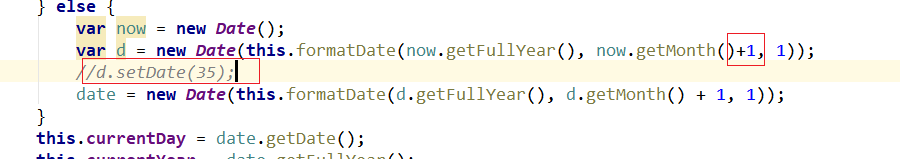

## 01-本章内容介绍  02:03

1.需求分析

2.学习POI的使用

3.使用POI批量导入预约数据

4.使用日历控件展示预约数据

5.使用日历控件修改单条数据


## 02-需求分析  02:10

前面我们已经完成了检查项管理、检查组管理、套餐管理等。接下来我们需要进行预约
设置，其实就是**设置每一天的体检预约最大数量**。客户可以通过微信端在线预约，在线
预约时需要选择体检的时间，如果客户选择的时间已经预约满则无法进行预约。


## 03-Apache POI（介绍）  03:29

Apache POI是用Java编写的免费开源的跨平台的Java API，Apache POI提供API给Java程
序对Microsoft Office格式档案读和写的功能，其中使用最多的就是使用POI操作Excel文
件。

maven坐标：

```xml
<dependency>
    <groupId>org.apache.poi</groupId>
    <artifactId>poi</artifactId>
    <version>3.14</version>
</dependency>
<dependency>
    <groupId>org.apache.poi</groupId>
    <artifactId>poi‐ooxml</artifactId>
    <version>3.14</version>
</dependency>
```

POI结构：

```
HSSF － 提供读写Microsoft Excel XLS格式档案的功能
XSSF － 提供读写Microsoft Excel OOXML XLSX格式档案的功能
HWPF － 提供读写Microsoft Word DOC格式档案的功能
HSLF － 提供读写Microsoft PowerPoint格式档案的功能
HDGF － 提供读Microsoft Visio格式档案的功能
HPBF － 提供读Microsoft Publisher格式档案的功能
HSMF － 提供读Microsoft Outlook格式档案的功能
```


## 04-Apache POI_入门案例（从Excel文件读取数据） 09:54

```java
	@Test
    public void test1() throws Exception{
        //加载指定文件，创建一个Excel对象（工作簿）
        XSSFWorkbook excel = new XSSFWorkbook(new FileInputStream(new File("e:\\poi.xlsx")));
        //读取Excel文件中第一个Sheet标签页
        XSSFSheet sheet = excel.getSheetAt(0);
        //遍历Sheet标签页，获得每一行数据
        for (Row row : sheet) {
            //遍历行，获得每个单元格对象
            for (Cell cell : row) {

                System.out.print(cell.getNumericCellValue());

            }
            System.out.println();
        }
        //关闭资源
        excel.close();
    }
```

>1.XSSFWorkbook用来读写XLSX格式的文件
>
>2.构造XSSFWorkbook时需要传入inputstream对象
>
>3.getSheetAt(x)可以获取第x+1个Sheet标签页，返回XSSFSheet对象
>
>4.XSSFSheet 实现了 Sheet extends Iterable<Row> 接口，所以可以直接进行遍历，获取每一行的数据
>
>5. 遍历Row可以获取每个单元格的数据Cell


## 05-Apache POI_入门案例（从Excel文件读取数据） 07:37

通过上面的入门案例可以看到，POI操作Excel表格封装了几个核心对象：

```
XSSFWorkbook：工作簿
XSSFSheet：工作表
Row：行
Cell：单元格
```

```java
 	@Test
    public void test2() throws Exception{
        //加载指定文件，创建一个Excel对象（工作簿）
        XSSFWorkbook excel = new XSSFWorkbook(new FileInputStream(new File("d:\\poi.xlsx")));
        //读取Excel文件中第一个Sheet标签页
        XSSFSheet sheet = excel.getSheetAt(0);
        //获得当前工作表中最后一个行号，需要注意：行号从0开始
        int lastRowNum = sheet.getLastRowNum();  
        System.out.println("lastRowNum = " + lastRowNum); 
        for(int i=0;i<=lastRowNum;i++){
            XSSFRow row = sheet.getRow(i);//根据行号获取每一行
            //获得当前行最后一个单元格索引
            short lastCellNum = row.getLastCellNum();
            System.out.println("lastCellNum = " + lastCellNum);
            for(int j=0;j<lastCellNum;j++){
                XSSFCell cell = row.getCell(j);//根据单元格索引获得单元格对象
                System.out.println(cell.getStringCellValue());
            }
        }
        //关闭资源
        excel.close();
    }
```


## 06-Apache POI_入门案例（从Excel文件读取数据_问题说明） 02:33

>getLastRowNum 返回的最后的行号，比如两行，返回的是1
>
>getLastCellNum  返回的是单元格数量，比如两列，返回的是2

所以其实比较规范的写法是

```
 for(int j=1;j<=lastCellNum;j++)
```


## 07-Apache POI_入门案例（向Excel文件写入数据）  09:08

```java
 //使用POI向Excel文件写入数据，并且通过输出流将创建的Excel文件保存到本地磁盘
    @Test
    public void test3() throws Exception{
        //在内存中创建一个Excel文件（工作簿）
        XSSFWorkbook excel = new XSSFWorkbook();
        //创建一个工作表对象
        XSSFSheet sheet = excel.createSheet("传智播客");
        //在工作表中创建行对象
        XSSFRow title = sheet.createRow(0);
        //在行中创建单元格对象
        title.createCell(0).setCellValue("姓名");
        title.createCell(1).setCellValue("地址");
        title.createCell(2).setCellValue("年龄");

        XSSFRow dataRow = sheet.createRow(1);
        dataRow.createCell(0).setCellValue("小明");
        dataRow.createCell(1).setCellValue("北京");
        dataRow.createCell(2).setCellValue(20);

        //创建一个输出流，通过输出流将内存中的Excel文件写到磁盘
        FileOutputStream out = new FileOutputStream(new File("d:\\hello.xlsx"));
        excel.write(out);
        out.flush();
        excel.close();
    }
```

>1.XSSFWorkbook可以直接new创建
>
>2.使用XSSFWorkbook.createSheet创建一个工作表
>
>3.XSSFSheet.createRow创建行，返回XSSFRow对象
>
>4.XSSFRow.createCell(int)创建单元格，直接对单元格setCellValue写入数据
>
>5.创建一个outputstream写入，通过XSSFWorkbook.write写入流


拓展：

### Easypoi介绍

Easypoi的目标不是替代poi,而是让一个不懂导入导出的快速使用poi完成Excel和word的各种操作,而不是看很多api才可以完成这样工作

>参考资料：https://opensource.afterturn.cn/doc/easypoi.html

导入maven坐标：

```xml
 <dependency>
            <groupId>cn.afterturn</groupId>
            <artifactId>easypoi-base</artifactId>
            <version>3.2.0</version>
        </dependency>
        <dependency>
            <groupId>cn.afterturn</groupId>
            <artifactId>easypoi-web</artifactId>
            <version>3.2.0</version>
        </dependency>
        <dependency>
            <groupId>cn.afterturn</groupId>
            <artifactId>easypoi-annotation</artifactId>
            <version>3.2.0</version>
        </dependency>
```

实体类代码：

```java
package com.itheima.test.easypoi;

import cn.afterturn.easypoi.excel.annotation.Excel;

import java.io.Serializable;

public class ExcelEntity implements Serializable {
    @Excel(name = "姓名", width = 30)
    private String        name;
    @Excel(name = "地址", width = 30)
    private String        address;
    @Excel(name = "年龄", width = 30)
    private Integer        age;

    public String getName() {
        return name;
    }

    public void setName(String name) {
        this.name = name;
    }

    public String getAddress() {
        return address;
    }

    public void setAddress(String address) {
        this.address = address;
    }

    public Integer getAge() {
        return age;
    }

    public void setAge(Integer age) {
        this.age = age;
    }
}

```

导入代码：

```java
   //导入代码
    @Test
    public void testImport(){
        ImportParams params = new ImportParams();
        //params.setTitleRows(0);
        params.setHeadRows(0);
        long start = new Date().getTime();
        List<ExcelEntity> list = ExcelImportUtil.importExcel(
                new File("d://hello.xlsx"),
                ExcelEntity.class, params);
        System.out.println(new Date().getTime() - start);
        System.out.println(list.size());
        System.out.println(ReflectionToStringBuilder.toString(list.get(0)));
    }
```

导出代码:

```java
//导出代码
    @Test
    public void testExport() throws IOException {
        List<ExcelEntity> list = new ArrayList<>();
        ExcelEntity entity = new ExcelEntity();
        entity.setName("张三");
        entity.setAddress("上海");
        entity.setAge(30);
        list.add(entity);

        ExcelEntity entity2 = new ExcelEntity();
        entity2.setName("李四");
        entity2.setAddress("天津");
        entity2.setAge(25);
        list.add(entity2);


        Workbook workbook = ExcelExportUtil.exportExcel(new ExportParams("标题","测试"),
                ExcelEntity .class, list);
        workbook.write(new FileOutputStream("d://hello2.xls"));
        workbook.close();
    }
```

>注意导出的格式为xls

数据量如果上百万之后，可以通过exportBigExcel进行导出

```java
 //导出大文件代码
    @Test
    public void testExportBig() throws IOException {

        List<ExcelEntity> list = new ArrayList<>();
        Workbook workbook = null;
        long start = new Date().getTime();
        ExportParams params = new ExportParams("大数据测试", "测试");
        for(int i = 0;i < 1000000;i++){
            ExcelEntity data  = new ExcelEntity();
            data.setName(String.valueOf(i));
            data.setAddress(String.valueOf(i));
            data.setAge(i);
            list.add(data);
            if(list.size() == 10000){
                workbook = ExcelExportUtil.exportBigExcel(params, ExcelEntity.class, list);
                list.clear();
            }
        }

        ExcelExportUtil.closeExportBigExcel();
        workbook.write(new FileOutputStream("d://hello2.xls"));
        workbook.close();
        System.out.println(new Date().getTime() - start);
    }
```


## 08-批量导入预约设置信息（操作流程）  03:35

预约设置信息对应的数据表为t_ordersetting，预约设置操作对应的页面为
ordersetting.html
t_ordersetting表结构：

| Field        | Type             | Comment    |
| ------------ | ---------------- | ---------- |
| id           | int(11) NOT NULL |            |
| orderDate    | date NULL        | 约预日期   |
| number       | int(11) NULL     | 可预约人数 |
| reservations | int(11) NULL     | 已预约人数 |

```
页面地址:day05\资源\页面\ordersetting.html
```

批量导入预约设置信息操作过程：
1、点击模板下载按钮下载Excel模板文件
2、将预约设置信息录入到模板文件中
3、点击上传文件按钮将录入完信息的模板文件上传到服务器
4、通过POI读取上传文件的数据并保存到数据库


## 09-批量导入预约设置信息_页面调整（提供模板文件并下载）  05:16

在webapp下建立文件夹template，把ordersetting_template.xlsx放到template下

```html
<el‐button style="margin‐bottom: 20px;margin‐right: 20px" type="primary"
@click="downloadTemplate()">模板下载</el‐button>
```

下载模板文件：

```javascript
//下载模板文件 
downloadTemplate(){
                    window.location.href="../../template/ordersetting_template.xlsx";
                },
```

注意: 此处路径 其实此处 一个../ 即可 写两个没有报错是因为 yige ../ 已经是根目录了 无法再回退了

## 10-批量导入预约设置信息_页面调整（文件上传）  04:32	

```html
<el-upload action="/ordersetting/upload.do"
              name="excelFile"
              :show-file-list="false"
              :on-success="handleSuccess"
              :before-upload="beforeUpload">
              <el-button type="primary">上传文件</el-button>
</el-upload>
```

```javascript
handleSuccess(response, file) {
    if(response.flag){
        this.$message({
        message: response.message,
        type: 'success'
    });
    }else{
    	this.$message.error(response.message);
    }
}

beforeUpload(file){
    const isXLS = file.type === 'application/vnd.ms‐excel';
    if(isXLS){
        return true;
    }
    const isXLSX = file.type === 'application/vnd.openxmlformatsofficedocument.
    spreadsheetml.sheet';
    if (isXLSX) {
   	 	return true;
    }
    this.$message.error('上传文件只能是xls或者xlsx格式!');
    return false;
}
```

>上传excel在windows下file.type为空的情况：
>
>https://segmentfault.com/a/1190000017281291


拓展：

优化写法，判断文件后缀

```javascript
//上传之前进行文件格式校验
                beforeUpload(file){
                    var startIndex = file.name.lastIndexOf(".");
                    var type = file.name.substring(startIndex+1, file.name.length).toLowerCase()

                    if(type === 'xls' || type === 'xlsx'){
                        return true;
                    }else{
                        this.$message.error('上传文件只能是xls或者xlsx格式!');
                        return false;
                    }

                },
```


## 11-批量导入预约设置信息_后台代码（封装POI工具类）15:38

> \day05\资源\工具类\POIUtils.java
>
> WPS 有空指针异常,需要调试

```java
package com.itheima.utils;

import java.io.FileNotFoundException;
import java.io.IOException;
import java.io.InputStream;
import java.text.SimpleDateFormat;
import java.util.ArrayList;
import java.util.List;
import org.apache.poi.hssf.usermodel.HSSFWorkbook;
import org.apache.poi.ss.usermodel.Cell;
import org.apache.poi.ss.usermodel.Row;
import org.apache.poi.ss.usermodel.Sheet;
import org.apache.poi.ss.usermodel.Workbook;
import org.apache.poi.xssf.usermodel.XSSFWorkbook;
import org.springframework.web.multipart.MultipartFile;

public class POIUtils {
    private final static String xls = "xls";
    private final static String xlsx = "xlsx";
    private final static String DATE_FORMAT = "yyyy/MM/dd";
    /**
     * 读入excel文件，解析后返回
     * @param file
     * @throws IOException
     */
    public static List<String[]> readExcel(MultipartFile file) throws IOException {
        //检查文件
        checkFile(file);
        //获得Workbook工作薄对象
        Workbook workbook = getWorkBook(file);
        //创建返回对象，把每行中的值作为一个数组，所有行作为一个集合返回
        List<String[]> list = new ArrayList<String[]>();
        if(workbook != null){
            for(int sheetNum = 0;sheetNum < workbook.getNumberOfSheets();sheetNum++){
                //获得当前sheet工作表
                Sheet sheet = workbook.getSheetAt(sheetNum);
                if(sheet == null){
                    continue;
                }
                //获得当前sheet的开始行
                int firstRowNum  = sheet.getFirstRowNum();
                //获得当前sheet的结束行
                int lastRowNum = sheet.getLastRowNum();
                //循环除了第一行的所有行
                for(int rowNum = firstRowNum+1;rowNum <= lastRowNum;rowNum++){
                    //获得当前行
                    Row row = sheet.getRow(rowNum);
                    if(row == null){
                        continue;
                    }
                    //获得当前行的开始列
                    int firstCellNum = row.getFirstCellNum();
                    //获得当前行的列数
                    int lastCellNum = row.getPhysicalNumberOfCells();
                    String[] cells = new String[row.getPhysicalNumberOfCells()];
                    //循环当前行
                    for(int cellNum = firstCellNum; cellNum < lastCellNum;cellNum++){
                        Cell cell = row.getCell(cellNum);
                        cells[cellNum] = getCellValue(cell);
                    }
                    list.add(cells);
                }
            }
            workbook.close();
        }
        return list;
    }

    //校验文件是否合法
    public static void checkFile(MultipartFile file) throws IOException{
        //判断文件是否存在
        if(null == file){
            throw new FileNotFoundException("文件不存在！");
        }
        //获得文件名
        String fileName = file.getOriginalFilename();
        //判断文件是否是excel文件
        if(!fileName.endsWith(xls) && !fileName.endsWith(xlsx)){
            throw new IOException(fileName + "不是excel文件");
        }
    }
    public static Workbook getWorkBook(MultipartFile file) {
        //获得文件名
        String fileName = file.getOriginalFilename();
        //创建Workbook工作薄对象，表示整个excel
        Workbook workbook = null;
        try {
            //获取excel文件的io流
            InputStream is = file.getInputStream();
            //根据文件后缀名不同(xls和xlsx)获得不同的Workbook实现类对象
            if(fileName.endsWith(xls)){
                //2003
                workbook = new HSSFWorkbook(is);
            }else if(fileName.endsWith(xlsx)){
                //2007
                workbook = new XSSFWorkbook(is);
            }
        } catch (IOException e) {
            e.printStackTrace();
        }
        return workbook;
    }
    public static String getCellValue(Cell cell){
        String cellValue = "";
        if(cell == null){
            return cellValue;
        }
        //如果当前单元格内容为日期类型，需要特殊处理
        String dataFormatString = cell.getCellStyle().getDataFormatString();
        if(dataFormatString.equals("m/d/yy")){
           
            // WPS 有空指针异常,需要调试  cell.getDateCellValue() ==null

            cellValue = new SimpleDateFormat(DATE_FORMAT).format(cell.getDateCellValue());
            return cellValue;//"2019/10/10"
        }
        //把数字当成String来读，避免出现1读成1.0的情况
        if(cell.getCellType() == Cell.CELL_TYPE_NUMERIC){
            cell.setCellType(Cell.CELL_TYPE_STRING);
        }
        //判断数据的类型
        switch (cell.getCellType()){
            case Cell.CELL_TYPE_NUMERIC: //数字
                cellValue = String.valueOf(cell.getNumericCellValue());
                break;
            case Cell.CELL_TYPE_STRING: //字符串
                cellValue = String.valueOf(cell.getStringCellValue());
                break;
            case Cell.CELL_TYPE_BOOLEAN: //Boolean
                cellValue = String.valueOf(cell.getBooleanCellValue());
                break;
            case Cell.CELL_TYPE_FORMULA: //公式
                cellValue = String.valueOf(cell.getCellFormula());
                break;
            case Cell.CELL_TYPE_BLANK: //空值
                cellValue = "";
                break;
            case Cell.CELL_TYPE_ERROR: //故障
                cellValue = "非法字符";
                break;
            default:
                cellValue = "未知类型";
                break;
        }
        return cellValue;
    }
}

```

> getCellValue方法中对不同类型的数据进行了处理，统一转换成了字符串

## 

## 12-批量导入预约设置信息_后台代码（Controller、服务接口） 11:23

在health_backend工程创建OrderSettingController并提供upload方法

```java
package com.itheima.controller;

import com.alibaba.dubbo.config.annotation.Reference;
import com.itheima.constant.MessageConstant;
import com.itheima.entity.Result;
import com.itheima.pojo.OrderSetting;
import com.itheima.service.OrderSettingService;
import com.itheima.utils.POIUtils;
import org.springframework.web.bind.annotation.RequestBody;
import org.springframework.web.bind.annotation.RequestMapping;
import org.springframework.web.bind.annotation.RequestParam;
import org.springframework.web.bind.annotation.RestController;
import org.springframework.web.multipart.MultipartFile;

import java.io.IOException;
import java.util.ArrayList;
import java.util.Date;
import java.util.List;
import java.util.Map;

/**
 * 预约设置
 */

@RestController
@RequestMapping("/ordersetting")
public class OrderSettingController {
    @Reference
    private OrderSettingService orderSettingService;

    //文件上传，实现预约设置数据批量导入
   //文件上传（Excel）
    @RequestMapping("/upload")
    public Result upload(@RequestParam("excelFile") MultipartFile excelFile){
        try {
            List<String[]> list = POIUtils.readExcel(excelFile);
            List<OrderSetting> data = new ArrayList<>();
            if(list != null && list.size() > 0){
                for (String[] strings : list) {
                    String date = strings[0];
                    String number = strings[1];
                    OrderSetting orderSetting = new OrderSetting(new SimpleDateFormat("yyyy/MM/dd").parse(date),Integer.parseInt(number));
                    data.add(orderSetting);
                }
            }
            orderSettingService.add(data);
            return new Result(true, MessageConstant.ORDERSETTING_SUCCESS);
        } catch (Exception e) {
            e.printStackTrace();
            return new Result(false, MessageConstant.ORDERSETTING_FAIL);
        }
    }

```

>new Date(orderDate)会报@Deprecated
>
>可以使用
>
>```java
>  SimpleDateFormat format = new SimpleDateFormat("yyyy/M/dd");
>  Date  date = format.parse(orderDate);
>```


创建OrderSettingService服务接口并提供新增方法

```java
package com.itheima.service;

import com.itheima.pojo.OrderSetting;

import java.util.List;
import java.util.Map;

public interface OrderSettingService {
    public void add(List<OrderSetting> data);
}

```


## 13-批量导入预约设置信息_后台代码（服务实现类、DAO）11:23

创建服务实现类OrderSettingServiceImpl并实现新增方法

```java
package com.itheima.service.impl;

import com.alibaba.dubbo.config.annotation.Service;
import com.itheima.dao.OrderSettingDao;
import com.itheima.pojo.OrderSetting;
import com.itheima.service.OrderSettingService;
import org.springframework.beans.factory.annotation.Autowired;
import org.springframework.transaction.annotation.Transactional;

import java.util.*;

/**
 * 预约设置服务
 */
@Service(interfaceClass = OrderSettingService.class)
@Transactional
public class OrderSettingServiceImpl implements OrderSettingService{
    @Autowired
    private OrderSettingDao orderSettingDao;
    //批量导入预约设置数据
    public void add(List<OrderSetting> list) {
        if(list != null && list.size() > 0){
            for (OrderSetting orderSetting : list) {
                //判断当前日期是否已经进行了预约设置
                long countByOrderDate = orderSettingDao.findCountByOrderDate(orderSetting.getOrderDate());
                if(countByOrderDate > 0){
                    //已经进行了预约设置，执行更新操作
                    orderSettingDao.editNumberByOrderDate(orderSetting);
                }else{
                    //没有进行预约设置，执行插入操作
                    orderSettingDao.add(orderSetting);
                }
            }
        }
        else{
            //抛出异常，或者返回错误对象
        }
    }
}

```

>同一个日期有可能会出现已经存在数据了，所以需要
>
>1.先执行查询，看看这个日期下有没有数据
>
>2.如果有数据，就更新数据
>
>3.如果没有数据，就插入数据

思考: 为啥不能先删除再插入

> 有可能已经有预约数据了所以不能删除


创建Dao接口OrderSettingDao并提供更新和新增方法

```
public interface OrderSettingDao {
    public void add(OrderSetting orderSetting);
    public void editNumberByOrderDate(OrderSetting orderSetting);
    public long findCountByOrderDate(Date orderDate);
}
```


创建Mapper映射文件OrderSettingDao.xml并提供相关SQL

```xml
<?xml version="1.0" encoding="UTF-8" ?>
<!DOCTYPE mapper PUBLIC "-//mybatis.org//DTD Mapper 3.0//EN"
        "http://mybatis.org/dtd/mybatis-3-mapper.dtd" >
<mapper namespace="com.itheima.dao.OrderSettingDao">
    <insert id="add" parameterType="com.itheima.pojo.OrderSetting">
        insert into t_ordersetting
      		(orderDate,number,reservations)
                      values
      		(#{orderDate},#{number},#{reservations})
    </insert>

    <update id="editNumberByOrderDate" parameterType="com.itheima.pojo.OrderSetting">
        update t_ordersetting
          set number = #{number}
          where orderDate = #{orderDate}
    </update>

    <select id="findCountByOrderDate" parameterType="java.util.Date" resultType="long">
        select count(id) from t_ordersetting where orderDate = #{orderDate}
    </select>

</mapper>
```


## 14-批量导入预约设置信息_测试  03:38


## 15-日历展示预约设置信息（效果说明）  02：22

在页面中已经完成了日历的动态展示，我们只需要查询当前月份的预约设置信息并展示
到日历中即可，同时在日历中还需要展示已经预约的人数





## 16-日历展示预约设置信息_页面调整（使用静态数据调试） 14：56

代码太长详见项目

>1.切换月份时，需要获取到当月的预约数据
>
>2.调用this.initData获取预约数据
>
>3.预约数据的格式为：
>
>```javascript
> this.leftobj = [
>                        { date: 1, number: 120, reservations: 1 },
>                        { date: 3, number: 120, reservations: 1 },
>                        { date: 4, number: 120, reservations: 120 },
>                        { date: 6, number: 120, reservations: 1 },
>                        { date: 8, number: 120, reservations: 1 }
>                    ];
>```


## 17-日历展示预约设置信息_页面调整（发送ajax请求获取动态数据）06:23

```javascript
//发送ajax请求，根据当前页面对应的月份查询数据库，封装成相应结果赋值给leftobj模型数据，用于页面展示
//date=2019-9
                    axios.post("/ordersetting/getOrderSettingByMonth.do?date=2019-9" + this.currentYear + "-" + this.currentMonth).then((res) => {
                        if(res.data.flag){
                            //res.data = Result
                            //Result.data.date = 7
                            this.leftobj = res.data.data;
                        }else{
                            this.$message.error(res.data.message);
                        }
                    });
```


## 18-日历展示预约设置信息_后台代码（Controller、服务接口） 07:00

在OrderSettingController中提供getOrderSettingByMonth方法，根据月份查询预约设
置信息

```java

    //根据月份查询对应的预约设置数据
    @RequestMapping("/getOrderSettingByMonth")
    public Result getOrderSettingByMonth(String date){//date格式为：yyyy-MM
        try{
            List<OrderSetting> list = orderSettingService.getOrderSettingByMonth(date);
            //遍历OrderSetting
            List<Map> data = new ArrayList<>()；
            return new Result(true,MessageConstant.GET_ORDERSETTING_SUCCESS,data);
        }catch (Exception e){
            e.printStackTrace();
            return new Result(false,MessageConstant.GET_ORDERSETTING_FAIL);
        }
    }
```

在OrderSettingService服务接口中扩展方法getOrderSettingByMonth

```java
public List<Map> getOrderSettingByMonth(String date);//参数格式为：2019‐03
```


## 19-日历展示预约设置信息_后台代码（服务实现类、DAO） 14:06

在OrderSettingServiceImpl服务实现类中实现方法getOrderSettingByMonth

```java
  //根据月份查询对应的预约设置数据
    public List<Map> getOrderSettingByMonth(String date) {//格式：yyyy-M
        String begin = date + "-1";//2019-6-1
        String end = date + "-31";//2019-6-31
        Map<String,String> map = new HashMap<>();
        map.put("begin",begin);
        map.put("end",end);
        //调用DAO，根据日期范围查询预约设置数据
        List<OrderSetting> list = orderSettingDao.getOrderSettingByMonth(map);
        List<Map> result = new ArrayList<>();
        if(list != null && list.size() > 0){
            for (OrderSetting orderSetting : list) {
                Map<String,Object> m = new HashMap<>();
                m.put("date",orderSetting.getOrderDate().getDate());//获取日期数字（几号）
                m.put("number",orderSetting.getNumber());
                m.put("reservations",orderSetting.getReservations());
                result.add(m);
            }
        }
        return result;
    }
```

>1.通过直接将前端传过来的年-月 yyyy-M参数，拼上-1和-31代表开始和结束时间，其中结束时间统一设置成31日，就算当月没有31日，也可以生效
>
>2.参数使用map进行传递
>
>3.返回的数据放入一个map中进行返回
>
>4.Date.getDate()已经不推荐使用
>
>```java
> Calendar cal=Calendar.getInstance();
> cal.setTime(orderSetting.getOrderDate());
> cal.get(Calendar.DAY_OF_MONTH)
>```

在OrderSettingDao.xml文件中扩展SQL

```xml
    <!--根据日期范围查询-->
    <select id="getOrderSettingByMonth" parameterType="map" resultType="com.itheima.pojo.OrderSetting">
        select * from t_ordersetting where orderDate between #{begin} and #{end}
    </select>
```


## 20-日历展示预约设置信息_测试   03:45

## 21-基于日历实现预约设置_页面调整（弹出预约设置提示窗口） 13:47

本章节要完成的功能为通过点击日历中的设置按钮来设置对应日期的可预约人数。


```HTML
<button v‐if="dayobject.day > today"
@click="handleOrderSet(dayobject.day)" class="orderbtn">设
置</button>
```

>由于判断了dayobject.day > today，只有明天开始的日子才有设置按钮
>
>点击按钮会触发handleOrderSet方法


messagebox控件的demo:

https://element.eleme.cn/#/zh-CN/component/message-box

```javascript
                handleOrderSet(day){
                  //alert(this.formatDate(day.getFullYear(),day.getMonth()+1,day.getDate()));
                    this.$prompt('请输入可预约人数', '预约设置', {
                        confirmButtonText: '确定',
                        cancelButtonText: '取消',
                        inputPattern: /^[1-9]*[1-9][0-9]*$/,
                        inputErrorMessage: '只能输入正整数'
                    }).then(({ value }) => {
                        //提交处理
                    }).catch(() => {
                        this.$message({
                            type: 'info',
                            message: '取消输入'
                        });
                    });
                },
```


## 22-基于日历实现预约设置_页面调整（发送ajax请求提交数据）11:50

```javascript
//发送ajax请求，将输入的数据提交到Controller
                        axios.post("/ordersetting/editNumberByDate.do",{
                            number:value,
                            orderDate:this.formatDate(day.getFullYear(),day.getMonth()+1,day.getDate()) //日期2019-09-20
                        }).then((res) => {
                            if(res.data.flag){
                                this.initData(this.formatDate(day.getFullYear(), day.getMonth() + 1, 1));
                                this.$message({
                                    type:'success',
                                    message:res.data.message
                                });
                            }else{
                                this.$message.error(res.data.message);
                            }
                        });
```

>orderDate这个字段，可以不转换，直接传day即可，spring mvc能够帮我们自动转换成Date对象
>
>数据返回之后要初始化到这个月的第一天，否则整个页面展示会有问题


## 23-基于日历实现预约设置_后台代码（Controller、服务接口） 03:07

在OrderSettingController中提供方法editNumberByDate

```java
//根据日期设置对应的预约设置数据
    @RequestMapping("/editNumberByDate")
    public Result editNumberByDate(@RequestBody OrderSetting orderSetting){
        try{
            orderSettingService.editNumberByDate(orderSetting);
            return new Result(true,MessageConstant.ORDERSETTING_SUCCESS);
        }catch (Exception e){
            e.printStackTrace();
            return new Result(false,MessageConstant.ORDERSETTING_FAIL);
        }
    }
```

在OrderSettingService服务接口中提供方法editNumberByDate

```java
public void editNumberByDate(OrderSetting orderSetting);
```


## 24-基于日历实现预约设置_后台代码（服务实现类） 07:17

在OrderSettingServiceImpl服务实现类中实现editNumberByDate

```java
//根据日期设置对应的预约设置数据
    public void editNumberByDate(OrderSetting orderSetting) {
        Date orderDate = orderSetting.getOrderDate();
        //根据日期查询是否已经进行了预约设置
        long count = orderSettingDao.findCountByOrderDate(orderDate);
        if(count > 0){
            //当前日期已经进行了预约设置，需要执行更新操作
            orderSettingDao.editNumberByOrderDate(orderSetting);
        }else{
            //当前日期没有就那些预约设置，需要执行插入操作
            orderSettingDao.add(orderSetting);
        }
    }
```

> 1.先判断下当日下是否有数据
>
> 2.有数据就更新预约的数据
>
> 3.没有数据就新增一条数据

在OrderSettingDao接口中提供方法

```java
public void editNumberByOrderDate(OrderSetting orderSetting);
public long findCountByOrderDate(Date orderDate);
```

在OrderSettingDao.xml映射文件中提供SQL

```xml
<update id="editNumberByOrderDate" parameterType="com.itheima.pojo.OrderSetting">
        update t_ordersetting
          set number = #{number}
          where orderDate = #{orderDate}
    </update>

    <select id="findCountByOrderDate" parameterType="date" resultType="long">
        select count(id) from t_ordersetting where orderDate = #{orderDate}
    </select>
```


## 25-基于日历实现预约设置_测试  01:31