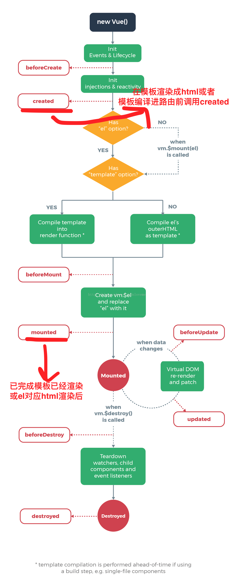

## 01-本章内容介绍   03:09

1. 移动端开发介绍
2. 移动端功能开发：套餐列表、套餐详情
3. 短信发送功能开发


## 02-移动端开发（移动端开发方式）10:41

#### 移动端开发方式

随着移动互联网的兴起和手机的普及，目前移动端应用变得愈发重要，成为了各个商家
的必争之地。例如，我们可以使用手机购物、支付、打车、玩游戏、订酒店、购票等，
以前只能通过PC端完成的事情，现在通过手机都能够实现，而且更加方便，而这些都需
要移动端开发进行支持，那如何进行移动端开发呢？
移动端开发主要有三种方式：
1、基于手机API开发（原生APP）
2、基于手机浏览器开发（移动web）
3、混合开发（混合APP）

##### 1 基于手机API开发

手机端使用手机API，例如使用Android、ios 等进行开发，服务端只是一个数据提供者。
手机端请求服务端获取数据（json、xml格式）并在界面进行展示。这种方式相当于传统
开发中的C/S模式，即需要在手机上安装一个客户端软件。
这种方式需要针对不同的手机系统分别进行开发，目前主要有以下几个平台：
1、苹果ios系统版本，开发语言是Objective-C Swift
2、安卓Android系统版本，开发语言是Java
3、微软Windows phone系统版本，开发语言是C#
4、塞班symbian系统版本，开发语言是C++
此种开发方式举例：手机淘宝、抖音、今日头条、大众点评


##### 2 基于手机浏览器开发

生存在浏览器中的应用，基本上可以说是触屏版的网页应用。这种开发方式相当于传统
开发中的B/S模式，也就是手机上不需要额外安装软件，直接基于手机上的浏览器进行访
问。这就需要我们编写的html页面需要根据不同手机的尺寸进行自适应调节，目前比较
流行的是html5开发。除了直接通过手机浏览器访问，还可以将页面内嵌到一些应用程序
中，例如通过微信公众号访问html5页面。
这种开发方式不需要针对不同的手机系统分别进行开发，只需要开发一个版本，就可以
在不同的手机上正常访问。
本项目会通过将我们开发的html5页面内嵌到微信公众号这种方式进行开发。


##### 3 混合开发

是半原生半Web的混合类App。需要下载安装，看上去类似原生App，访问的内容是Web
网页。其实就是把HTML5页面嵌入到一个原生容器里面。


| 开发方式 | 优势                                                         | 劣势                                                         |
| -------- | ------------------------------------------------------------ | ------------------------------------------------------------ |
| 原生APP  | 1、可访问手机所有功能、可实现功能齐全；<br/>2、运行速度快、性能高，的用户体验；<br/>3、支持大量图形和动画和重新发现，不卡，反应快。<br/>4、比较快捷地使用设备端提供的接口，处理速度上有优势。 | 成本高、周期长，Android和iOS都需要单独开发。                 |
| 移动web  | **1、**支持范围广；<br/>**2、**开发成本低、周期短。          | **1、**对联网要求高，离线不能做任何操作；<br/>**2、**功能有限；<br/>**3、**运行速度慢，页面不能承载太多东西；<br/>**4、**图片和动画支持性不高；<br/>**5、**如果用户使用更多的新型浏览器，那么就会出现运行问题。 |
| 混合开发 | **1、**比web版实现功能多；<br/>**2、**兼容多平台；<br/>**3、**可离线运行； | **1、**用户体验不如本地应用；<br/>**2、**性能稍慢（需要连接网络）；<br/>**3、**技术还不是很成熟。 |


## 03-移动端开发（微信公众号开发_账号分类）  03:55

要进行微信公众号开发，首先需要访问微信公众平台，官
网：https://mp.weixin.qq.com/。

在微信公众平台可以看到，有四种帐号类型：服务号、订阅号、小程序、企业微信（原
企业号）。


本项目会选择订阅号这种方式进行公众号开发。


## 04-移动端开发（微信公众号开发_注册账号、自定义菜单）09:49

要开发微信公众号，首先需要注册成为会员，然后就可以登录微信公众平台进行自定义
菜单的设置。
注册页面：https://mp.weixin.qq.com/cgi-bin/registermidpage?action=index&lang=zh_CN&token=


## 05-移动端开发（微信公众号开发_上线要求）   03:49

如果是个人用户身份注册的订阅号，则自定义菜单的菜单内容不能进行跳转网页，因为
个人用户目前不支持微信认证，而跳转网页需要微信认证之后才有权限。
如果是企业用户，首先需要进行微信认证，通过后就可以进行跳转网页了，跳转网页的
地址要求必须有域名并且域名需要备案通过。

>测试公众号：黑马健康


## 06-需求分析	05:22

用户在体检之前需要进行预约，可以通过电话方式进行预约，此时会由体检中心客服人
员通过后台系统录入预约信息。用户也可以通过手机端自助预约。本章节开发的功能为
用户通过手机自助预约。
预约流程如下：
1、访问移动端首页
2、点击体检预约进入体检套餐列表页面
3、在体检套餐列表页面点击具体套餐进入套餐详情页面
4、在套餐详情页面点击立即预约进入预约页面
5、在预约页面录入体检人相关信息点击提交预约


## 07-搭建移动端工程（准备工作） 06：33

本项目是基于SOA架构进行开发，前面我们已经完成了后台系统的部分功能开发，在后
台系统中都是通过Dubbo调用服务层发布的服务进行相关的操作。本章节我们开发移动
端工程也是同样的模式，所以我们也需要在移动端工程中通过Dubbo调用服务层发布的
服务，如下图：


在health_common工程的pom.xml文件中导入阿里短信发送的maven坐标

```xml
<dependency>
<groupId>com.aliyun</groupId>
<artifactId>aliyun-java-sdk-core</artifactId>
<version>3.3.1</version>
</dependency>
<dependency>
<groupId>com.aliyun</groupId>
<artifactId>aliyun-java-sdk-dysmsapi</artifactId>
<version>1.0.0</version>
</dependency>
```


在health_common工程中导入如下通用组件
ValidateCodeUtils工具类：

```java
package com.itheima.utils;

import java.util.Random;

/**
 * 随机生成验证码工具类
 */
public class ValidateCodeUtils {
    /**
     * 随机生成验证码
     * @param length 长度为4位或者6位
     * @return
     */
    public static Integer generateValidateCode(int length){
        Integer code =null;
        if(length == 4){
            code = new Random().nextInt(9999);//生成随机数，最大为9999
            if(code < 1000){ 
                code = code + 1000;//保证随机数为4位数字
            }
        }else if(length == 6){
            code = new Random().nextInt(999999);//生成随机数，最大为999999
            if(code < 100000){
                code = code + 100000;//保证随机数为6位数字
            }
        }else{
            throw new RuntimeException("只能生成4位或6位数字验证码");
        }
        return code;
    }

    /**
     * 随机生成指定长度字符串验证码
     * @param length 长度
     * @return
     */
    public static String generateValidateCode4String(int length){
        Random rdm = new Random();
        String hash1 = Integer.toHexString(rdm.nextInt());
        String capstr = hash1.substring(0, length);
        return capstr;
    }
}

```

>用于生成短信验证码


SMSUtils工具类：

```java
package com.itheima.utils;

import com.aliyuncs.DefaultAcsClient;
import com.aliyuncs.IAcsClient;
import com.aliyuncs.dysmsapi.model.v20170525.SendSmsRequest;
import com.aliyuncs.dysmsapi.model.v20170525.SendSmsResponse;
import com.aliyuncs.exceptions.ClientException;
import com.aliyuncs.http.MethodType;
import com.aliyuncs.profile.DefaultProfile;
import com.aliyuncs.profile.IClientProfile;

/**
 * 短信发送工具类
 */
public class SMSUtils {
	public static final String VALIDATE_CODE = "SMS_159620392";//发送短信验证码
	public static final String ORDER_NOTICE = "SMS_159771588";//体检预约成功通知
	/**
	 * 发送短信
	 * @param phoneNumbers
	 * @param param
	 * @throws ClientException
	 */
	public static void sendShortMessage(String templateCode,String phoneNumbers,String param) throws ClientException{
		// 设置超时时间-可自行调整
		System.setProperty("sun.net.client.defaultConnectTimeout", "10000");
		System.setProperty("sun.net.client.defaultReadTimeout", "10000");
		// 初始化ascClient需要的几个参数
		final String product = "Dysmsapi";// 短信API产品名称（短信产品名固定，无需修改）
		final String domain = "dysmsapi.aliyuncs.com";// 短信API产品域名（接口地址固定，无需修改）
		// 替换成你的AK
		final String accessKeyId = "LTAIY8Mawj3VMseR";// 你的accessKeyId,参考本文档步骤2
		final String accessKeySecret = "2eHxOORZf4YzpQebROfOoXBFLHJCRY";// 你的accessKeySecret，参考本文档步骤2
		// 初始化ascClient,暂时不支持多region（请勿修改）
		IClientProfile profile = DefaultProfile.getProfile("cn-hangzhou", accessKeyId, accessKeySecret);
		DefaultProfile.addEndpoint("cn-hangzhou", "cn-hangzhou", product, domain);
		IAcsClient acsClient = new DefaultAcsClient(profile);
		// 组装请求对象
		SendSmsRequest request = new SendSmsRequest();
		// 使用post提交
		request.setMethod(MethodType.POST);
		// 必填:待发送手机号。支持以逗号分隔的形式进行批量调用，批量上限为1000个手机号码,批量调用相对于单条调用及时性稍有延迟,验证码类型的短信推荐使用单条调用的方式
		request.setPhoneNumbers(phoneNumbers);
		// 必填:短信签名-可在短信控制台中找到
		request.setSignName("传智健康");
		// 必填:短信模板-可在短信控制台中找到
		request.setTemplateCode(templateCode);
		// 可选:模板中的变量替换JSON串,如模板内容为"亲爱的${name},您的验证码为${code}"时,此处的值为
		// 友情提示:如果JSON中需要带换行符,请参照标准的JSON协议对换行符的要求,比如短信内容中包含\r\n的情况在JSON中需要表示成\\r\\n,否则会导致JSON在服务端解析失败
		request.setTemplateParam("{\"code\":\""+param+"\"}");
		// 可选-上行短信扩展码(扩展码字段控制在7位或以下，无特殊需求用户请忽略此字段)
		// request.setSmsUpExtendCode("90997");
		// 可选:outId为提供给业务方扩展字段,最终在短信回执消息中将此值带回给调用者
		// request.setOutId("yourOutId");
		// 请求失败这里会抛ClientException异常
		SendSmsResponse sendSmsResponse = acsClient.getAcsResponse(request);
		if (sendSmsResponse.getCode() != null && sendSmsResponse.getCode().equals("OK")) {
			// 请求成功
			System.out.println("请求成功");
		}
	}
}

```

> 代码是由阿里云提供的模板


RedisMessageConstant常量类：

```java
package com.itheima.constant;

public class RedisMessageConstant {
    public static final String SENDTYPE_ORDER = "001";//用于缓存体检预约时发送的验证码
    public static final String SENDTYPE_LOGIN = "002";//用于缓存手机号快速登录时发送的验证码
    public static final String SENDTYPE_GETPWD = "003";//用于缓存找回密码时发送的验证码

}
```


## 08-搭建移动端工程（创建health_mobile工程）  09:58

创建移动端工程health_mobile，打包方式为war，用于存放Controller，在Controller中
通过Dubbo可以远程访问服务层相关服务，所以需要依赖health_interface接口工程。

与health_backend代码基本一致，注意下spring-redis的配置。

```xml
<?xml version="1.0" encoding="UTF-8"?>
<beans xmlns="http://www.springframework.org/schema/beans"
       xmlns:xsi="http://www.w3.org/2001/XMLSchema-instance"
       xmlns:p="http://www.springframework.org/schema/p"
       xmlns:context="http://www.springframework.org/schema/context"
       xmlns:dubbo="http://code.alibabatech.com/schema/dubbo"
       xmlns:mvc="http://www.springframework.org/schema/mvc"
       xsi:schemaLocation="http://www.springframework.org/schema/beans
		 http://www.springframework.org/schema/beans/spring-beans.xsd
          http://www.springframework.org/schema/mvc
          http://www.springframework.org/schema/mvc/spring-mvc.xsd
          http://code.alibabatech.com/schema/dubbo
          http://code.alibabatech.com/schema/dubbo/dubbo.xsd
          http://www.springframework.org/schema/context
          http://www.springframework.org/schema/context/spring-context.xsd">

    <context:property-placeholder location="classpath:redis.properties" />

    <!--Jedis连接池的相关配置-->
    <bean id="jedisPoolConfig" class="redis.clients.jedis.JedisPoolConfig">
        <property name="maxTotal">
            <value>${redis.pool.maxActive}</value>
        </property>
        <property name="maxIdle">
            <value>${redis.pool.maxIdle}</value>
        </property>
        <property name="testOnBorrow" value="true"/>
        <property name="testOnReturn" value="true"/>
    </bean>

    <bean id="jedisPool" class="redis.clients.jedis.JedisPool">
        <constructor-arg name="poolConfig" ref="jedisPoolConfig" />
        <constructor-arg name="host" value="${redis.host}" />
        <constructor-arg name="port" value="${redis.port}" type="int" />
        <constructor-arg name="timeout" value="${redis.timeout}" type="int" />
    </bean>
</beans>
```

>这里加载了redis.properties配置文件，redis的配置项其实是在properties中定义。


## 09-套餐列表页面动态展示（完善页面）   10:12

展示套餐信息

```javascript
 var vue = new Vue({
        el:'#app',
        data:{
            setmealList:[]//模型数据，用于套餐列表展示
        },
        created (){
            //发送ajax请求，获取所有的套餐数据，赋值给setmealList模型数据，用于页面展示
            axios.get("/setmeal/getAllSetmeal.do").then((res) => {
                if(res.data.flag){
                    //查询成功，给模型数据赋值
                    this.setmealList = res.data.data;
                }else{
                    //查询失败，弹出提示信息
                    this.$message.error(res.data.message);
                }
            });
        }
    });
```

```
created() 和 mounted () 的区别
从下图中可以看出，created运行时，还未挂载到DOM，不能访问到$el属性，可用于初始化一些数据，但和DOM操作相关的不能在created中执行；monuted运行时，实例已经挂在到DOM，此时可以通过DOM API获取到DOM节点。
```




## 10-套餐列表页面动态展示（展示图片注意事项） 04:39

图片展示代码：

```html

```

通过:src获取具体的图片链接，图片链接由七牛云域名+后台返回的图片ID拼合而成。

具体开发中将七牛云域名替换成自己的域名即可。


## 11-套餐列表页面动态展示（后台代码）   07:56

在health_mobile工程中创建SetmealController并提供getSetmeal方法，在此方法中通
过Dubbo远程调用套餐服务获取套餐列表数据

```java
package com.itheima.controller;

import com.alibaba.dubbo.config.annotation.Reference;
import com.itheima.constant.MessageConstant;
import com.itheima.entity.Result;
import com.itheima.pojo.Setmeal;
import com.itheima.service.SetmealService;
import org.springframework.web.bind.annotation.RequestBody;
import org.springframework.web.bind.annotation.RequestMapping;
import org.springframework.web.bind.annotation.RestController;

import java.util.List;

/**
 * 套餐管理
 */

@RestController
@RequestMapping("/setmeal")
public class SetmealController {
    @Reference
    private SetmealService setmealService;
    //查询所有套餐
    @RequestMapping("/getAllSetmeal")
    public Result getAllSetmeal(){
        try{
            List<Setmeal> list = setmealService.findAll();
     return new Result(true, MessageConstant.GET_SETMEAL_LIST_SUCCESS,list);
        }catch (Exception e){
            e.printStackTrace();
            return new Result(false, MessageConstant.GET_SETMEAL_LIST_FAIL);
        }
    }

}

```

在SetmealService服务接口中扩展findAll方法

```java
public List<Setmeal> findAll();
```

在SetmealServiceImpl服务实现类中实现findAll方法

```java
    public List<Setmeal> findAll() {
        return setmealDao.findAll();
    }
```

在SetmealDao接口中扩展findAll方法

```
public List<Setmeal> findAll();
```

在SetmealDao.xml映射文件中扩展SQL语句

```xml
<select id="findAll" resultType="com.itheima.pojo.Setmeal">
select * from t_setmeal
</select>
```


## 12-套餐列表页面动态展示（测试）  03:18

1.install 根项目

2.启动interface_provider项目

3.启动mobile项目


## 13-套餐详情页面动态展示（完善页面_获取请求参数中套餐ID）14:22

前面我们已经完成了体检套餐列表页面动态展示，点击其中任意一个套餐则跳转到对应
的套餐详情页面（/pages/setmeal_detail.html），并且会携带此套餐的id作为参数提
交。
请求路径格式：http://localhost/pages/setmeal_detail.html?id=10
在套餐详情页面需要展示当前套餐的信息（包括图片、套餐名称、套餐介绍、适用性
别、适用年龄）、此套餐包含的检查组信息、检查组包含的检查项信息等。


#### 获取请求参数中套餐id

在页面中已经引入了healthmobile.js文件，此文件中已经封装了getUrlParam方法可以
根据URL请求路径中的参数名获取对应的值

```javascript
//获取指定的URL参数值 http://localhost/pages/setmeal_detail.html?id=3&&name=jack
&+
function getUrlParam(paraName) {
    var url = document.location.toString();
    //alert(url);
    var arrObj = url.split("?");
    if (arrObj.length > 1) {
        var arrPara = arrObj[1].split("&");
        var arr;
        for (var i = 0; i < arrPara.length; i++) {
            arr = arrPara[i].split("=");
            if (arr != null && arr[0] == paraName) {
                return arr[1];
            }
        }
        return "";
    }
    else {
        return "";
    }
}
```

>参考例子：http://localhost/pages/setmeal_detail.html?id=12   paraName=12
>
>1.arrObj获取到?之后，分成两个字符串，arrObj =["http://localhost/pages/setmeal_detail.html", "id=12"]
>
>2.arrObj.length > 1 进入第一个分支，arrPara根据&分割，arrPara = ["id=12"]
>
>3.循环arrPara，只会循环一次，arr根据=分割，arr[0] = paramName，所以arr[1] = 12


## 14-套餐详情页面动态展示（完善页面_发送ajax获取套餐详情、展示套餐详情）  07:03

```javascript
//发送ajax请求，根据套餐ID查询套餐详细信息（包括套餐基本信息、套餐包含的检查组、检查组包含的检查项）
            axios.post("/setmeal/findById.do?id=" + id).then((response) => {
                if(response.data.flag){
                    this.setmeal = response.data.data;
                    this.imgUrl = 'http://psyrcmf27.bkt.clouddn.com/' + this.setmeal.img;
                }
            });
```

页面效果：

```html
<div class="table-content">
                    <ul class="table-list">
                        <li class="table-item" v-for="checkgroup in setmeal.checkGroups">
                            <div class="item flex2">{{checkgroup.name}}</div>
                            <div class="item flex3">
                                <label v-for="checkitem in checkgroup.checkItems">
                                    {{checkitem.name}}
                                </label>
                            </div>
                            <div class="item flex3">{{checkgroup.remark}}</div>
                        </li>
                    </ul>
                </div>
```

>1.遍历setmeal中的checkgroups,生成每一个检查组的信息
>
>2.遍历checkgroup中的checkItems，获取检查项的信息


## 15-套餐详情页面动态展示（后台代码_Controller、服务接口）  03:23

在health_mobile工程中创建SetmealController并提供findById方法

```java
//根据套餐ID查询套餐详情（套餐基本信息、套餐对应的检查组信息、检查组对应的检查项信息）
    @RequestMapping("/findById")
    public Result findById(int id){
        try{
            Setmeal setmeal = setmealService.findById(id);
            return new Result(true, MessageConstant.QUERY_SETMEAL_SUCCESS,setmeal);
        }catch (Exception e){
            e.printStackTrace();
            return new Result(false, MessageConstant.QUERY_SETMEAL_FAIL);
        }
    }
```

在SetmealService服务接口中扩展findById方法

```java
public Setmeal findById(int id);
```


## 16-套餐详情页面动态展示（服务实现类、DAO）  29:27

在SetmealServiceImpl服务实现类中实现findById方法

```java
    //根据套餐ID查询套餐详情（套餐基本信息、套餐对应的检查组信息、检查组对应的检查项信息）
    public Setmeal findById(int id) {
        return setmealDao.findById(id);
    }
```

在SetmealDao中添加findById方法

```java
 public Setmeal findById(int id);
```

在SetmealDao.xml中完成代码编写

```xml
<resultMap id="baseResultMap" type="com.itheima.pojo.Setmeal">
        <id column="id" property="id"/>
        <result column="name" property="name"/>
        <result column="code" property="code"/>
        <result column="helpCode" property="helpCode"/>
        <result column="sex" property="sex"/>
        <result column="age" property="age"/>
        <result column="price" property="price"/>
        <result column="remark" property="remark"/>
        <result column="attention" property="attention"/>
        <result column="img" property="img"/>
    </resultMap>

    <resultMap id="findByIdResultMap" type="com.itheima.pojo.Setmeal" extends="baseResultMap">
        <!--多对多映射-->
        <collection
                property="checkGroups"
                ofType="com.itheima.pojo.CheckGroup"
                select="com.itheima.dao.CheckGroupDao.findCheckGroupById"
                column="id"
                >
        </collection>
    </resultMap>

	<!--根据套餐ID查询套餐详情（包含套餐基本信息、检查组信息、检查项信息）-->
    <select id="findById" parameterType="int" resultMap="findByIdResultMap">
        select * from t_setmeal where id = #{id}
    </select>
```

>resultType
>resultType可以把查询结果封装到pojo类型中，但必须pojo类的属性名和查询到的数据库表的字段名一致。 
>如果sql查询到的字段与pojo的属性名不一致，则需要使用resultMap将字段名和属性名对应起来，进行手动配置封装，将结果映射到pojo中
>
>resultMap
>resultMap可以实现将查询结果映射为复杂类型的pojo，比如在查询结果映射对象中包括pojo和list实现一对一查询和一对多查询。 
>
>配置一对多的关系：
>
>```xml
> <!-- 配置一对多的关系
>  				property：填写pojo类中集合类类属性的名称
>                ofType:填写pojo类中集合类的类型
>                select：查询集合类的方法，在mapper.xml中定义
>               	column:查询集合类的条件列
>    -->
>```


在CheckGroupDao.xml中添加方法：

```xml
    <resultMap id="baseResultMap" type="com.itheima.pojo.CheckGroup">
        <id column="id" property="id"/>
        <result column="name" property="name"/>
        <result column="code" property="code"/>
        <result column="helpCode" property="helpCode"/>
        <result column="sex" property="sex"/>
        <result column="remark" property="remark"/>
        <result column="attention" property="attention"/>
    </resultMap>

    <resultMap id="findByIdResultMap" type="com.itheima.pojo.CheckGroup" extends="baseResultMap">
        <!--检查组和检查项多对多关联查询-->
        <collection property="checkItems"
                     ofType="com.itheima.pojo.CheckItem"
                     column="id"
                     select="com.itheima.dao.CheckItemDao.findCheckItemById"
        ></collection>
    </resultMap>    

<!--根据套餐ID查询关联的检查组详情-->
    <select id="findCheckGroupById" parameterType="int" resultMap="findByIdResultMap">
        select * from t_checkgroup where id in (select checkgroup_id from t_setmeal_checkgroup where setmeal_id = #{setmeal_id})
    </select>
```


在CheckItemDao.xml中添加方法：

```xml
    <!--根据检查组ID查询关联的检查项-->
    <select id="findCheckItemById" parameterType="int" resultType="com.itheima.pojo.CheckItem">
        select * from t_checkitem
        where id
  	    in (select checkitem_id from t_checkgroup_checkitem where checkgroup_id=#{id})
    </select>
```

补充

```java
    //根据套餐ID查询套餐详情（套餐基本信息、套餐对应的检查组信息、检查组对应的检查项信息）
    public Setmeal findById(int id) {
        //1 ) 根据id 查询出来 t_Setmeal表 的基本信息
        Setmeal setMeal = setmealDao.findById(id);
        //2)  根据id  关联查询所有关联的的检查组信息,无item 信息
        //--------------------------------------------------
        //# 子查询
        //SELECT * FROM t_checkgroup WHERE id IN(SELECT checkgroup_id FROM t_setmeal_checkgroup WHERE setmeal_id=12)
        //# 内连接 查询
        //SELECT * FROM t_checkgroup  g ,t_setmeal_checkgroup sc WHERE g.id=sc.checkgroup_id  AND sc.setmeal_id=12
        //--------------------------------------------------
        List<CheckGroup> checkGroups = checkGroupDao.findCheckGroupsBysetMealId(id);
        setMeal.setCheckGroups(checkGroups);
        //3) 循环遍历 checkGroups
        for(CheckGroup checkGroup:checkGroups){
            // 4)根据检查组id  查询关联的检查项信息
            List<CheckItem> checkItems = checkItemDao.findCheckitemByGroupId(checkGroup.getId());
            checkGroup.setCheckItems(checkItems);
        }

        return setmealDao.findById(id);
    }
```


## 17-套餐详情页面动态展示（测试）01:04

## 18-短信发送（短信服务介绍、注册阿里云账号）  04:58

阿里云：https://www.aliyun.com/

短信发送使用场景：

1.在线预约时，确认手机号

2.预约成功之后，发送通知

3.手机号快速登录


#### 短信服务介绍

短信服务（Short Message Service）是阿里云为用户提供的一种通信服务的能力。
支持国内和国际快速发送验证码、短信通知和推广短信，服务范围覆盖全球200多个国家和地区。
国内短信支持三网合一专属通道，与工信部携号转网平台实时互联。电信级运维保障，实时监控自动切换，
到达率高达99%。完美支撑双11期间20亿短信发送，6亿用户触达。


注册阿里云是免费的，短信服务是收费的


## 19-短信发送（设置短信签名、设置短信模板）   09:43

#### 短信服务-国内消息-签名管理-添加签名

签名指的是短信发送的内容中最后会留有一个组织或者企业的签名

个人用户只能使用验证码，需要2个小时左右的验证时间


#### 短信服务-国内消息-模板管理-添加模板

模板指的是发送给用户的短信内容

> 模版内容:给用户发送验证码的内容
>
> 可以使用常用模板库快速生成


## 20-短信发送（设置access keys）11:34

鼠标放在个人头像上，会出现accessKeys，点击进去。


## 21-短信发送（代码实现） 08:15

导入maven坐标

```xml


<dependency>
            <groupId>com.aliyun</groupId>
            <artifactId>aliyun-java-sdk-core</artifactId>
            <version>3.3.1</version>
        </dependency>
        <dependency>
            <groupId>com.aliyun</groupId>
            <artifactId>aliyun-java-sdk-dysmsapi</artifactId>
            <version>1.0.0</version>
</dependency>
```

导入SMSUtils

```java
package com.itheima.utils;

import com.aliyuncs.DefaultAcsClient;
import com.aliyuncs.IAcsClient;
import com.aliyuncs.dysmsapi.model.v20170525.SendSmsRequest;
import com.aliyuncs.dysmsapi.model.v20170525.SendSmsResponse;
import com.aliyuncs.exceptions.ClientException;
import com.aliyuncs.http.MethodType;
import com.aliyuncs.profile.DefaultProfile;
import com.aliyuncs.profile.IClientProfile;

/**
 * 短信发送工具类
 */
public class SMSUtils {
	public static final String VALIDATE_CODE = "SMS_159620392";//发送短信验证码
	public static final String ORDER_NOTICE = "SMS_159771588";//体检预约成功通知
	/**
	 * 发送短信
	 * @param phoneNumbers
	 * @param param
	 * @throws ClientException
	 */
	public static void sendShortMessage(String templateCode,String phoneNumbers,String param) throws ClientException{
		// 设置超时时间-可自行调整
		System.setProperty("sun.net.client.defaultConnectTimeout", "10000");
		System.setProperty("sun.net.client.defaultReadTimeout", "10000");
		// 初始化ascClient需要的几个参数
		final String product = "Dysmsapi";// 短信API产品名称（短信产品名固定，无需修改）
		final String domain = "dysmsapi.aliyuncs.com";// 短信API产品域名（接口地址固定，无需修改）
		// 替换成你的AK
		final String accessKeyId = "LTAIY8Mawj3VMseR";// 你的accessKeyId,参考本文档步骤2
		final String accessKeySecret = "2eHxOORZf4YzpQebROfOoXBFLHJCRY";// 你的accessKeySecret，参考本文档步骤2
		// 初始化ascClient,暂时不支持多region（请勿修改）
		IClientProfile profile = DefaultProfile.getProfile("cn-hangzhou", accessKeyId, accessKeySecret);
		DefaultProfile.addEndpoint("cn-hangzhou", "cn-hangzhou", product, domain);
		IAcsClient acsClient = new DefaultAcsClient(profile);
		// 组装请求对象
		SendSmsRequest request = new SendSmsRequest();
		// 使用post提交
		request.setMethod(MethodType.POST);
		// 必填:待发送手机号。支持以逗号分隔的形式进行批量调用，批量上限为1000个手机号码,批量调用相对于单条调用及时性稍有延迟,验证码类型的短信推荐使用单条调用的方式
		request.setPhoneNumbers(phoneNumbers);
		// 必填:短信签名-可在短信控制台中找到
		request.setSignName("传智健康");
		// 必填:短信模板-可在短信控制台中找到
		request.setTemplateCode(templateCode);
		// 可选:模板中的变量替换JSON串,如模板内容为"亲爱的${name},您的验证码为${code}"时,此处的值为
		// 友情提示:如果JSON中需要带换行符,请参照标准的JSON协议对换行符的要求,比如短信内容中包含\r\n的情况在JSON中需要表示成\\r\\n,否则会导致JSON在服务端解析失败
		request.setTemplateParam("{\"code\":\""+param+"\"}");
		// 可选-上行短信扩展码(扩展码字段控制在7位或以下，无特殊需求用户请忽略此字段)
		// request.setSmsUpExtendCode("90997");
		// 可选:outId为提供给业务方扩展字段,最终在短信回执消息中将此值带回给调用者
		// request.setOutId("yourOutId");
		// 请求失败这里会抛ClientException异常
		SendSmsResponse sendSmsResponse = acsClient.getAcsResponse(request);
		if (sendSmsResponse.getCode() != null && sendSmsResponse.getCode().equals("OK")) {
			// 请求成功
			System.out.println("请求成功");
		}else{
            	System.out.println("请求失败,原因是:"+sendSmsResponse.getMessage());
        }
	}
}

```

>1.VALIDATE_CODE和ORDER_NOTICE指定模板的CODE
>
>2.request.setSignName("传智健康");设置签名的名称，在阿里云签名管理中定义的名字
>
>3.request.setTemplateParam("{\"code\":\""+param+"\"}");设置参数，拼合成JSON发送即可

