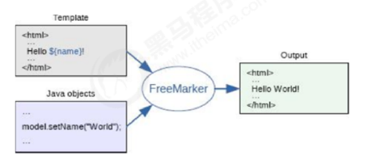

# day07 freemaker

1)网页静态化介绍 
2)Freemarker介绍
3) Freemarker入门及语法
4) 项目中网页的静态化技术实现

## 01-网页静态化介绍  06:22

```
问: 如何提升程序的访问效率,减少数据库查询
  1)缓存技术,例如redis 
  2)写死页面(静态页面)
 第二种方案显然速度更快,但是我们不能每个套餐(商品)都写一个静态页面吧. 太浪费时间了,怎么办?
 
```

解决方案1 手动编写程序处理

```
   我们发现套餐页面的样式等是固定的,只有数据是变化的,能不能写一个"模板"然后写一个程序从数据库读取动态的数据然后通过程序将模板标签替换,动态的生成一个页面
```

解决方案2使用别人提供好的工具

```
FreeMarker是一款用Java语言编写的模板引擎，用它可以通过模板和要改变的数据来生成输出文本(例如HTML网页，配置文件，源代码等)，作为用来实现网页静态化技术的一种手段。

thymeleaf 也是一个优秀的模板技术,和freeMaker 类似
```

## 02-Freemarker介绍 04:21

```
在线文档
http://freemarker.foofun.cn/toc.html
```


FreeMarker 是一个用 Java 语言编写的模板引擎，它基于模板来生成文本输出



## 03-Freemarker入门案例 21:44

1) 导入坐标

```
<dependency>
<groupId>org.freemarker</groupId>
<artifactId>freemarker</artifactId>
<version>2.3.23</version>
</dependency>
```

2) 创建模板文件

```html
<html>
<head>
<meta charset="utf-8">
<title>Freemarker入门</title>
</head>
<body>
<#--我只是一个注释，我不会有任何输出 -->
${name}你好，${message}
</body>
</html>
```

3) 生成文件

```java
public static void main(String[] args) throws Exception{
//1.创建配置类
Configuration configuration=new Configuration(Configuration.getVersion());
//2.设置模板所在的目录
configuration.setDirectoryForTemplateLoading(new File("D:\\ftl"));
//3.设置字符集,读取文件的编码
configuration.setDefaultEncoding("utf-8");
//4.加载模板
Template template = configuration.getTemplate("test.ftl");
//5.创建数据模型
Map map=new HashMap();
map.put("name", "张三");
map.put("message", "欢迎来到传智播客！");
//6.创建Writer对象
//   // 指定输出编码格式 utf-8
        Writer writer = new BufferedWriter(new OutputStreamWriter(new FileOutputStream ("d:\\ftl\\test.html"),"UTF-8"));
//Writer out =new FileWriter(new File("d:\\test.flt"));
//7.输出
template.process(map, out);
//8.关闭Writer对象
out.close();
}
```

小结:

freemaker 模板内容

1、文本，直接输出的部分 

2、注释，即<#--...-->格式不会输出 

3、插值（Interpolation）：即${..}部分,
将使用数据模型中的部分替代输出 

4、FTL指令：FreeMarker指令，和HTML标记类似，名字前加#予以
区分，不会输出

## 04- assign指令

assign指令用于在页面上定义一个变量

```html
1)定义简单类型
<#assign linkman="周先生">
联系人：${linkman}
2)定义对象类型  
<#assign info={"mobile":"13812345678",'address':'北京市昌平区'} >
电话：${info.mobile} 地址：${info.address}
```

## 05-include指令

include指令用于模板文件的嵌套

```html
<#include "head.ftl"/>
```


## 06-if指令

在模板文件中使用if指令进行判断

```html
<#if (gender>0) > 男</#if>

<#if success=true>
你已通过实名认证
<#elseif>
你未通过实名认证
</#if>
```

（2）在java代码中为success变量赋值

```java
map.put("success", true);
```

在freemarker的判断中，可以使用= 也可以使用==

## 07-if 指令补充

```
assign 指令和java 代码都可以定义变量, 如果都定义同一个则以 assign 为为准
```

## 08-list

```html
<#list goodsList as goods>
商品名称： ${goods.name} 价格：${goods.price}<br>
</#list>
```

## 08-补充 -freemaker 为空

```
http://freemarker.foofun.cn/
```

```
1判断某变量是否存在:“??”
<#if name??>
${aaa!''} 如果为空显示 ' '

freemarker中显示某对象使用${name}.
但如果name为null，freemarker就会报错。这时候需要判断参数是不是空，可以通过如下语句：
<#if name??>
……
</#if>
2：当然也可以通过设置默认值${name!''}来避免对象为空的错误。如果name为空，就以默认值（“!”后的字符）显示。

3：对象user，name为user的属性的情况，user，name都有可能为空，那么可以写成${(user.name)!''}表示user或者name为null，都显示为空。判断为空（注意有个小括号，很多人会忘记）
<#if (user.name)??>
……
</#if>
```

内建函数(freemaker 内部建立的一些函数)

```
内建函数说白了就类似于我们Java 对象的函数, 比如java 字符串函数的length()
1)list?size 获取数组大小
2) 字符串转json
<#assign text="{'bank':'工商银行','account':'10101920201920212'}" />
	<#assign data=text?eval />
3) 日期格式化
	当前日期：${today?date} <br>
当前时间：${today?time} <br>   
当前日期+时间：${today?datetime} <br>        
日期格式化：  ${today?string("yyyy年MM月")}  // 参考java 字符串格式转换语法

price?c
```

## 09--生成移动端 分析

```
前面我们已经学习了Freemarker的基本使用方法，下面我们就可以将Freemarker应用到项目中，帮我
们生成移动端套餐列表静态页面和套餐详情静态页面。接下来我们需要思考几个问题：
 (0) 那些页面应该静态化? 数据不经常发生变化,访问量大的
（1）什么时候生成静态页面比较合适呢？
（2）将静态页面生成到什么位置呢？
（3）应该生成几个静态页面呢？
对于第一个问题，应该是当套餐数据发生改变时，需要生成静态页面，即我们通过后台系统修改套餐数
据（包括新增、删除、编辑）时。
对于第二个问题，如果是在开发阶段可以将文件生成到项目工程中，如果上线后可以将文件生成到移动
端系统运行的tomcat中。
对于第三个问题，套餐列表只需要一个页面就可以了，在这个页面中展示所有的套餐列表数据即可。套
餐详情页面需要有多个，即一个套餐应该对应一个静态页面。
```

## 10-套餐列表模板

mobile_setmeal.ftl

```html
<!DOCTYPE html>
<html lang="zh-CN">
<head>
    <meta charset="utf-8">
    <meta http-equiv="X-UA-Compatible" content="IE=edge">
    <!-- 上述3个meta标签*必须*放在最前面，任何其他内容都*必须*跟随其后！ -->
    <meta name="viewport" content="width=device-width, initial-scale=1.0, maximum-scale=1.0, user-scalable=0,user-scalable=no,minimal-ui">
    <meta name="description" content="">
    <meta name="author" content="">
    <link rel="icon" href="../img/asset-favico.ico">
    <title>预约</title>
    <link rel="stylesheet" href="../css/page-health-order.css" />
</head>
<body data-spy="scroll" data-target="#myNavbar" data-offset="150">
<div class="app" id="app">
    <!-- 页面头部 -->
    <div class="top-header">
        <span class="f-left"><i class="icon-back" onclick="history.go(-1)"></i></span>
        <span class="center">传智健康</span>
        <span class="f-right"><i class="icon-more"></i></span>
    </div>
    <!-- 页面内容 -->
    <div class="contentBox">
        <div class="list-column1">
            <ul class="list">
                <#list setmealList as setmeal>
                    <li class="list-item">
                        <a class="link-page" href="setmeal_detail_${setmeal.id}.html">
                            
                            <div class="item-body">
                                <h4 class="ellipsis item-title">${setmeal.name}</h4>
                                <p class="ellipsis-more item-desc">${setmeal.remark}</p>
                                <p class="item-keywords">
                                    <span>
                                        <#if setmeal.sex == '0'>
                                            性别不限
                                        <#else>
                                            <#if setmeal.sex == '1'>
                                                男
                                            <#else>
                                                女
                                            </#if>
                                        </#if>
                                    </span>
                                    <span>${setmeal.age}</span>
                                </p>
                            </div>
                        </a>
                    </li>
                </#list>
            </ul>
        </div>
    </div>
</div>
<!-- 页面 css js -->
<script src="../plugins/vue/vue.js"></script>
<script src="../plugins/vue/axios-0.18.0.js"></script>
</body>
```

## 11-套餐详情列表页面

```html
<!DOCTYPE html>
<html lang="zh-CN">
<head>
    <meta charset="utf-8">
    <meta http-equiv="X-UA-Compatible" content="IE=edge">
    <!-- 上述3个meta标签*必须*放在最前面，任何其他内容都*必须*跟随其后！ -->
    <meta name="viewport" content="width=device-width, initial-scale=1.0, maximum-scale=1.0, user-scalable=0,user-scalable=no,minimal-ui">
    <meta name="description" content="">
    <meta name="author" content="">
    <link rel="icon" href="../img/asset-favico.ico">
    <title>预约详情</title>
    <link rel="stylesheet" href="../css/page-health-orderDetail.css" />
    <script src="../plugins/vue/vue.js"></script>
    <script src="../plugins/vue/axios-0.18.0.js"></script>
    <script src="../plugins/healthmobile.js"></script>
</head>
<body data-spy="scroll" data-target="#myNavbar" data-offset="150">
<div id="app" class="app">
    <!-- 页面头部 -->
    <div class="top-header">
        <span class="f-left"><i class="icon-back" onclick="history.go(-1)"></i></span>
        <span class="center">传智健康</span>
        <span class="f-right"><i class="icon-more"></i></span>
    </div>
    <!-- 页面内容 -->
    <div class="contentBox">
        <div class="card">
            <div class="project-img">
                
            </div>
            <div class="project-text">
                <h4 class="tit">${setmeal.name}</h4>
                <p class="subtit">${setmeal.remark}</p>
                <p class="keywords">
                    <span>
						<#if setmeal.sex == '0'>
							性别不限
                        <#else>
                            <#if setmeal.sex == '1'>
								男
                            <#else>
								女
                            </#if>
                        </#if>
                    </span>
                    <span>${setmeal.age}</span>
                </p>
            </div>
        </div>
        <div class="table-listbox">
            <div class="box-title">
                <i class="icon-zhen"><span class="path1"></span><span class="path2"></span></i>
                <span>套餐详情</span>
            </div>
            <div class="box-table">
                <div class="table-title">
                    <div class="tit-item flex2">项目名称</div>
                    <div class="tit-item  flex3">项目内容</div>
                    <div class="tit-item  flex3">项目解读</div>
                </div>
                <div class="table-content">
                    <ul class="table-list">
						<#list setmeal.checkGroups as checkgroup>
                            <li class="table-item">
                                <div class="item flex2">${checkgroup.name}</div>
                                <div class="item flex3">
									<#list checkgroup.checkItems as checkitem>
                                        <label>
                                            ${checkitem.name}
                                        </label>
                                    </#list>
                                </div>
                                <div class="item flex3">${checkgroup.remark}</div>
                            </li>
                        </#list>
                    </ul>
                </div>
                <div class="box-button">
                    <a @click="toOrderInfo()" class="order-btn">立即预约</a>
                </div>
            </div>
        </div>
    </div>
</div>
<script>
    var vue = new Vue({
        el:'#app',
        methods:{
            toOrderInfo(){
                window.location.href = "orderInfo.html?id=${setmeal.id}";
            }
        }
    });
</script>
</body>
```

## 配置文件

```xml
<bean id="freemarkerConfig"
class="org.springframework.web.servlet.view.freemarker.FreeMarkerConfigurer">
<!--指定模板文件所在目录-->
<property name="templateLoaderPath" value="/WEB-INF/ftl/" />
<!--指定字符集-->
<property name="defaultEncoding" value="UTF-8" />
</bean>
<context:property-placeholder location="classpath:freemarker.properties"/>
```

13 java 代码

```java
//新增套餐，同时关联检查组
    public void add(Setmeal setmeal, Integer[] checkgroupIds) {
        setmealDao.add(setmeal);
        Integer setmealId = setmeal.getId();//获取套餐id
        this.setSetmealAndCheckGroup(setmealId,checkgroupIds);
        //完成数据库操作后需要将图片名称保存到redis
        jedisPool.getResource().sadd(RedisConstant.SETMEAL_PIC_DB_RESOURCES,setmeal.getImg());

        //当添加套餐后需要重新生成静态页面（套餐列表页面、套餐详情页面）
        generateMobileStaticHtml();
    }

    //生成当前方法所需的静态页面
    public void generateMobileStaticHtml(){
        //在生成静态页面之前需要查询数据
        List<Setmeal> list = setmealDao.findAll();

        //需要生成套餐列表静态页面
        generateMobileSetmealListHtml(list);

        //需要生成套餐详情静态页面
        generateMobileSetmealDetailHtml(list);
    }

    //生成套餐列表静态页面
    public void generateMobileSetmealListHtml(List<Setmeal> list){
        Map map = new HashMap();
        //为模板提供数据，用于生成静态页面
        map.put("setmealList",list);
        generteHtml("mobile_setmeal.ftl","m_setmeal.html",map);
    }

    //生成套餐详情静态页面（可能有多个）
    public void generateMobileSetmealDetailHtml(List<Setmeal> list){
        for (Setmeal setmeal : list) {
            Map map = new HashMap();
            map.put("setmeal",setmealDao.findById4Detail(setmeal.getId()));
            generteHtml("mobile_setmeal_detail.ftl","setmeal_detail_" + setmeal.getId() + ".html",map);
        }
    }

    //通用的方法，用于生成静态页面
    public void generteHtml(String templateName,String htmlPageName,Map map){
        Configuration configuration = freeMarkerConfigurer.getConfiguration();//获得配置对象
        Writer out = null;
        try {
            Template template = configuration.getTemplate(templateName);
            //构造输出流
            // 中文乱码  
            //out = new BufferedWriter (new OutputStreamWriter (new FileOutputStream (outPutPath + "/" + htmlPageName),"UTF-8"));            //构造输出流
            out = new FileWriter(new File(outPutPath + "/" + htmlPageName));
            //输出文件
            template.process(map,out);
            out.close();
        } catch (Exception e) {
            e.printStackTrace();
        }
    }
```

14 -测试

```
  public void genById(Integer setmealId){
        Map map = new HashMap();
        map.put("setmeal",setmealDao.findById4Detail(setmealId));
        generteHtml("mobile_setmeal_detail.ftl","setmeal_detail_" + setmealId + ".html",map);
    }
```


15-bug 修复,,数据为空

1-bug 修复数据不为空