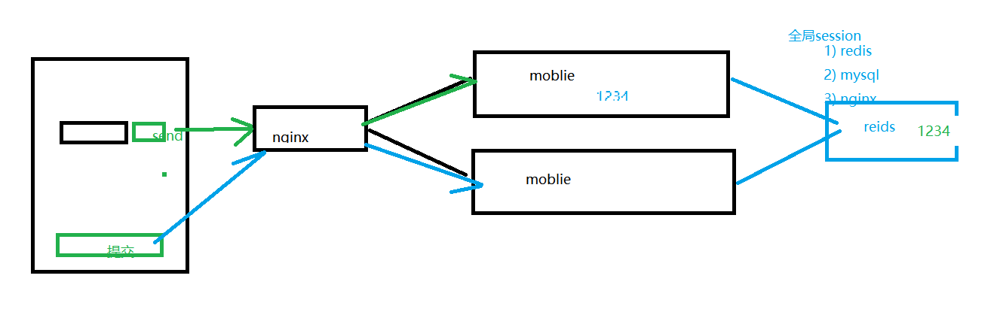

```js
// js date 减一天
this.today2 = this.today2.setDate(this.today2.getDate()-1);
```


## 01-本章内容介绍  04:31

1.体检预约的流程

2.体检预约功能开发

3.预约成功页面展示


## 02-体检预约流程说明     01:46

体检预约流程

1、在移动端首页点击体检预约，页面跳转到套餐列表页面
2、在套餐列表页面点击要预约的套餐，页面跳转到套餐详情页面
**3、在套餐详情页面点击立即预约，页面跳转到预约页面**
**4、在预约页面录入体检人信息，包括手机号，点击发送验证码**
**5、在预约页面录入收到的手机短信验证码，点击提交预约，完成体检预约**

 参看day01流程图

## 03-体检预约_页面调整（展示预约的套餐信息） 10:07

在预约页面（/pages/orderInfo.html）进行调整

#### 展示预约的套餐信息

第一步：从请求路径中获取当前套餐的id

```html
<script>
var id = getUrlParam("id");//套餐id
</script>
```

第二步：定义模型数据setmeal，用于套餐数据展示

```javascript
			data:{
                    setmeal:{},//套餐信息
                    orderInfo:{
                        setmealId:id,
                        sex:'1'
                    }//预约信息
                },
```

第三步：在VUE的钩子函数中发送ajax请求，根据id查询套餐信息

```javascript
			mounted(){
                    //发送ajax请求，根据套餐ID查询套餐信息，用于页面展示
                    axios.post("/setmeal/findById.do?id=" + id).then((res) =>{
                        if(res.data.flag){
                            this.setmeal = res.data.data;
                        }
                    });
                }
```


## 04-体检预约_页面调整（手机号输入校验）  08:30

第一步：在页面导入的healthmobile.js文件中已经定义了校验手机号的方法

```javascript
/**
 * 手机号校验
 1--以1为开头；
 2--第二位可为3456789中的任意一位；
 3--最后以0-9的9个整数结尾。
 */
function checkTelephone(telephone) {
    var reg=/^[1][3456789][0-9]{9}$/;
    if (!reg.test(telephone)) {
        return false;
    } else {
        return true;
    }
}
```

>原例子中只判断了34578，其实6和9已经被加到运营商的号段中了


第二步：为发送验证码按钮绑定事件sendValidateCode

```html
<div class="input‐row">
<label>手机号</label>
<input v‐model="orderInfo.telephone"
type="text" class="input‐clear" placeholder="请输入手机号">
<input style="font‐size: x‐small;"
id="validateCodeButton" @click="sendValidateCode()"
type="button" value="发送验证码">
</div>
```

```javascript
//发送验证码
sendValidateCode(){
//获取用户输入的手机号
var telephone = this.orderInfo.telephone;
//校验手机号输入是否正确
if (!checkTelephone(telephone)) {
		this.$message.error('请输入正确的手机号');
		return false;
	}
}
```


## 05-体检预约_页面调整（30秒倒计时效果）   09:08

```javascript
clock = window.setInterval(doLoop,1000);
```

通过jquery的id选择器，找到validateCodeButton的dom对象

```
validateCodeButton = $("#validateCodeButton")[0];
```

>这个对象赋值可以在mounted中进行，这样只需要初始化一次，顺序是：
>
>1.加载healthmobile.js
>
>2.加载dom
>
>3.设置validateCodeButton为按钮的dom对象


其中，validateCodeButton和clock是在healthmobile.js文件中定义的变量，doLoop是
在healthmobile.js文件中定义的方法

```javascript
var clock = '';//定时器对象，用于页面30秒倒计时效果
var nums = 30;
var validateCodeButton;//按钮对象
//基于定时器实现30秒倒计时效果
function doLoop() {
    validateCodeButton.disabled = true;//将按钮置为不可点击
    nums--;
    if (nums > 0) {
        validateCodeButton.value = nums + '秒后重新获取';
    } else {
        clearInterval(clock); //清除js定时器
        validateCodeButton.disabled = false;//按钮又可以点击了
        validateCodeButton.value = '重新获取验证码';
        nums = 30; //重置时间
    }
}
```

>1.初始化nums为30，每次-1，所以第一次就是29,
>
>2.由于nums>0,所以显示为29秒后重新获取
>
>3.直接nums=0，也就是30秒后，会清除js定时器，恢复按钮状态和文字，重置nums为30

```js
<script>
var num=10;

function log(){
	console.log(new Date());
	num--;
	if(num<=0){
		clearInterval(clock);
	}
}

var clock= setInterval(log,1000);

</script>
```


## 06-体检预约_页面调整（发送ajax请求为用户发送短信验证码） 19:03

在按钮上显示30秒倒计时效果的同时，需要发送ajax请求，在后台给用户发送手机验证
码

```javascript
axios.post("/validateCode/send4Order.do?telephone=" +
telephone).then((response) => {
if(!response.data.flag){
//验证码发送失败
	this.$message.error('验证码发送失败，请检查手机号输入是否正确');
	}
}
```

创建ValidateCodeController，提供方法发送短信验证码，并将验证码保存到redis

```java
package com.itheima.controller;

import com.itheima.constant.MessageConstant;
import com.itheima.constant.RedisMessageConstant;
import com.itheima.entity.Result;
import com.itheima.utils.SMSUtils;
import com.itheima.utils.ValidateCodeUtils;
import org.springframework.beans.factory.annotation.Autowired;
import org.springframework.web.bind.annotation.RequestMapping;
import org.springframework.web.bind.annotation.RestController;
import redis.clients.jedis.JedisPool;

/**
 * 验证码操作
 */

@RestController
@RequestMapping("/validateCode")
public class ValidateCodeController {
    @Autowired
    private JedisPool jedisPool;

    //用户在线体检预约发送验证码
    @RequestMapping("/send4Order")
    public Result send4Order(String telephone){
        //随机生成4位数字验证码
        String validateCode = ValidateCodeUtils.generateValidateCode(4).toString();
        //给用户发送验证码
        try{
      // request.setTemplateParam("{\""+key+"\":\""+value+"\"}");  
          SMSUtils.sendShortMessage(SMSUtils.VALIDATE_CODE,telephone,validateCode);
        }catch (Exception e){
            e.printStackTrace();
            return new Result(false, MessageConstant.SEND_VALIDATECODE_FAIL);
        }
        //将验证码保存到redis（5分钟）
        jedisPool.getResource().setex(telephone + RedisMessageConstant.SENDTYPE_ORDER,300,validateCode);
        //300  240秒 过了60秒  >= 240
        return new Result(true,MessageConstant.SEND_VALIDATECODE_SUCCESS);
    }
}

```

>1.ValidateCodeUtils获取验证码，4位
>
>2.通过SMSUtils的发送短信验证码，发送短信，如果失败就返回错误信息。
>
>3.写入到redis中，并设置过期时间为300秒（5分钟）。redis的key一般由手机号+业务名来拼合而成，避免不同业务同一个手机号重复

拓展：

这种只在前端加校验的方式，很容易被通过模拟请求的方式，大量调用发送验证码的方法。可以在方法中针对同样的redis key获取到过期时间，如果过期时间>240，也就是说时间过了少于(300-240)=60秒，不允许用户重新发。

```java
package com.itheima.controller;

import com.itheima.constant.MessageConstant;
import com.itheima.constant.RedisMessageConstant;
import com.itheima.entity.Result;
import com.itheima.utils.SMSUtils;
import com.itheima.utils.ValidateCodeUtils;
import org.springframework.beans.factory.annotation.Autowired;
import org.springframework.web.bind.annotation.RequestMapping;
import org.springframework.web.bind.annotation.RestController;
import redis.clients.jedis.JedisPool;

/**
 * 验证码操作
 */

@RestController
@RequestMapping("/validateCode")
public class ValidateCodeController {
    @Autowired
    private JedisPool jedisPool;

    //用户在线体检预约发送验证码
    @RequestMapping("/send4Order")
    public Result send4Order(String telephone){
        String key = telephone + RedisMessageConstant.SENDTYPE_ORDER;
        //随机生成4位数字验证码
        String validateCode = ValidateCodeUtils.generateValidateCode(4).toString();
        Long ttl = jedisPool.getResource().ttl(key);
        if(ttl > 240){
            return new Result(false, "一分钟内不能重复点击");
        }
        //给用户发送验证码
        try{
            SMSUtils.sendShortMessage(SMSUtils.VALIDATE_CODE,telephone,validateCode);
            //System.out.println(validateCode);
        }catch (Exception e){
            e.printStackTrace();
            jedisPool.getResource().del(key);
            return new Result(false, MessageConstant.SEND_VALIDATECODE_FAIL);
        }
        //将验证码保存到redis（5分钟）
        jedisPool.getResource().setex(key,300,validateCode);
        return new Result(true,MessageConstant.SEND_VALIDATECODE_SUCCESS);
    }
}

```




前端把清除定时器的方法封装一下：

```javascript
var clock = '';//定时器对象，用于页面30秒倒计时效果
var nums = 30;
var validateCodeButton;//按钮对象
//基于定时器实现30秒倒计时效果
function doLoop() {
    validateCodeButton.disabled = true;//将按钮置为不可点击
    nums--;
    if (nums > 0) {
        validateCodeButton.value = nums + '秒后重新获取';
    } else {
        clearLoop()
    }
}

function clearLoop() {
    clearInterval(clock); //清除js定时器
    validateCodeButton.disabled = false;//按钮又可以点击了
    validateCodeButton.value = '重新获取验证码';
    nums = 30; //重置时间
}
```

如果发送短信失败，清除定时器：

```javascript
axios.post("/validateCode/send4Order.do?telephone=" + telephone).then((res) => {
                            if(!res.data.flag){
                                //短信验证码发送失败
                                this.$message.error(res.data.message);
                                clearLoop()
                            }
 });
```


## 07-体检预约_页面调整（日历展示）   07:40

页面中使用DatePicker控件来展示日历。根据需求，最多可以提前一个月进行体检预
约，所以日历控件只展示未来一个月的日期

```html
<div class="date">
<label>体检日期</label>
<i class="icon‐date" class="picktime"></i>
<input v‐model="orderInfo.orderDate" type="text" class="picktime"
readonly>
</div>
```

```javascript
<script>
//日期控件
var calendar = new datePicker();
calendar.init({
'trigger': '.picktime',/*按钮选择器，用于触发弹出插件*/
'type': 'date',/*模式：date日期；datetime日期时间；time时间；ym年月；*/
'minDate': getSpecifiedDate(new Date(),1),/*最小日期*/
'maxDate': getSpecifiedDate(new Date(),30),/*最大日期*/
'onSubmit': function() { /*确认时触发事件*/},
'onClose': function() { /*取消时触发事件*/ }
});
</script>
```

>1.minDate设置了从明天开始
>
>2.maxDate设置了30天后


其中getSpecifiedDate方法定义在healthmobile.js文件中

```javascript
//获得指定日期后指定天数的日期
function getSpecifiedDate(date,days) {
date.setDate(date.getDate() + days);//获取指定天之后的日期
var year = date.getFullYear();
var month = date.getMonth() + 1;
var day = date.getDate();
return (year + "‐" + month + "‐" + day);
}
```


## 08-体检预约_页面调整（提交预约请求）  08:55

为提交预约按钮绑定事件

```html
<div class="box‐button">
<button @click="submitOrder()" type="button" class="btn order‐btn">提交
预约</button>
</div>
```

```javascript
//提交预约
submitOrder(){
//校验身份证号格式
if(!checkIdCard(this.orderInfo.idCard)){
	this.$message.error('身份证号码输入错误，请重新输入');
	return ;
}

axios.post("/order/submit.do",this.orderInfo).then((response) => {
if(response.data.flag){
	//预约成功，跳转到预约成功页面
	window.location.href="orderSuccess.html?orderId=" +
	response.data.data;
}else{
	//预约失败，提示预约失败信息
	this.$message.error(response.data.message);
	}
});
}
```

> /order/submit.do这个接口需要返回预约的ID，用来在预约成功的页面展示相关的预约数据


校验身份证号：

```javascript
/**
 * 身份证号码校验
 * 身份证号码为15位或者18位，15位时全为数字，18位前17位为数字，最后一位是校验位，可能为数字或字符X
 */
function checkIdCard(idCard){
    var reg = /(^\d{15}$)|(^\d{18}$)|(^\d{17}(\d|X|x)$)/;
    if(reg.test(idCard)){
        return true;
    }else{
        return false;
    }
}
```

关于身份证号的一些补充:

​	实际上现在的身份证号有自己独有的规则

```
在早期身份证号只有15位,没有出生年份,校验不严格,当时全国也没有联网,甚至出现了身份证号重复的现象
18位身份证号码规则：
	前1、2位数字表示：所在省份的代码；
	第3、4位数字表示：所在城市的代码；
	第5、6位数字表示：所在区县的代码；
	第7-14位数字表示：出生年、月、日；
	第15、16位数字表示：所在地的派出所的代码；
	第17位数字表示性别：奇数表示男性，偶数表示女性；
	第18位数字是校检码。是根据前17位数字计算出来的一个 1-10 的数据, 如果计算的是10 用x 代替
```


## 09-体检预约_后台代码（Controller、思路分析）07:32

在health_mobile工程中创建OrderController并提供submitOrder方法

```java
package com.itheima.controller;

import com.alibaba.dubbo.config.annotation.Reference;
import com.itheima.constant.MessageConstant;
import com.itheima.constant.RedisMessageConstant;
import com.itheima.entity.Result;
import com.itheima.pojo.Order;
import com.itheima.service.OrderService;
import com.itheima.utils.SMSUtils;
import org.springframework.beans.factory.annotation.Autowired;
import org.springframework.web.bind.annotation.RequestBody;
import org.springframework.web.bind.annotation.RequestMapping;
import org.springframework.web.bind.annotation.RestController;
import redis.clients.jedis.JedisPool;

import java.util.Map;

/**
 * 体检预约处理
 */
@RestController
@RequestMapping("/order")
public class OrderController {
    @Autowired
    private JedisPool jedisPool;
    @Reference
    private OrderService orderService;
    //在线体检预约
    @RequestMapping("/submit")
    public Result submit(@RequestBody Map map){
        String telephone = (String) map.get("telephone");
        //首先判断参数是否正确，telephone字段是否为null或者空字符串
        //验证码是否为空
        //从Redis中获取保存的验证码
        //telephone + RedisMessageConstant.SENDTYPE_ORDER
        //将用户输入的验证码和Redis中保存的验证码进行比对
        //如果比对成功，调用服务完成预约业务处理 SERVICE_PROVIDER接口来进行数据库存储
        //如果比对不成功，返回结果给页面   new Result(false,xxx)
    }

}

```


## 10-体检预约_后台代码（Controller、服务接口） 15:13

```java
public class OrderController {
    @Autowired
    private JedisPool jedisPool;
    @Reference
    private OrderService orderService;
    //在线体检预约
    @RequestMapping("/submit")
    public Result submit(@RequestBody Map map){

        //  1)   (String) map.get("telephone")   空指针异常风险


        String telephone = (String) map.get("telephone");
        //从Redis中获取保存的验证码
        String validateCodeInRedis = jedisPool.getResource().get(telephone + RedisMessageConstant.SENDTYPE_ORDER);
        String validateCode = (String) map.get("validateCode");

        //  2)  没有处理暴力破解
        //  每个手机号每次点击 变量+1 存储到redis

        String numstr = jedisPool.getResource().get(telephone + RedisMessageConstant.SENDTYPE_ORDER+"num");
        int num=0;
        if(numstr!=null&&numstr.length()>0){
             num = Integer.parseInt(numstr);
        }

        if(num>5){
            return new Result(false, "操作过于频繁");
        }

        num++;
        jedisPool.getResource().setex(telephone + RedisMessageConstant.SENDTYPE_ORDER+"num",10,num+"");


        //将用户输入的验证码和Redis中保存的验证码进行比对
        if(validateCodeInRedis != null && validateCode != null && validateCode.equals(validateCodeInRedis)){
            //如果比对成功，调用服务完成预约业务处理
            map.put("orderType", Order.ORDERTYPE_WEIXIN);//设置预约类型，分为微信预约、电话预约
            Result result = null;
            try{
                result = orderService.order(map);//通过Dubbo远程调用服务实现在线预约业务处理
            }catch (Exception e){
                e.printStackTrace();
                return new Result(false, MessageConstant.VALIDATECODE_ERROR);
            }

            if(result.isFlag()){
                //预约成功，可以为用户发送短信
                try{
                    SMSUtils.sendShortMessage(SMSUtils.ORDER_NOTICE,telephone, (String) map.get("orderDate"));
                }catch (Exception e){
                    e.printStackTrace();
                }
            }
            return result;
        }else{
            //如果比对不成功，返回结果给页面
            return new Result(false, MessageConstant.VALIDATECODE_ERROR);
        }
    }
```

>1.比对redis中存储的手机号验证码和前台传递过来的验证码，如果失败直接返回错误结果
>
>2.第一步中如果成功，设置预约类型，分为微信预约、电话预约。这里通过接口调用一定是微信预约。
>
>3.调用dubbo服务进行预约
>
>4.如果预约成功，发送短信给用户。注意短信中包含预约日期，这个预约日期会从dubbo服务的返回值中进行获取。


在health_interface工程中创建体检预约服务接口OrderService并提供预约方法

```java
package com.itheima.service;
import com.itheima.entity.Result;
import java.util.Map;
/**
* 体检预约服务接口
*/
public interface OrderService {
	//体检预约
	public Result order(Map map) throws Exception;
}
```


## 11-体检预约_后台代码（业务处理思路分析） 07:50

体检预约方法处理逻辑比较复杂，需要进行如下业务处理：
1、检查用户所选择的预约日期是否已经提前进行了预约设置，如果没有设置则无法进行
预约。

>后台系统中可以设置每天最多的预约人数，如果没有进行设置，是不允许用户去进行这天的预约
>
>查找t_ordersetting 参数：预约日期orderDate

2、检查用户所选择的预约日期是否已经约满，如果已经约满则无法预约

>获取数据库中的已预约人数和可预约人数，如果已预约人数>=可预约人数，则无法预约
>
>判断已预约人数>=可预约人数，是则返回错误，否继续进行

3、检查用户是否重复预约（同一个用户在同一天预约了同一个套餐），如果是重复预约
则无法完成再次预约

> 检查member表中的会员，是否在order表中在同一天预约了同一个套餐
>
> 通过手机号拿到member信息 t_member 参数手机号
>
> 查找t_order 通过member_id orderDate setmeal_id

4、检查当前用户是否为会员，如果是会员则直接完成预约，如果不是会员则自动完成注
册并进行预约

>上一步中member表中会员未查到，就自动注册
>
>insert 一条数据到t_member
>
>进行预约 insert t_order 添加预约信息

5、预约成功，更新当日的已预约人数

>第1步中获取到的预约设置信息，已预约人数+1，update  t_ordersetting


## 12-体检预约_后台代码（服务实现类_判断所选预约日期是否进行了预约设置） 08：31

```java
//1、检查用户所选择的预约日期是否已经提前进行了预约设置，如果没有设置则无法进行预约
        String orderDate = (String) map.get("orderDate");//预约日期
// 可以使用 SimpleDateFomrat.parse   转换
        OrderSetting orderSetting= orderSettingDao.findByOrderDate(DateUtils.parseString2Date(orderDate));
        if(orderSetting == null){
            //指定日期没有进行预约设置，无法完成体检预约
            return new Result(false, MessageConstant.SELECTED_DATE_CANNOT_ORDER);
        }
```

>findByOrderDate获取出来的OrderSetting数据，后续代码会中多次用到

在OrderSettingDao中添加方法：

```java
  public OrderSetting findByOrderDate(Date orderDate);
```

在OrderSettingDao.xml中添加：

```xml
    <!--根据日期查询预约设置信息-->
    <select id="findByOrderDate" parameterType="date" resultType="com.itheima.pojo.OrderSetting">
        select * from t_ordersetting where orderDate = #{orderDate}
    </select>
```


## 13-体检预约_后台代码（服务实现类_判断所选预约日期是否已经约满）  02:17

```java
        //2、检查用户所选择的预约日期是否已经约满，如果已经约满则无法预约
        int number = orderSetting.getNumber();//可预约人数
        int reservations = orderSetting.getReservations();//已预约人数
        if(reservations >= number){
            //已经约满，无法预约
            return new Result(false,MessageConstant.ORDER_FULL);
        }
```


## 14-体检预约_后台代码（服务实现类_判断用户是否在重复预约） 12:28

MemberDao.xml

```xml
<?xml version="1.0" encoding="UTF-8" ?>
<!DOCTYPE mapper PUBLIC "-//mybatis.org//DTD Mapper 3.0//EN"
        "http://mybatis.org/dtd/mybatis-3-mapper.dtd" >
<mapper namespace="com.itheima.dao.MemberDao" >
    <select id="findAll" resultType="com.itheima.pojo.Member">
        select * from t_member
    </select>

    <!--根据条件查询-->
    <select id="selectByCondition" parameterType="string" resultType="com.itheima.pojo.Member">
        select * from t_member
        <if test="value != null and value.length > 0">
            where fileNumber = #{value} or phoneNumber = #{value} or name = #{value}
        </if>
    </select>

    <!--新增会员-->
    <insert id="add" parameterType="com.itheima.pojo.Member">
        <selectKey resultType="java.lang.Integer" order="AFTER" keyProperty="id">
            SELECT LAST_INSERT_ID()
        </selectKey>
        insert into t_member(fileNumber,name,sex,idCard,phoneNumber,regTime,password,email,birthday,remark)
        values (#{fileNumber},#{name},#{sex},#{idCard},#{phoneNumber},#{regTime},#{password},#{email},#{birthday},#{remark})
    </insert>

    <!--删除会员-->
    <delete id="deleteById" parameterType="int">
        delete from t_member where id = #{id}
    </delete>

    <!--根据id查询会员-->
    <select id="findById" parameterType="int" resultType="com.itheima.pojo.Member">
        select * from t_member where id = #{id}
    </select>

    <!--根据id查询会员-->
    <select id="findByTelephone" parameterType="string" resultType="com.itheima.pojo.Member">
        select * from t_member where phoneNumber = #{phoneNumber}
    </select>

    <!--编辑会员-->
    <update id="edit" parameterType="com.itheima.pojo.Member">
        update t_member
        <set>
            <if test="fileNumber != null">
                fileNumber = #{fileNumber},
            </if>
            <if test="name != null">
                name = #{name},
            </if>
            <if test="sex != null">
                sex = #{sex},
            </if>
            <if test="idCard != null">
                idCard = #{idCard},
            </if>
            <if test="phoneNumber != null">
                phoneNumber = #{phoneNumber},
            </if>
            <if test="regTime != null">
                regTime = #{regTime},
            </if>
            <if test="password != null">
                password = #{password},
            </if>
            <if test="email != null">
                email = #{email},
            </if>
            <if test="birthday != null">
                birthday = #{birthday},
            </if>
            <if test="remark != null">
                remark = #{remark},
            </if>
        </set>
        where id = #{id}
    </update>

    <!--根据日期统计会员数，统计指定日期之前的会员数-->
    <select id="findMemberCountBeforeDate" parameterType="string" resultType="int">
        select count(id) from t_member where regTime &lt;= #{value}
    </select>

    <!--根据日期统计会员数-->
    <select id="findMemberCountByDate" parameterType="string" resultType="int">
        select count(id) from t_member where regTime = #{value}
    </select>

    <!--根据日期统计会员数，统计指定日期之后的会员数-->
    <select id="findMemberCountAfterDate" parameterType="string" resultType="int">
        select count(id) from t_member where regTime &gt;= #{value}
    </select>

    <!--总会员数-->
    <select id="findMemberTotalCount" resultType="int">
        select count(id) from t_member
    </select>
</mapper>
```

MemberDao.java

```java
package com.itheima.dao;

import com.github.pagehelper.Page;
import com.itheima.pojo.Member;

import java.util.List;

public interface MemberDao {
    public List<Member> findAll();
    public Page<Member> selectByCondition(String queryString);
    public void add(Member member);
    public void deleteById(Integer id);
    public Member findById(Integer id);
    public Member findByTelephone(String telephone);
    public void edit(Member member);
    public Integer findMemberCountBeforeDate(String date);
    public Integer findMemberCountByDate(String date);
    public Integer findMemberCountAfterDate(String date);
    public Integer findMemberTotalCount();
}

```

OrderDao.xml

```xml
<?xml version="1.0" encoding="UTF-8" ?>
<!DOCTYPE mapper PUBLIC "-//mybatis.org//DTD Mapper 3.0//EN"
        "http://mybatis.org/dtd/mybatis-3-mapper.dtd" >
<mapper namespace="com.itheima.dao.OrderDao" >
    <resultMap id="baseResultMap" type="com.itheima.pojo.Order">
        <id column="id" property="id"/>
        <result column="member_id" property="memberId"/>
        <result column="orderDate" property="orderDate"/>
        <result column="orderType" property="orderType"/>
        <result column="orderStatus" property="orderStatus"/>
        <result column="setmeal_id" property="setmealId"/>
    </resultMap>
    <!--新增-->
    <insert id="add" parameterType="com.itheima.pojo.Order">
        <selectKey resultType="java.lang.Integer" order="AFTER" keyProperty="id">
            SELECT LAST_INSERT_ID()
        </selectKey>
        insert into t_order(member_id,orderDate,orderType,orderStatus,setmeal_id)
        values (#{memberId},#{orderDate},#{orderType},#{orderStatus},#{setmealId})
    </insert>

    <!--动态条件查询-->
    <select id="findByCondition" parameterType="com.itheima.pojo.Order" resultMap="baseResultMap">
        select * from t_order
        <where>
            <if test="id != null">
                and id = #{id}
            </if>
            <if test="memberId != null">
                and member_id = #{memberId}
            </if>
            <if test="orderDate != null">
                and orderDate = #{orderDate}
            </if>
            <if test="orderType != null">
                and orderType = #{orderType}
            </if>
            <if test="orderStatus != null">
                and orderStatus = #{orderStatus}
            </if>
            <if test="setmealId != null">
                and setmeal_id = #{setmealId}
            </if>
        </where>
    </select>

    <!--根据预约id查询预约信息，包括体检人信息、套餐信息-->
    <select id="findById4Detail" parameterType="int" resultType="map">
        select m.name member ,s.name setmeal,o.orderDate orderDate,o.orderType orderType
        from
          t_order o,
          t_member m,
          t_setmeal s
        where o.member_id=m.id and o.setmeal_id=s.id and o.id=#{id}
    </select>

    <!--根据日期统计预约数-->
    <select id="findOrderCountByDate" parameterType="string" resultType="int">
        select count(id) from t_order where orderDate = #{value}
    </select>

    <!--根据日期统计预约数，统计指定日期之后的预约数-->
    <select id="findOrderCountAfterDate" parameterType="string" resultType="int">
        select count(id) from t_order where orderDate &gt;= #{value}
    </select>

    <!--根据日期统计到诊数-->
    <select id="findVisitsCountByDate" parameterType="string" resultType="int">
        select count(id) from t_order where orderDate = #{value} and orderStatus = '已到诊'
    </select>

    <!--根据日期统计到诊数，统计指定日期之后的到诊数-->
    <select id="findVisitsCountAfterDate" parameterType="string" resultType="int">
        select count(id) from t_order where orderDate &gt;= #{value} and orderStatus = '已到诊'
    </select>

    <!--热门套餐，查询前5条-->
    <select id="findHotSetmeal" resultType="map">
        select s.name, count(o.id) setmeal_count ,count(o.id)/(select count(id) from t_order) proportion
          from t_order o inner join t_setmeal s on s.id = o.setmeal_id
          group by o.setmeal_id
          order by setmeal_count desc limit 0,4
    </select>
</mapper>
```

OrderDao.java

```java
package com.itheima.dao;

import com.itheima.pojo.Order;

import java.util.List;
import java.util.Map;

public interface OrderDao {
    public void add(Order order);
    public List<Order> findByCondition(Order order);
    public Map findById4Detail(Integer id);
    public Integer findOrderCountByDate(String date);
    public Integer findOrderCountAfterDate(String date);
    public Integer findVisitsCountByDate(String date);
    public Integer findVisitsCountAfterDate(String date);
    public List<Map> findHotSetmeal();
}

```


OrderController中添加代码：

```java
        //3、检查用户是否重复预约（同一个用户在同一天预约了同一个套餐），如果是重复预约则无法完成再次预约
        String telephone = (String) map.get("telephone");//获取用户页面输入的手机号
        Member member = memberDao.findByTelephone(telephone);
        if(member != null){
            //判断是否在重复预约
            Integer memberId = member.getId();//会员ID
            Date order_Date = DateUtils.parseString2Date(orderDate);//预约日期
            String setmealId = (String) map.get("setmealId");//套餐ID
            Order order = new Order(memberId, order_Date, Integer.parseInt(setmealId));
            //根据条件进行查询
            List<Order> list = orderDao.findByCondition(order);
            if(list != null && list.size() > 0){
                //说明用户在重复预约，无法完成再次预约
                return new Result(false,MessageConstant.HAS_ORDERED);
            }
        }else{
            //4、检查当前用户是否为会员，如果是会员则直接完成预约，如果不是会员则自动完成注册并进行预约
        }
```


## 15-体检预约_后台代码（服务实现类_自动完成会员注册）  03:47

```java
		if(member != null){
            //判断是否在重复预约
            Integer memberId = member.getId();//会员ID
            Date order_Date = DateUtils.parseString2Date(orderDate);//预约日期
            String setmealId = (String) map.get("setmealId");//套餐ID
            Order order = new Order(memberId, order_Date, Integer.parseInt(setmealId));
            //根据条件进行查询
            List<Order> list = orderDao.findByCondition(order);
            if(list != null && list.size() > 0){
                //说明用户在重复预约，无法完成再次预约
                return new Result(false,MessageConstant.HAS_ORDERED);
            }
        }else{
            //4、检查当前用户是否为会员，如果是会员则直接完成预约，如果不是会员则自动完成注册并进行预约
            member = new Member();
            member.setName((String) map.get("name"));
            member.setPhoneNumber(telephone);
            member.setIdCard((String) map.get("idCard"));
            member.setSex((String) map.get("sex"));
            member.setRegTime(new Date());
            memberDao.add(member);//自动完成会员注册
        }
```


## 16-体检预约_后台代码（服务实现类_保存预约信息并更新已预约人数）  09:49

```java
        //5、预约成功，更新当日的已预约人数
        Order order = new Order();
        order.setMemberId(member.getId());//设置会员ID
        order.setOrderDate(DateUtils.parseString2Date(orderDate));//预约日期
        order.setOrderType((String) map.get("orderType"));//预约类型
        order.setOrderStatus(Order.ORDERSTATUS_NO);//到诊状态
        order.setSetmealId(Integer.parseInt((String) map.get("setmealId")));//套餐ID
        orderDao.add(order);

        orderSetting.setReservations(orderSetting.getReservations() + 1);//设置已预约人数+1
        orderSettingDao.editReservationsByOrderDate(orderSetting);

```

>setOrderStatus默认设置为未到诊
>
>添加完预约之后，需要更新已预约人数的数量


## 17-体检预约_测试   08:40

```java
 //体检预约
    public Result order(Map map) throws Exception{
        //1、检查用户所选择的预约日期是否已经提前进行了预约设置，如果没有设置则无法进行预约
        String orderDate = (String) map.get("orderDate");//预约日期
        OrderSetting orderSetting= orderSettingDao.findByOrderDate(DateUtils.parseString2Date(orderDate));
        if(orderSetting == null){
            //指定日期没有进行预约设置，无法完成体检预约
            return new Result(false, MessageConstant.SELECTED_DATE_CANNOT_ORDER);
        }

        //2、检查用户所选择的预约日期是否已经约满，如果已经约满则无法预约
        int number = orderSetting.getNumber();//可预约人数
        int reservations = orderSetting.getReservations();//已预约人数
        if(reservations >= number){
            //已经约满，无法预约
            return new Result(false,MessageConstant.ORDER_FULL);
        }

        //3、检查用户是否重复预约（同一个用户在同一天预约了同一个套餐），如果是重复预约则无法完成再次预约
        String telephone = (String) map.get("telephone");//获取用户页面输入的手机号
        Member member = memberDao.findByTelephone(telephone);
        if(member != null){
            //判断是否在重复预约
            Integer memberId = member.getId();//会员ID
            Date order_Date = DateUtils.parseString2Date(orderDate);//预约日期
            String setmealId = (String) map.get("setmealId");//套餐ID
            Order order = new Order(memberId, order_Date, Integer.parseInt(setmealId));
            //根据条件进行查询
            List<Order> list = orderDao.findByCondition(order);
            if(list != null && list.size() > 0){
                //说明用户在重复预约，无法完成再次预约
                return new Result(false,MessageConstant.HAS_ORDERED);
            }
        }else{
            //4、检查当前用户是否为会员，如果是会员则直接完成预约，如果不是会员则自动完成注册并进行预约
            member = new Member();
            member.setName((String) map.get("name"));
            member.setPhoneNumber(telephone);
            member.setIdCard((String) map.get("idCard"));
            member.setSex((String) map.get("sex"));
            member.setRegTime(new Date());
            memberDao.add(member);//自动完成会员注册
        }

        //5、预约成功，更新当日的已预约人数
        Order order = new Order();
        order.setMemberId(member.getId());//设置会员ID
        order.setOrderDate(DateUtils.parseString2Date(orderDate));//预约日期
        order.setOrderType((String) map.get("orderType"));//预约类型
        order.setOrderStatus(Order.ORDERSTATUS_NO);//到诊状态
        order.setSetmealId(Integer.parseInt((String) map.get("setmealId")));//套餐ID
        orderDao.add(order);

        orderSetting.setReservations(orderSetting.getReservations() + 1);//设置已预约人数+1
        orderSettingDao.editReservationsByOrderDate(orderSetting);

        return new Result(true,MessageConstant.ORDER_SUCCESS,order.getId());
    }
```

>返回order.getId()给调用方，方便调用方返回给前端

OrderSettingDao.xml中添加方法：

```xml
    <!--根据日期查询预约设置信息-->
    <select id="findByOrderDate" parameterType="date" resultType="com.itheima.pojo.OrderSetting">
        select * from t_ordersetting where orderDate = #{orderDate}
    </select>
```


>操作前记得在ordersetting表中插入预约数据

## 18-预约成功页面动态展示_页面调整    03:43

前面已经完成了体检预约，预约成功后页面会跳转到成功提示页面
（orderSuccess.html）并展示预约的相关信息（体检人、体检套餐、体检时间等）。

提供orderSuccess.html页面，展示预约成功后相关信息

```html
<div class="info‐title">
<span class="name">体检预约成功</span>
</div>
<div class="notice‐item">
<div class="item‐title">预约信息</div>
<div class="item‐content">
<p>体检人：{{orderInfo.member}}</p>
<p>体检套餐：{{orderInfo.setmeal}}</p>
<p>体检日期：{{orderInfo.orderDate}}</p>
<p>预约类型：{{orderInfo.orderType}}</p>
</div>
</div>
```

发送请求，获取预约相关信息

```javascript
		 mounted(){
                //发送ajax请求，根据预约ID查询预约相关信息，用于页面展示
                axios.post("/order/findById.do?id=" + id).then((response) => {
                    if(response.data.flag){
                        this.orderInfo = response.data.data;
                    }else{
                        this.$message.error(response.data.message);
                    }
                });
            }
```


## 19-预约成功页面动态展示_后台代码（Controller、服务接口）  05:08

在OrderController中提供findById方法，根据预约id查询预约相关信息

```java
/**
* 根据id查询预约信息，包括套餐信息和会员信息
* @param id
* @return
*/
@RequestMapping("/findById")
public Result findById(Integer id){
try{
	Map map = orderService.findById(id);
	//查询预约信息成功
	return new Result(true,MessageConstant.QUERY_ORDER_SUCCESS,map);
}catch (Exception e){
	e.printStackTrace();
//查询预约信息失败
	return new Result(false,MessageConstant.QUERY_ORDER_FAIL);
}
}
```

在OrderService服务接口中扩展findById方法

```java
//根据id查询预约信息，包括体检人信息、套餐信息
public Map findById(Integer id) throws Exception;
```


## 20-预约成功页面动态展示_后台代码（服务实现类、DAO） 07:42

在OrderServiceImpl服务实现类中实现findById方法

```java
//根据id查询预约信息，包括体检人信息、套餐信息
public Map findById(Integer id) throws Exception {
	Map map = orderDao.findById4Detail(id);
	if(map != null){
		//处理日期格式
		Date orderDate = (Date) map.get("orderDate");
		map.put("orderDate",DateUtils.parseDate2String(orderDate));
	}
	return map;
}
```

>日期转换成年月日形式方便前端展示

在OrderDao接口中扩展findById4Detail方法

```java
public Map findById4Detail(Integer id);
```

在OrderDao.xml映射文件中提供SQL语句

```xml
<!‐‐根据预约id查询预约信息，包括体检人信息、套餐信息‐‐>
<select id="findById4Detail" parameterType="int" resultType="map">
select m.name member ,s.name setmeal,o.orderDate orderDate,o.orderType
orderType
from
t_order o,
t_member m,
t_setmeal s
where o.member_id=m.id and o.setmeal_id=s.id and o.id=#{id}
</select>
```


备注：

#### [SQL] FROM多个表与INNER JOIN

对多个表进行联合查询有两种写法：

（1）FROM多个表

```sql
SELECT
    [a].[NoticeText]    
FROM
    [dbo].[Notice] [a],
    [dbo].[User] [b],
    [dbo].[WechatSE] [c]
WHERE
    [a].[UserID] =[b].[UserID]
    AND [b].[UserID]=[c].[UserID]
    AND [c].[OpenID]=@OpenID
```

（2）使用INNER JOIN

```sql
SELECT [a].[NoticeText]     
    FROM [dbo].[Notice] [a]
        INNER JOIN [dbo].[User] [b] ON [a].[UserID] =[b].[UserID]
        INNER JOIN [dbo].[WechatSE] [c] ON [b].[UserID]=[c].[UserID]
    WHERE [c].[OpenID]=@OpenID
```


## 21-预约成功页面动态展示_测试   02：11

