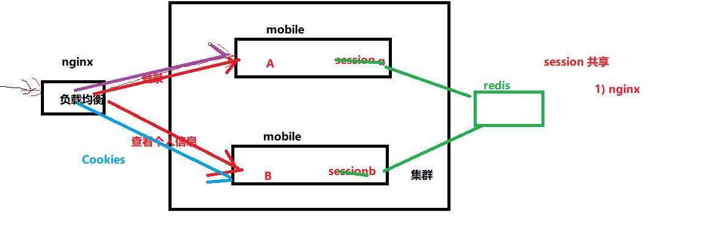
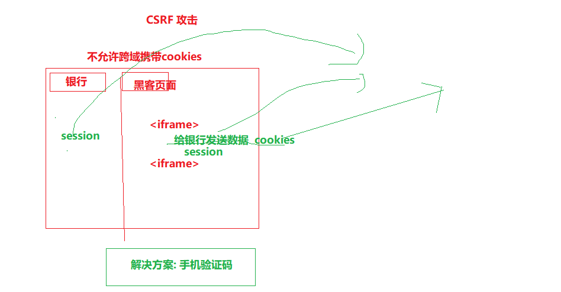
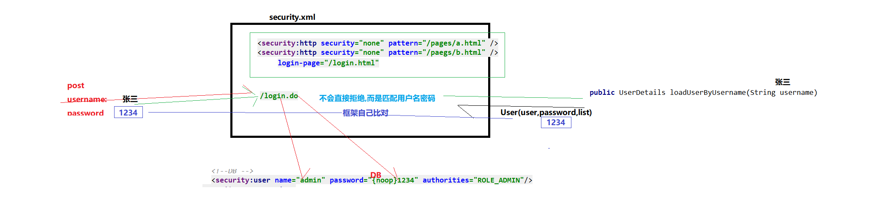
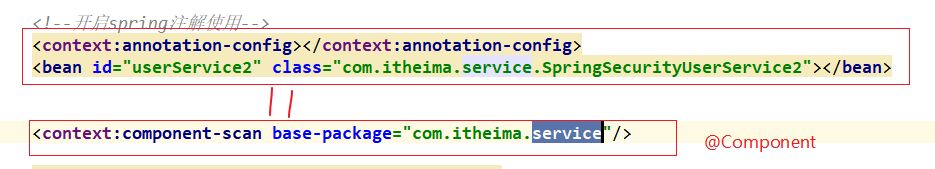

## 01-本章内容介绍   01:52

1.需求分析

2.手机快速登录

3权限控制-Spring Security


## 02-手机快速登录需求分析    02:00

手机快速登录功能，就是通过短信验证码的方式进行登录。这种方式相对于用户名密码
登录方式，用户不需要记忆自己的密码，只需要通过输入手机号并获取验证码就可以完
成登录，是目前比较流行的登录方式。


## 03-手机快速登录_页面调整（发送验证码） 05:34

登录页面为/pages/login.html

为获取验证码按钮绑定事件，并在事件对应的处理函数中校验手机号，如果手机号输入
正确则显示30秒倒计时效果并发送ajax请求，发送短信验证码

```html
<div class="input‐row">
<label>手机号</label>
<div class="loginInput">
<input v‐model="loginInfo.telephone" id='account' type="text"
placeholder="请输入手机号">
<input id="validateCodeButton"
@click="sendValidateCode()" type="button" style="font‐size:
12px"
value="获取验证码">
</div>
</div>
```

```javascript
				//发送验证码
                sendValidateCode(){
                    //获取用户输入的手机号
                    var telephone = this.loginInfo.telephone;
                    //调用js方法，校验输入的手机号是否合法
                    if(!checkTelephone(telephone)){
                        //校验不通过，提示错误信息
                        this.$message.error("请输入正确的手机号");
                        return false;
                    }
                    //在按钮上显示30秒倒计时效果
                    validateCodeButton = $("#validateCodeButton")[0];//锁定dom对象
                    clock = window.setInterval(doLoop,1000);//定时器方法，可以实现每隔指定的时间调用指定的方法
                    //发送ajax请求，为用户发送手机验证码
                    axios.post("/validateCode/send4Login.do?telephone=" + telephone).then((res) => {
                        if(!res.data.flag){
                            //短信验证码发送失败
                            this.$message.error(res.data.message);
                        }
                    });
                },
```


## 04-手机快速登录_后台代码（发送验证码并保存到Redis）02:48

ValidateCodeController中添加方法：

```java
/用户手机快速登录发送验证码
    @RequestMapping("/send4Login")
    public Result send4Login(String telephone){
        //随机生成6位数字验证码
        Integer validateCode = ValidateCodeUtils.generateValidateCode(6);
        //给用户发送验证码
        try{
            SMSUtils.sendShortMessage(SMSUtils.VALIDATE_CODE,telephone,validateCode.toString());
        }catch (Exception e){
            e.printStackTrace();
            return new Result(false, MessageConstant.SEND_VALIDATECODE_FAIL);
        }
        //将验证码保存到redis（5分钟）
        jedisPool.getResource().setex(telephone + RedisMessageConstant.SENDTYPE_LOGIN,300,validateCode.toString());
        return new Result(true,MessageConstant.SEND_VALIDATECODE_SUCCESS);
    }
```

>登录时短信验证码为6位
>
>修改redis的key，防止和预约时的验证码冲突


## 05-手机快速登录_页面调整（提交登录请求） 07:30

```javascript
				//获取用户输入的手机号
                    var telephone = this.loginInfo.telephone;
                    //调用js方法，校验输入的手机号是否合法
                    if(!checkTelephone(telephone)){
                        //校验不通过，提示错误信息
                        this.$message.error("请输入正确的手机号");
                        return false;
                    }
                    //发送ajax请求，将表单数据提交到Controller进行登录处理
                    axios.post("/member/login.do",this.loginInfo).then((res) => {
                        if(res.data.flag){
                            //登录成功，跳转到会员首页
                            window.location.href = "member.html";
                        }else{
                            this.$message.error(res.data.message);
                        }
                    });
```

```

```


## 06-手机快速登录_后台代码（Controller、服务接口）21:13

在health_mobile工程中创建MemberController并提供login方法进行登录检查，处理逻
辑为：

1、校验用户输入的短信验证码是否正确，如果验证码错误则登录失败
2、如果验证码正确，则判断当前用户是否为会员，如果不是会员则自动完成会员注册
3、向客户端写入Cookie，内容为用户手机号
4、将会员信息保存到Redis，使用手机号作为key，保存时长为30分钟

```
//  1) @RequestBody 不能漏
    // 2) 为什么要写入cookies,为什么要存入redis ?   为什么不用session?
   
         // 答案: 集群部署 时的session 共享
    //手机号快速登录
    @RequestMapping("/login")
    public Result login(HttpServletResponse response, @RequestBody Map map){
```



MemberControlle代码：

```java
package com.itheima.controller;

import com.alibaba.dubbo.config.annotation.Reference;
import com.alibaba.fastjson.JSON;
import com.itheima.constant.MessageConstant;
import com.itheima.constant.RedisMessageConstant;
import com.itheima.entity.Result;
import com.itheima.pojo.Member;
import com.itheima.service.MemberService;
import org.springframework.beans.factory.annotation.Autowired;
import org.springframework.web.bind.annotation.RequestBody;
import org.springframework.web.bind.annotation.RequestMapping;
import org.springframework.web.bind.annotation.RestController;
import redis.clients.jedis.JedisPool;

import javax.servlet.http.Cookie;
import javax.servlet.http.HttpServletResponse;
import java.util.Date;
import java.util.Map;

/**
 * 处理会员相关操作
 */

@RestController
@RequestMapping("/member")
public class MemberController {
    @Autowired
    private JedisPool jedisPool;

    @Reference
    private MemberService memberService;

    //手机号快速登录
    @RequestMapping("/login")
    public Result login(HttpServletResponse response, @RequestBody Map map){
        String telephone = (String) map.get("telephone");
        String validateCode = (String) map.get("validateCode");
        //从Redis中获取保存的验证码
        String validateCodeInRedis = jedisPool.getResource().get(telephone + RedisMessageConstant.SENDTYPE_LOGIN);
        if(validateCodeInRedis != null && validateCode != null && validateCode.equals(validateCodeInRedis)){
            //验证码输入正确
            //判断当前用户是否为会员（查询会员表来确定）
            Member member = memberService.findByTelephone(telephone);
            if(member == null){
                member = new Member();
                //不是会员，自动完成注册（自动将当前用户信息保存到会员表）
                member.setRegTime(new Date());
                member.setPhoneNumber(telephone);
                memberService.add(member);
            }
            //向客户端浏览器写入Cookie，内容为手机号
            Cookie cookie = new Cookie("login_member_telephone",telephone);
            cookie.setPath("/");
            cookie.setMaxAge(60*60*24*30);
            response.addCookie(cookie);
            //将会员信息保存到Redis
            String json = JSON.toJSON(member).toString();
            jedisPool.getResource().setex(telephone,60*30,json);
            return new Result(true,MessageConstant.LOGIN_SUCCESS);
        }else{
            //验证码输入错误
            return new Result(false, MessageConstant.VALIDATECODE_ERROR);
        }
    }
}

```

>新增会员代码有误：
>
>由于返回的memeber是null，所以要new一个Member对象再设置属性值，否则会抛异常。


在MemberService服务接口中提供findByTelephone和add方法

```java
public void add(Member member);
public Member findByTelephone(String telephone);
```


## 07-手机快速登录_后台代码（服务实现类）  05:40

在MemberServiceImpl服务实现类中实现findByTelephone和add方法

```java
package com.itheima.service.impl;

import com.alibaba.dubbo.config.annotation.Service;
import com.itheima.dao.MemberDao;
import com.itheima.pojo.Member;
import com.itheima.service.MemberService;
import com.itheima.utils.MD5Utils;
import org.springframework.beans.factory.annotation.Autowired;
import org.springframework.transaction.annotation.Transactional;

/**
 * 会员服务
 */
@Service(interfaceClass = MemberService.class)
@Transactional
public class MemberServiceImpl implements MemberService {
    @Autowired
    private MemberDao memberDao;

    public Member findByTelephone(String telephone) {
        return memberDao.findByTelephone(telephone);
    }

    //保存会员信息
    public void add(Member member) {
        String password = member.getPassword();
        if(password != null){
            //使用md5将明文密码进行加密
            password = MD5Utils.md5(password);
            member.setPassword(password);
        }
        memberDao.add(member);
    }
}
```

>保存会员信息时，为了防止有些场景下用户使用密码注册，所以判断一下密码是否为空，如果不为空，就将密码用md5加密之后放入数据库中。
>
>md5 散列算法 加盐
>RSA 非对称性加密 公钥 私钥  慢
>AES 对称性加密 秘钥 快


## 08-手机快速登录_测试   02:34

## 09-权限控制（认证和授权概念）05:16

前面我们已经完成了传智健康后台管理系统的部分功能，例如检查项管理、检查组管
理、套餐管理、预约设置等。接下来我们需要思考2个问题：
**问题1：在生产环境下我们如果不登录后台系统就可以完成这些功能操作吗？**
答案显然是否定的，要操作这些功能必须首先登录到系统才可以。
**问题2：是不是所有用户，只要登录成功就都可以操作所有功能呢？**
答案是否定的，并不是所有的用户都可以操作这些功能。不同的用户可能拥有不同的权
限，这就需要进行授权了。

认证：系统提供的用于识别用户身份的功能，通常提供用户名和密码进行登录其实就是
在进行认证，认证的目的是让系统知道你是谁。
授权：用户认证成功后，需要为用户授权，其实就是指定当前用户可以操作哪些功能。


>你要登机，你需要出示你的身份证和机票，身份证是为了证明你张三确实是你张三，这就是 认证(authentication)；而机票是为了证明你张三确实买了票可以上飞机，这就是 授权(authorization)。
>
>在网站认证领域再举个例子：
>
>你要登陆论坛，输入用户名张三，密码1234，密码正确，证明你张三确实是张三，这就是 认证(authentication)；再一check用户张三是个版主，所以有权限加精删别人帖，这就是 授权(authorization)。  


## 10-权限控制（权限模块数据模型） 08:51

前面已经分析了认证和授权的概念，要实现最终的权限控制，需要有一套表结构支撑：
用户表t_user、权限表t_permission、角色表t_role、菜单表t_menu、用户角色关系表
t_user_role、角色权限关系表t_role_permission、角色菜单关系表t_role_menu。
表之间关系如下图：


通过上图可以看到，权限模块共涉及到7张表。在这7张表中，角色表起到了至关重要的
作用，其处于核心位置，因为用户、权限、菜单都和角色是多对多关系。
接下来我们可以分析一下在认证和授权过程中分别会使用到哪些表：

认证过程：只需要用户表就可以了，在用户登录时可以查询用户表t_user进行校验，判断
用户输入的用户名和密码是否正确。

授权过程：用户必须完成认证之后才可以进行授权，首先可以根据用户查询其角色，再
根据角色查询对应的菜单，这样就确定了用户能够看到哪些菜单。然后再根据用户的角
色查询对应的权限，这样就确定了用户拥有哪些权限。所以授权过程会用到上面7张表。

```sql
-- 1) 根据用户id  查询关联的角色  id=1
    SELECT * FROM t_role WHERE id IN (SELECT role_id FROM t_user_role WHERE user_id=1)
    
SELECT t_role.* FROM t_role,t_user_role WHERE t_role.id=t_user_role.role_id AND t_user_role.`user_id`=1 
    

-- 2) 根据用户id  查询关联菜单
SELECT * FROM t_menu WHERE id IN(
SELECT menu_id FROM t_role_menu WHERE role_id IN (SELECT role_id FROM t_user_role WHERE user_id=1))


--- 内连接
SELECT 
  t_menu.* 
FROM
  t_menu,
  t_role_menu,
  t_user_role 
WHERE t_role_menu.`role_id` = t_user_role.`role_id` 
  AND t_menu.id = t_role_menu.`menu_id`
  AND t_user_role.`user_id` = 1 

-- 3) 根据用户id  查询 拥有的权限
SELECT * FROM t_permission WHERE id IN (

SELECT permission_id FROM t_role_permission WHERE role_id IN (

SELECT role_id FROM t_user_role WHERE user_id=1
))
```


## 11-权限控制（表结构设计和实体类设计）07:11

表关系图：


#### t_role:

>keyword:关键字，具备唯一性，具有可读性


#### t_menu:

>linkUrl:前端页面的URL
>
>path:前端path，标识菜单中的菜单路径
>
>priority:标识菜单的顺序
>
>parentMenuId:父菜单的id,用于构建菜单树
>
>icon:图标
>
>level:标识菜单中的层级

 

## 12-权限控制（Spring Security简介） 03:40

Spring Security是 Spring提供的安全认证服务的框架。 使用Spring Security可以帮助我
们来简化认证和授权的过程。官网：https://spring.io/projects/spring-security 


## 13-权限控制（Spring Security入门案例）  24:05

对应的maven坐标：

```xml
<dependency>
<groupId>org.springframework.security</groupId>
<artifactId>spring‐security‐web</artifactId>
<version>5.0.5.RELEASE</version>
</dependency>
<dependency>
<groupId>org.springframework.security</groupId>
<artifactId>spring‐security‐config</artifactId>
<version>5.0.5.RELEASE</version>
</dependency>
```


配置web.xml:

在web.xml中主要配置SpringMVC的DispatcherServlet和用于整合第三方框架的
DelegatingFilterProxy，用于整合Spring Security。

```xml
<!DOCTYPE web-app PUBLIC
 "-//Sun Microsystems, Inc.//DTD Web Application 2.3//EN"
 "http://java.sun.com/dtd/web-app_2_3.dtd" >

<web-app>
  <display-name>Archetype Created Web Application</display-name>
  <filter>
    <!--
      DelegatingFilterProxy用于整合第三方框架
      整合Spring Security时过滤器的名称必须为springSecurityFilterChain，
	  否则会抛出NoSuchBeanDefinitionException异常
    -->
    <filter-name>springSecurityFilterChain</filter-name>
    <filter-class>org.springframework.web.filter.DelegatingFilterProxy</filter-class>
  </filter>
  <filter-mapping>
    <filter-name>springSecurityFilterChain</filter-name>
    <url-pattern>/*</url-pattern>
  </filter-mapping>
  <servlet>
    <servlet-name>springmvc</servlet-name>
    <servlet-class>org.springframework.web.servlet.DispatcherServlet</servlet-class>
    <!-- 指定加载的配置文件 ，通过参数contextConfigLocation加载 -->
    <init-param>
      <param-name>contextConfigLocation</param-name>
      <param-value>classpath:spring-security.xml</param-value>
    </init-param>
    <load-on-startup>1</load-on-startup>
  </servlet>
  <servlet-mapping>
    <servlet-name>springmvc</servlet-name>
    <url-pattern>*.do</url-pattern>
  </servlet-mapping>
</web-app>

```

>spring security通过过滤器来完成权限的控制
>
>DelegatingFilterProxy类存在与spring-web包中，其作用就是一个filter的代理，用这个类的好处是可以通过spring容器来管理filter的生命周期，还有就是，可以通过spring注入的形式，来代理一个filter执行。
>
>所以springSecurityFilterChain其实是在spring容器中的一个bean。


在spring-security.xml中主要配置Spring Security的拦截规则和认证管理器。

```html
<?xml version="1.0" encoding="UTF-8"?>
<beans xmlns="http://www.springframework.org/schema/beans"
       xmlns:xsi="http://www.w3.org/2001/XMLSchema-instance"
       xmlns:context="http://www.springframework.org/schema/context"
       xmlns:dubbo="http://code.alibabatech.com/schema/dubbo"
       xmlns:mvc="http://www.springframework.org/schema/mvc"
       xmlns:security="http://www.springframework.org/schema/security"
       xsi:schemaLocation="http://www.springframework.org/schema/beans
						http://www.springframework.org/schema/beans/spring-beans.xsd
						http://www.springframework.org/schema/mvc
						http://www.springframework.org/schema/mvc/spring-mvc.xsd
						http://code.alibabatech.com/schema/dubbo
						http://code.alibabatech.com/schema/dubbo/dubbo.xsd
						http://www.springframework.org/schema/context
						http://www.springframework.org/schema/context/spring-context.xsd
                     http://www.springframework.org/schema/security
                     http://www.springframework.org/schema/security/spring-security.xsd">

    <!--配置哪些资源匿名可以访问（不登录也可以访问）-->
    <!--<security:http security="none" pattern="/pages/a.html"></security:http>
    <security:http security="none" pattern="/pages/b.html"></security:http>-->
    <!--<security:http security="none" pattern="/pages/**"></security:http>-->
    <security:http security="none" pattern="/login.html"></security:http>
    <!--
        auto-config:自动配置，如果设置为true，表示自动应用一些默认配置，比如框架会提供一个默认的登录页面
        use-expressions:是否使用spring security提供的表达式来描述权限
    -->
    <security:http auto-config="true" use-expressions="true">
        <!--配置拦截规则，/** 表示拦截所有请求-->
        <!--
            pattern:描述拦截规则
            asscess:指定所需的访问角色或者访问权限
        -->
        <security:intercept-url pattern="/**" access="hasRole('ROLE_ADMIN')"></security:intercept-url>

    </security:http>

    <!--配置认证管理器-->
    <security:authentication-manager>
        <!--配置认证提供者-->
        <security:authentication-provider>
            <!--
                    配置一个具体的用户，后期需要从数据库查询用户-->
            <security:user-service>
                <security:user name="admin" password="{noop}1234" authorities="ROLE_ADMIN"/>
            </security:user-service>

        </security:authentication-provider>
    </security:authentication-manager>

</beans>
```


```
<!--
            asscess:指定所需的访问角色或者访问权限
            isAuthenticated() : 只要登录没有角色也能访问 ,
            hasRole: 登录成功,并且有角色才能访问  //  hasRole('ROLE_ADMIN,ROLE_User')
            hasAnyRole :
            permitAll : 不管是否登录都能访问
            denyAll : 拒绝
            hasAuthority:权限
            hasAnyAuthority: 任意权限
            hasRole: 默认会 把我们配置的字符串加一个 ROLE_
            
           角色 都是ROLE_ 开头
           如果不是 ROLE_ 开头 表示 权限
        -->
        <security:intercept-url pattern="/**"  access="hasRole('ADMIN')"  />
```


## 14-权限控制（Spring Security入门案例测试） 07:34

1.访问http://localhost:85/index.html，会跳转到http://localhost:85/login

2.输入admin 123 (错误的密码) 会提示：

```
Your login attempt was not successful, try again.

Reason: Bad credentials  
```

3.输入admin 1234 会跳转到http://localhost:85/index.html(默认会隐藏掉/index.html)

>出现favicon 404重新登录下即可


## 15-权限控制（对入门案例进行改进_问题说明）03:23

前面我们已经完成了Spring Security的入门案例，通过入门案例我们可以看到，Spring
Security将我们项目中的所有资源都保护了起来，要访问这些资源必须要完成认证而且需
要具有ROLE_ADMIN角色。
但是入门案例中的使用方法离我们真实生产环境还差很远，还存在如下一些问题：
1、项目中我们将所有的资源（所有请求URL）都保护起来，实际环境下往往有一些资源
不需要认证也可以访问，也就是可以匿名访问。

2、登录页面是由框架生成的，而我们的项目往往会使用自己的登录页面。
3、直接将用户名和密码配置在了配置文件中，而真实生产环境下的用户名和密码往往保
存在数据库中。
4、在配置文件中配置的密码使用明文，这非常不安全，而真实生产环境下密码需要进行
加密。


## 16-权限控制（对入门案例进行改进_配置可匿名访问的资源）06：26

第一步：在项目中创建pages目录，在pages目录中创建a.html和b.html
第二步：在spring-security.xml文件中配置，指定哪些资源可以匿名访问

```html

<!--
     http：用于定义相关权限控制
     指定哪些资源不需要进行权限校验，可以使用通配符
-->
<security:http security="none" pattern="/pages/a.html" />
<security:http security="none" pattern="/paegs/b.html" />
<security:http security="none" pattern="/pages/**"></security:http>
```

> /pages/**代表所有子文件夹和文件夹中的文件


## 17-权限控制（对入门案例进行改进_使用指定的登录页面）  19:07

配置登录页面可匿名访问

```html
<security:http security="none" pattern="/login.html"></security:http>
```

编写登录页面login.html

```html
<!DOCTYPE html>
<html lang="en">
<head>
    <meta charset="UTF-8">
    <title>登录页面</title>
</head>
<body>
    <h3>自定义登录页面</h3>
    <form action="/login.do" method="post">
        username：<input type="text" name="username"><br>
        password：<input type="password" name="password"><br>
        <input type="submit" value="登录">
    </form>
</body>
</html>
```

配置登录页面

```html
        <security:form-login
                login-page="/login.html"
                username-parameter="username"
                password-parameter="password"
                login-processing-url="/login.do"
                default-target-url="/index.html"
                authentication-failure-url="/login.html"></security:form-login>
```

>login-page 登录页面
>
>username-parameter提交表单中的用户名字段
>
>password-parameter提交表单中的密码字段
>
>login-processing-url提交表单中的接口地址
>
> default-target-url默认跳转页面
>
>authentication-failure-url验证错误时的跳转页面
>
>注意：接口是由框架自动处理的，所以只要前端的接口地址和配置文件中的一致，框架就会帮我们自动去处理这个请求。我们也不需要在controller中编写这个页面了。


修改spring-security.xml文件，关闭CsrfFilter过滤器

```html
 <!--
csrf：对应CsrfFilter过滤器
disabled：是否启用CsrfFilter过滤器，如果使用自定义登录页面需要关闭此项，否则登录操作会被禁用（403）
-->
<security:csrf disabled="true"></security:csrf>
```

> csrf攻击：
>
> https://www.cnblogs.com/moxiaotao/p/10107303.html


拓展：

spring-security防止csrf攻击的原理：

> 生成页面时，在内存中保存一个随机csrf值，同时在页面上有一个隐藏的input,存放这个csrf值，保证前后端这个值一致
>
> 点击登录时提交form表单，会携带这个随机csrf值，如果值不匹配，可以认为是csrf攻击，从而登录操作会被禁用（403）
>
> 类似于我们的登录验证码的操作





## 18-权限控制（对入门案例进行改进_从数据库查询用户信息1） 09：14

企业开发过程中，一般用户名和密码会存放在数据库中，所以我们需要修改下配置文件中用户名密码的获取方式。

1.编写UserDetailsService实现类SpringSecurityUserService，里面包含一个方法

```java
UserDetails loadUserByUsername(String username) throws UsernameNotFoundException;
```

2.在配置文件中注入这个类

```xml
<bean id="userService" class="com.itheima.service.SpringSecurityUserService"/>
```

3.修改配置认证管理器

```xml
    <!--配置认证管理器-->
    <security:authentication-manager>
        <!--配置认证提供者-->
        <security:authentication-provider user-service-ref="userService">
        </security:authentication-provider>
    </security:authentication-manager>
```

通过user-service-ref来指定我们的实现类

> 注意视频老师提到多次通过反射调用这个方法，这里其实spring security只需要以接口形式获得该实现类，调用接口方法即可。不需要使用反射的技术。


## 19-权限控制（对入门案例进行改进_从数据库查询用户信息2）  19:50

 我们先使用map来模式用户的账号数据

```java
 //模拟数据库中的用户数据
    public  static Map<String, User> map = new HashMap<>();
    static {
        com.itheima.pojo.User user1 = new com.itheima.pojo.User();
        user1.setUsername("admin");
        user1.setPassword("admin");//明文密码（没有加密）

        com.itheima.pojo.User user2 = new com.itheima.pojo.User();
        user2.setUsername("xiaoming");
        user2.setPassword("1234");

        map.put(user1.getUsername(),user1);
        map.put(user2.getUsername(),user2);
    }
```

完成loadUserByUsername函数的编写

```java
//根据用户名查询用户信息
    public UserDetails loadUserByUsername(String username) throws UsernameNotFoundException {
        System.out.println("用户输入的用户名为：" + username);
        //根据用户名查询数据库获得用户信息(包含数据库中存储的密码信息)
        User user = map.get(username);//模拟查询根据用户名查询数据库
        if(user == null){
            //用户名不存在
            return null;
        }else{
            //将用户信息返回给框架
            //框架会进行密码比对(页面提交的密码和数据库中查询的密码进行比对)
            List<GrantedAuthority> list = new ArrayList<>();
            //为当前登录用户授权,后期需要改为从数据库查询当前用户对应的权限
            list.add(new SimpleGrantedAuthority("permission_A"));//授权
            list.add(new SimpleGrantedAuthority("permission_B"));

            if(username.equals("admin")){
                list.add(new SimpleGrantedAuthority("ROLE_ADMIN"));//授予角色
            }
            org.springframework.security.core.userdetails.User securityUser =
                    new org.springframework.security.core.userdetails.User(username,"{noop}"+user.getPassword(),list);
            return securityUser;
        }
    }
```

1.从map中获取用户名对应的数据，如果返回数据不存在，返回null让框架返回登录失败的错误信息

2.UserDetails是个接口，我们真正需要创建的是org.springframework.security.core.userdetails.User，进行返回。他的参数有三个

>String username  用户名
>
>String password   密码
>
>Collection<? extends GrantedAuthority> 可以使用List进行返回，里面保存权限数据
>
>List<GrantedAuthority> list = new ArrayList<>();
>
>new SimpleGrantedAuthority("permission_A")授予角色的写法

3.返回密码的时候加上"{noop}"会让密码进行明文匹配


由于在配置文件中指定了

```xml
 <security:intercept-url pattern="/**" access="hasRole('ROLE_ADMIN')"></security:intercept-url>
```

对于index.html，只有ROLE_ADMIN这个角色能看到，所以使用xiaoming/1234这个用户，登录到系统中之后会显示403forbidden没有权限。而admin/admin用户可以看到。





## 20-权限控制（对入门案例进行改进_对密码进行加密）  13:05

```java
  public static void main(String[] args) {
       BCryptPasswordEncoder encoder = new BCryptPasswordEncoder();
        String str = encoder.encode("123456");
        System.out.println(str);
        System.out.println(encoder.encode("123456"));
        System.out.println(encoder.encode("123456"));
        System.out.println(encoder.encode("123456"));
        System.out.println(encoder.encode("123456"));
        System.out.println(encoder.encode("123456"));

        boolean b = encoder.matches("123456", "$2a$10$ksvmf91VJrlNmLU7BXDoM.COI3GAggT6fNrwgim2qMpU.WkBj5ybi");
        System.out.println(b);

    }


    public static void main2(String[] args) {
       String pwd="123456";

        String encoding = encoding(pwd);
        System.out.println(encoding);

        boolean match = match(pwd, "*&^%&Ub7ec0471d390d2d340995d38525a97ec");


    }

    public static String  encoding(String pwd){
        // 1)
          String salt="*&^%&U";// 随机字符串
        // 2) 加盐
        pwd+=salt;
        //3) 加密
        String md5 = MD5Utils.md5(pwd);
        return salt+md5;
    }


    public static boolean match(String pwd,String db) {//123456
       // String  db="*&^%&Ub7ec0471d390d2d340995d38525a97ec";
        String salt=db.substring(0,6);// 随机字符串
        System.out.println(salt);
        System.out.println(pwd);

        // 2) 加盐
        pwd+=salt;
        //3) 加密
        String md5 = MD5Utils.md5(pwd);
        System.out.println(salt+md5);
        return  db.equals(salt+md5);
    }
```


常见的密码加密方式有：

RSA：非对称加密算法

3DES、AES、DES：使用对称加密算法，可以通过解密来还原出原始密码
MD5、SHA1：使用单向HASH算法，无法通过计算还原出原始密码，但是可以建立彩虹
表进行查表破解
bcrypt：将salt随机并混入最终加密后的密码，验证时也无需单独提供之前的salt，从而
无需单独处理salt问题
加密后的格式一般为：

````
$2a$10$/bTVvqqlH9UiE0ZJZ7N2Me3RIgUCdgMheyTgV0B4cMCSokPa.6oCa
````

加密后字符串的长度为固定的60位。其中：$是分割符，无意义；2a是bcrypt加密版本
号；10是cost的值；而后的前22位是salt值；再然后的字符串就是密码的密文了。

>cost作用是指定hash的次数，cost是一个2的指数，如果cost为6.则要进行
>2**6=64次hash计算


1.配置密码加密对象

```xml
    <!--配置密码加密对象-->
    <bean id="passwordEncoder"
          class="org.springframework.security.crypto.bcrypt.BCryptPasswordEncoder" />
```


2.配置认证使用密码加密

```xml
 <!--配置认证管理器-->
    <security:authentication-manager>
        <!--配置认证提供者-->
        <security:authentication-provider user-service-ref="userService">
            <security:password-encoder ref="passwordEncoder"/>
        </security:authentication-provider>
    </security:authentication-manager>
```

 

3.开启spring注解使用，否则无法通过注解注入加密对象

```xml
 <!--开启spring注解使用,这个注解的作用是让 类上的自动注入的注解生效
	和包扫描不同,包扫描 相当于  包扫描+注解扫描

-->
    <context:annotation-config></context:annotation-config>
```




重新编写获取用户信息接口

```java
package com.itheima.service;

import com.itheima.pojo.User;
import org.springframework.beans.factory.annotation.Autowired;
import org.springframework.security.core.GrantedAuthority;
import org.springframework.security.core.authority.SimpleGrantedAuthority;
import org.springframework.security.core.userdetails.UserDetails;
import org.springframework.security.core.userdetails.UserDetailsService;
import org.springframework.security.core.userdetails.UsernameNotFoundException;
import org.springframework.security.crypto.bcrypt.BCryptPasswordEncoder;

import java.util.ArrayList;
import java.util.HashMap;
import java.util.List;
import java.util.Map;

@Component
public class SpringSecurityUserService2 implements UserDetailsService {
    @Autowired
    private BCryptPasswordEncoder passwordEncoder;

    //模拟数据库中的用户数据
    public  Map<String, User> map = new HashMap<>();

    public void initUserData(){
        User user1 = new User();
        user1.setUsername("admin");
        user1.setPassword(passwordEncoder.encode("admin"));//使用bcrypt提供的方法对密码进行加密

        User user2 = new User();
        user2.setUsername("xiaoming");
        user2.setPassword(passwordEncoder.encode("1234"));

        map.put(user1.getUsername(),user1);
        map.put(user2.getUsername(),user2);
    }

    //根据用户名查询用户信息
    public UserDetails loadUserByUsername(String username) throws UsernameNotFoundException {
        initUserData();

        System.out.println("用户输入的用户名为：" + username);
        //根据用户名查询数据库获得用户信息(包含数据库中存储的密码信息)
        User user = map.get(username);//模拟查询根据用户名查询数据库
        if(user == null){
            //用户名不存在
            return null;
        }else{
            //将用户信息返回给框架
            //框架会进行密码比对(页面提交的密码和数据库中查询的密码进行比对)
            List<GrantedAuthority> list = new ArrayList<>();
            //为当前登录用户授权,后期需要改为从数据库查询当前用户对应的权限
            list.add(new SimpleGrantedAuthority("permission_A"));//授权
            list.add(new SimpleGrantedAuthority("permission_B"));

            if(username.equals("admin")){
                list.add(new SimpleGrantedAuthority("ROLE_ADMIN"));//授予角色
                list.add(new SimpleGrantedAuthority("add"));//授权
            }
            org.springframework.security.core.userdetails.User securityUser = new org.springframework.security.core.userdetails.User(username,user.getPassword(),list);
            return securityUser;
        }
    }
}

```

>为什么需要在返回密码的时候加密？
>
>因为开启密码校验之后，通过spring security在校验时会对前端提交的密码进行加密再去比对。如果后端不加密，那么这个密码就会不匹配，导致失败。
>
>所以前端加密，后端加密，就能匹配上了。


## 21-权限控制（对入门案例进行改进_配置多种校验规则） 08：09

```xml
<!‐‐只要认证通过就可以访问‐‐>
<security:intercept‐url pattern="/index.jsp" access="isAuthenticated()"
/>
<security:intercept‐url pattern="/a.html" access="isAuthenticated()" />
<!‐‐拥有add权限就可以访问b.html页面‐‐>
<security:intercept‐url pattern="/b.html" access="hasAuthority('add')"
/>
<!‐‐拥有ROLE_ADMIN角色就可以访问c.html页面‐‐>
<security:intercept‐url pattern="/c.html" access="hasRole('ROLE_ADMIN')"
/>
<!‐‐拥有ROLE_ADMIN角色就可以访问d.html页面，
注意：此处虽然写的是ADMIN角色，框架会自动加上前缀ROLE_‐‐>
<security:intercept‐url pattern="/d.html" access="hasRole('ADMIN')" />

 access="hasRole('ADMIN') and hasAuthority('add')"

```

>isAuthenticated:只要认证通过就可以
>
>hasAuthority具有某种权限
>
>hasRole具有某种角色
>
>hasAuthority('ROLE_ADMIN')  =  hasRole(''ROLE_ADMIN'') = hasRole(''ADMIN'') 
>
>拥有ROLE_ADMIN角色就可以访问d.html页面，
>注意：此处虽然写的是ADMIN角色，框架会自动加上前缀ROLE_


## 22-权限控制（对入门案例进行改进_注解方式权限控制） 09：41

第一步：在spring-security.xml文件中配置组件扫描，用于扫描Controller

```xml
<mvc:annotation‐driven></mvc:annotation‐driven>
<context:component‐scan base‐package="com.itheima.controller">
</context:component‐scan>
```

已经使用

```xml
  <context:annotation-config></context:annotation-config>
```

就可以不用加mvc注解开启了


第二步：在spring-security.xml文件中开启权限注解支持

```xml
<!‐‐开启注解方式权限控制‐‐>
<security:global‐method‐security pre‐post‐annotations="enabled" />
```


第三步：创建Controller类并在Controller的方法上加入注解进行权限控制

```java
package com.itheima.controller;

import org.springframework.security.access.prepost.PreAuthorize;
import org.springframework.web.bind.annotation.RequestMapping;
import org.springframework.web.bind.annotation.RestController;

@RestController
@RequestMapping("/hello")
public class HelloController {
    @RequestMapping("/add")
    @PreAuthorize("hasAuthority('add')")//调用此方法要求当前用户必须具有add权限
    public String add(){
        System.out.println("add...");
        return "success";
    }

    @RequestMapping("/delete")
    @PreAuthorize("hasRole('ROLE_ADMIN') ")//调用此方法要求当前用户必须具有ROLE_ADMIN角色
    public String delete(){
        System.out.println("delete...");
        return "success";
    }
     @RequestMapping("/delete1")
     @PreAuthorize("hasRole('ROLE_ADMIN') and hasAuthority('add') ")//调用此方法要求当前用户必须具有ROLE_ADMIN角色
    public String delete1(){
        System.out.println("delete...");
        return "success";
    }
    
}
```


## 23-权限控制（对入门案例进行改进_退出登录）  05:20

```xml
<!‐‐
logout：退出登录
logout‐url：退出登录操作对应的请求路径
logout‐success‐url：退出登录后的跳转页面
‐‐>
<security:logout logout‐url="/logout.do"
logout‐success‐url="/login.html" invalidatesession="
true"/>
```

>只需要请求/logout.do这个URL地址就可以，同时会将当前session失效，最后页面会跳转到login.html页面。