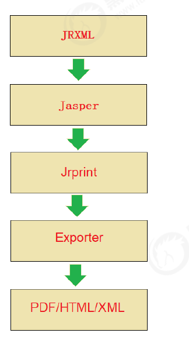
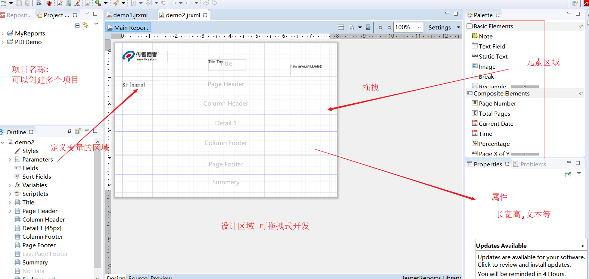
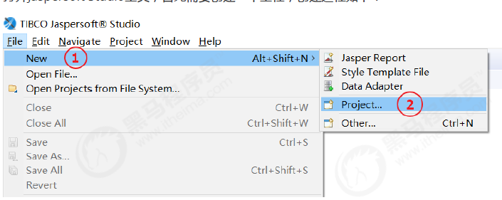
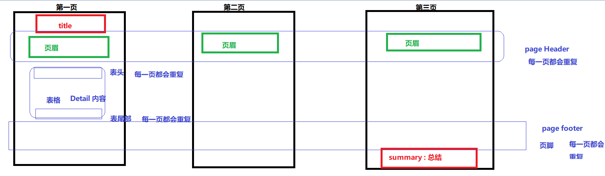
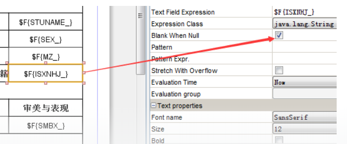
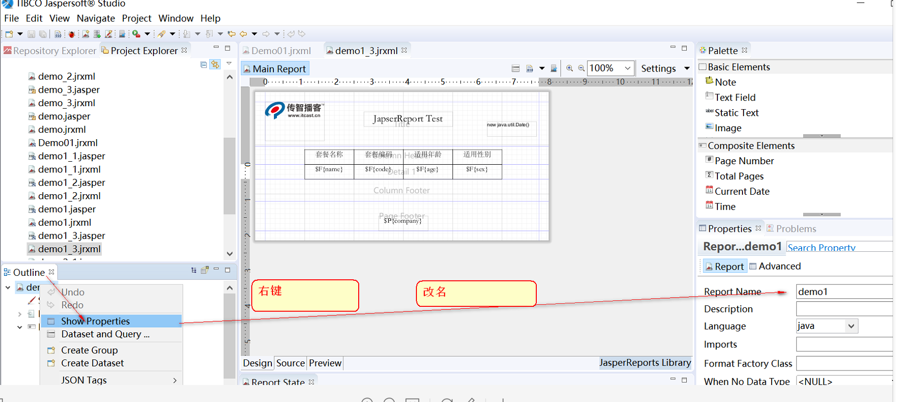

约140分钟

当日内容:

----PDF 导出

##01- Itext生成PDF文件 09:00

maven 坐标

```xml
<dependency>
    <groupId>com.lowagie</groupId>
    <artifactId>itext</artifactId>
    <version>2.1.7</version>
</dependency>
```

java 代码

```java
package com.itheima.app;
import com.lowagie.text.Document;
import com.lowagie.text.DocumentException;
import com.lowagie.text.Paragraph;
import com.lowagie.text.pdf.PdfWriter;
import java.io.FileNotFoundException;
import java.io.FileOutputStream;
public class ItextDemo {
    public static void main(String[] args) {
        try {
            Document document = new Document();
            PdfWriter.getInstance(document, new
            FileOutputStream("D:\\test.pdf"));
            document.open();
            document.add(new Paragraph("hello itext"));
            document.close();
        } catch (FileNotFoundException e) {
            e.printStackTrace();
        } catch (DocumentException e) {
            e.printStackTrace();
        }
    }
}
```

##02- JasperReports快速体验 15:00

第一步导入坐标

```xml
<dependency>
<groupId>net.sf.jasperreports</groupId>
<artifactId>jasperreports</artifactId>
<version>6.8.0</version>
</dependency>
<dependency>
<groupId>junit</groupId>
<artifactId>junit</artifactId>
<version>4.12</version>
</dependency>
```

第二步

```
将提前准备好的jrxml文件复制到maven工程中(后面会详细讲解如何创建jrxml文件)
```

第三步：编写单元测试，输出PDF报表

```java
@Test
public void testJasperReports()throws Exception{
    String jrxmlPath =
    "D:\\ideaProjects\\projects111\\jasperdemo\\src\\main\\resources\\demo.jrxml";
    String jasperPath =
    "D:\\ideaProjects\\projects111\\jasperdemo\\src\\main\\resources\\demo.jasper";
    //编译模板
    JasperCompileManager.compileReportToFile(jrxmlPath,jasperPath);
     Map paramters = new HashMap();
        paramters.put("reportDate","2019-10-10");
        paramters.put("company","itcast");
    List<Map> list = new ArrayList();
     
        Map map1 = new HashMap();
        map1.put("name","xiaoming");
        map1.put("address","beijing");
        map1.put("email","xiaoming@itcast.cn");
        Map map2 = new HashMap();
        map2.put("name","xiaoli");
        map2.put("address","nanjing");
        map2.put("email","xiaoli@itcast.cn");
    list.add(map1);
    list.add(map2);
    //填充数据
    JasperPrint jasperPrint =
    JasperFillManager.fillReport(jasperPath,paramters,new JRBeanCollectionDataSource(list));
    //输出文件
    String pdfPath = "D:\\test.pdf";
    JasperExportManager.exportReportToPdfFile(jasperPrint,pdfPath);
}
```

##03- JasperReports原理 6:00



##04- JasperReports开发流程 3:00

1. 制作报表模板

2. 模板编译

3. 构造数据

4. 填充数据

5. 输出文件

   ```
   总结: 1) 编写模板 
        2) 编写java 代码填充数据
   ```

   

##05-模板设计器Jaspesoft Studio (安装）3:00


##06-模板设计器Jaspesoft Studio (面板介绍）3:00



##07-模板设计器Jaspesoft Studio (创建模板文件）9:00



模板详细说明





##08-模板设计器Jaspesoft Studio (Image元素）4:00


##09-模板设计器Jaspesoft Studio (Static Text)4:00
##l0-模板设计器Jaspesoft Studio (Current Date元繁〉3:00
##11-模板设计器Jaspesoft Studio(动态数据填充_Parameters)6:00


##12-模板设计器Jaspesoft Studio (动态数据填充_Fields之jdbc数据源方式）14:00

备注: 

```
jdbc 方式获取数据,未来也是通过模板获取数据,我们的java 代码不在负责这部分内容数据的填充
```

##13-模板设计器Jaspesoft Studio (动态数据填充_Fields之jdbc数据源方式） 2   3:00

##14-模板设计器Jaspesoft Studio(动态数据填充_Fields之JavaBean据源方式）12:00
##15-模板设计器Jaspesoft Studio (添加边框）6:00
##16-结合TasperReports输出PDF报表（JDBC数据源方式填充数据） 17:00

```java
 //基于jdbc数据源方式填充数据
    @Test
    public void test2() throws Exception{
        Class.forName("com.mysql.jdbc.Driver");
        Connection connection =
                DriverManager.getConnection("jdbc:mysql://localhost:3306/health",
                        "root",
                        "root");
        String jrxmlPath = "D:\\demo1.jrxml";
        String jasperPath = "D:\\demo1.jasper";

        //模板编译，编译为后缀为jasper的二进制文件
        // 注意这里不需要每次都编译,编译一次即可
        // 如果  jasper 不存在才编译,效率较高
          if(!new File("jasperPath").exists()) {
            JasperCompileManager.compileReportToFile(jrxmlPath, jasperPath);
        }

        //为模板文件准备数据，用于最终的PDF文件数据填充
        Map map = new HashMap();
        map.put("company","传智播客");

        //填充数据
        JasperPrint jasperPrint = JasperFillManager.fillReport(jasperPath,map,connection);

        //输出文件
        String pdfPath = "D:\\test.pdf";
        JasperExportManager.exportReportToPdfFile(jasperPrint,pdfPath);
    }
```

补充:

​	如何不显示 null  



编辑时没有 "华文宋体字体"

```
1) 手动输入
2) 把老师给的 字体文件 stsong.ttf 复制到 安装目录\features\jre.win32.win32.x86_64.feature_1.8.0.u151\jre\lib\fonts
下 重启
3) 给winwows 安装华文宋体字体
```

##17结合JasperReports输出PDF报表（JavaBean据源方式頃充数据）9:00

```java
//基于Javabean数据源方式填充数据
    @Test
    public void test3() throws Exception{
        String jrxmlPath = "D:\\itcastProject\\health_parent\\jasperReportsDemo\\src\\main\\resources\\demo2.jrxml";
        String jasperPath = "D:\\itcastProject\\health_parent\\jasperReportsDemo\\src\\main\\resources\\demo2.jasper";

        //模板编译，编译为后缀为jasper的二进制文件
        JasperCompileManager.compileReportToFile(jrxmlPath,jasperPath);

        //为模板文件准备数据，用于最终的PDF文件数据填充
        Map map = new HashMap();
        map.put("company","传智播客");

        //Javabean数据源填充，用于填充列表数据
        List<Map> list = new ArrayList();
        Map map1 = new HashMap();
        map1.put("name","入职体检套餐");
        map1.put("code","RZTJ");
        map1.put("age","18-60");
        map1.put("sex","男");

        Map map2 = new HashMap();
        map2.put("name","阳光爸妈老年健康体检");
        map2.put("code","YGBM");
        map2.put("age","55-60");
        map2.put("sex","女");
        list.add(map1);
        list.add(map2);

        //填充数据
        JasperPrint jasperPrint = JasperFillManager.fillReport(jasperPath,map,new JRBeanCollectionDataSource(list));

        //输出文件
        String pdfPath = "D:\\test.pdf";
        JasperExportManager.exportReportToPdfFile(jasperPrint,pdfPath);
    }
```


##18-在项目中输出运营数PDF报表（提供模板板文件）6:00

##19-在项目中输出运营数PDF报表（搭建环境）4:00
##20-在项目中输出运营数PDF报表（修改页面）3:00

```
页面中添加下载PDF 连接
```

##21-在项目中输出运营数PDF报表（Java代码实现）8:00

```java
  //导出运营数据到PDF文件并提供客户端下载
    @RequestMapping("/exportBusinessReport4PDF")
    public Result exportBusinessReport4PDF(HttpServletRequest request, HttpServletResponse response){
        try{
            Map<String,Object> result = reportService.getBusinessReportData();

            //取出返回结果数据，准备将报表数据写入到Excel文件中
            List<Map> hotSetmeal = (List<Map>) result.get("hotSetmeal");

            //动态获取pdf模板文件绝对磁盘路径
            String jrxmlPath = request.getSession().getServletContext().getRealPath("template") + File.separator + "health_business3.jrxml";
            String jasperPath = request.getSession().getServletContext().getRealPath("template") + File.separator + "health_business3.jasper";

            //编译模板
            JasperCompileManager.compileReportToFile(jrxmlPath, jasperPath);

            //填充数据---使用JavaBean数据源方式填充
            JasperPrint jasperPrint =
                    JasperFillManager.fillReport(jasperPath,result,
                            new JRBeanCollectionDataSource(hotSetmeal));

            //创建输出流，用于从服务器写数据到客户端浏览器
            ServletOutputStream out = response.getOutputStream();
            response.setContentType("application/pdf");
            response.setHeader("content-Disposition", "attachment;filename=report.pdf");

            //输出文件
            JasperExportManager.exportReportToPdfStream(jasperPrint,out);

            out.flush();
            out.close();

            return null;
        }catch (Exception e){
            e.printStackTrace();
            return new Result(false, MessageConstant.GET_BUSINESS_REPORT_FAIL);
        }
    }
```


##22-在项目中输出运营数PDF报表（测试）2:00

````````````````
---------------------------------------------
统一答复 : 1) 软件没字体上述有三种解决方案, 笔记已更新
         2) 点击没反应是,当前窗口本身操作的就是这个文件
		3)  文件改名 

````````````````

