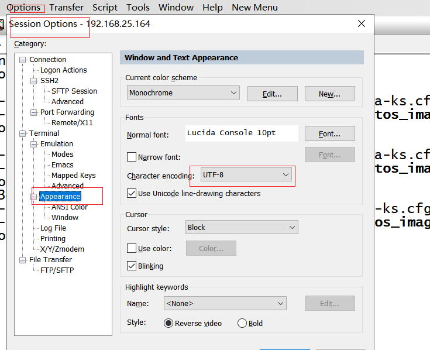
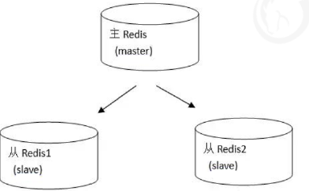
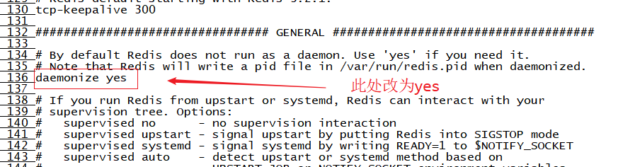
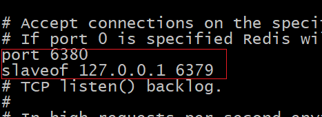
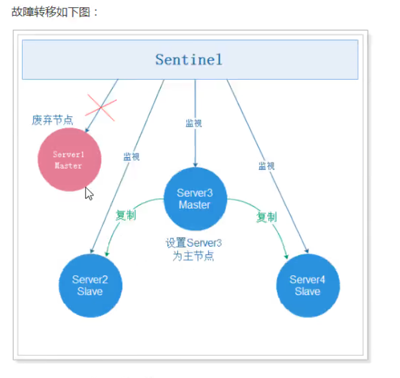
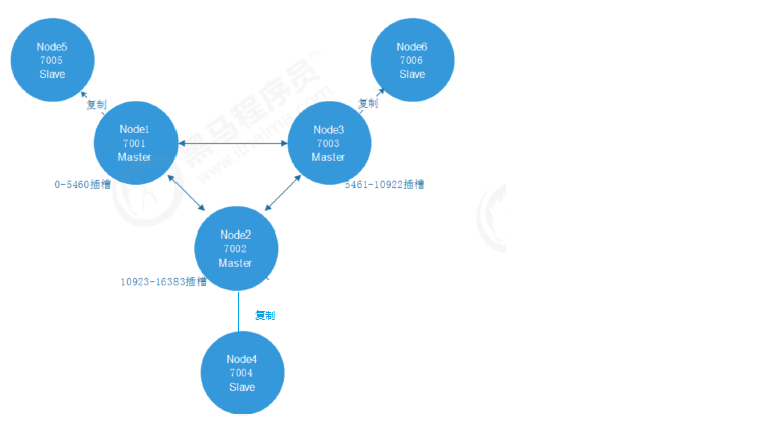
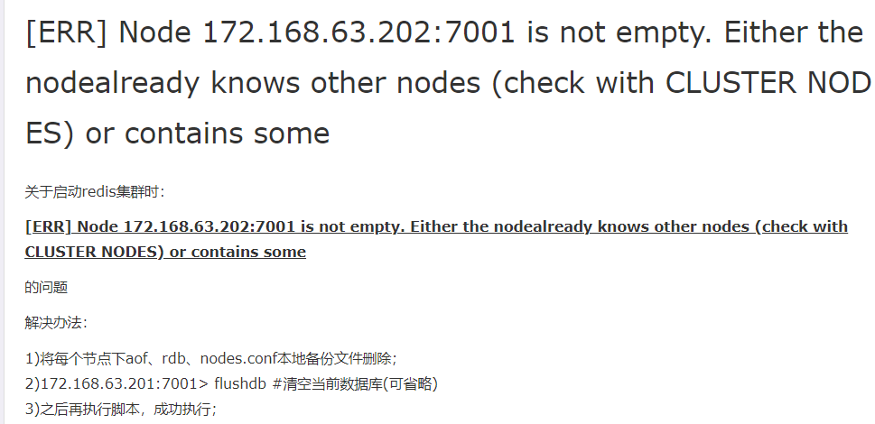

##01-本章内容介绍  2:00

注意: 请使用 linux  centOS 7.0 以上版本

中文乱码



```
本章内容我们的主题为Redis集群搭建与使用，目前Redis在企业中的应用已经非常广泛，同时Redis也是面试中的重点内容。
    1) redis 缓存问题介绍
    2) 主从复制
    3) redis 内置高可用组件- 哨 兵Sentinel 
    4) Redis cluster 集群搭建及使用
```

##02- Redis缓存相关问题(缓存穿透) 6:00

**缓存穿透**

概念:

```
缓存穿透是指查询一个数据库一定不存在的数据。查询穿透了缓存进入到了数据库。
```

问题:

201801011212098778878

```
我们以前正常的使用Redis缓存的流程大致是：
1、数据查询首先进行缓存查询
2、如果数据存在则直接返回缓存数据
3、如果数据不存在，就对数据库进行查询，并把查询到的数据放进缓存
4、如果数据库查询数据为空，则不放进缓存
例如我们的数据表中主键是自增产生的，所有的主键值都大于0。此时如果用户传入的参数为-1，会是
怎么样？这个-1，就是一定不存在的对象。程序就会每次都去查询数据库，而每次查询都是空，每次又
都不会进行缓存。假如有人恶意攻击，就可以利用这个漏洞，对数据库造成压力，甚至压垮我们的数据
库。
```

解决方案

```
为了防止有人利用这个漏洞恶意攻击我们的数据库，我们可以采取如下措施：
如果从数据库查询的对象为空，也放入缓存，key为用户提交过来的主键值，value为null，只是设定的
缓存过期时间较短，比如设置为60秒。这样下次用户再根据这个key查询redis缓存就可以查询到值了
（当然值为null），从而保护我们的数据库免遭攻击。
```

```
---
其他
1)设置ID  为复杂id ,先进性id 规则校验
2) 对同一个ip 地址 同一个url 进行请求限制,比如 1s 内只允许5次请求
```

##03- Redis缓存相关问题(缓存雪崩) 3:00

概念

```
缓存雪崩，是指在某一个时间段，缓存集中过期失效。在缓存集中失效的这个时间段对数据的访问查
询，都落到了数据库上，对于数据库而言，就会产生周期性的压力波峰。
```

解决方案

```
为了避免缓存雪崩的发生，我们可以将缓存的数据设置不同的失效时间，这样就可以避免缓存数据在某
个时间段集中失效。例如对于热门的数据（访问频率高的数据）可以缓存的时间长一些，对于冷门的数
据可以缓存的时间段一些。甚至对于一些特别热门的数据可以设置永不过期。
```


##04- Redis缓存相关问题(缓存击穿) 5:00

概念:

```
缓存击穿，是指一个key非常热点（例如双十一期间进行抢购的商品数据），在不停的扛着大并发，大
并发集中对这一个点进行访问，当这个key在失效的瞬间，持续的大并发就穿破缓存，直接请求到数据
库上，就像在一个屏障上凿开了一个洞。
```

解决方案:

```
我们同样可以将这些热点数据设置永不过期就可以解决缓存击穿的问题了。
```


##05-主从复制(原理) 5:00

单机版redis 存在的问题

```
1) redis 单点故障
2) 扩容
```

Replication

```
在主从复制模式下Redis节点分为两种角色：主节点(也称为master)和从节点(也称为slave)。这种模式
集群是由一个主节点和多个从节点构成。
原则：Master会将数据同步到slave，而slave不会将数据同步到master。Slave启动时会连接master来
同步数据。
---------
这是一个典型的分布式读写分离模型。我们可以利用master来处理写操作，slave提供读操作。这样可
以有效减少单个机器的并发访问数量。
```



##06-主从复制集群搭建 14:00

1) redis 安装

**说明: 今天我们要创建很多redis ,请安装时redis 是,单独存放一个文件夹,方便管理**

```sh
#  1.1)  上传文件
#为了方便管理 ,在 /usr/local/ 下新建一个文件夹 allredis
cd /usr/local
mkdir allredis
# 上传完成后将我们附件提供的软件安装包 copy 至新建的文件夹下即可

# 1.2) 安装 c 语言编译环境(略,linux 课程已经安装过)
yum install gcc-c++
# 1.3) 解压
tar -xzvf redis-4.0.14.tar.gz
# 1.4) 编译安装:切换至程序目录，并执行make命令编译：
cd redis-4.0.14
make
# 1.5) 执行安装命令(最好安装至指定目录,方便管理)
make PREFIX=/usr/local/allredis/redis install 
# 1.6) 配置redis
#   1.	复制配置文件到/usr/local/allredis/redis/bin目录
	cd redis-4.0.14  
	cp redis.conf /usr/local/allredis/redis/bin
#  修改配置文件
# 进入 reids 修改 刚刚复制的文件 
#修改为后台运行
vim  redis.conf
# 显示行号
:set nu
然后找到如下位置进行修改如下
```



bind 0.0.0.0 表示 其他所有机器都可以访问

bind 192.168.1.12  表示 只能本机和  192.168.1.12  访问

2) 主从复制环境搭建

```sh
# 切换目录
cd cd /usr/local/allredis/

# 1) 将redis 复制两份 ,一个是 主节点(master) 一个是从节点slaver
cp -r redis redis-master
cp -r redis redis-slaver
# 2) 进入 redis-slaver 修改 redis.conf 文件 修改端口号,并加入 从节点配置
```



  主从问题:

```
1)主节点能够读写
2) 从节点只能读不能写
3) 如果主节点挂了,此时从节点还是从节点,不会主动升级.不能写,只能读
```

##07-哨兵Sentinel(高可用介绍)4:00

高可用:

```
在高并发环境,局部断网环境,局部断电环境,局部服务器不稳定可能出现宕机的环境,系统依旧可以系统稳定的服务叫做高可用,
   这种可用性理论上只能降低,不能完全消除
```

如何提高高可用性

```
1) 避免服务器单点部署,即多部署几台
2) 冗余,如果涉及到数据存储,多存储几分
3) 实现自动故障转移(建立一套监控机制,一旦有节点挂了,立即自动切换)
```

##08-哨兵Sentinel(介绍) 5:00

```
sentinel(哨兵)是用于监控redis集群中Master状态的工具，其本身也是一个独立运行的进程，是Redis
的高可用解决方案,sentinel哨兵模式已经被集成在redis2.4之后的版本中

sentinel可以监视一个或者多个redis master服务，以及这些master服务的所有从服务；当某个master
服务下线时，自动将该master下的某个从服务升级为master服务替代已下线的master服务继续处理请
求，并且其余从节点开始从新的主节点复制数据。
```


##09-哨兵Sentinel(配置) 12:00

```sh
# 1) 准备文件
 #复制一份 redis 单独部署 sentinel
 cp -r redis redis-sentinel
 #复制一份配置文件 
 cp redis-4.0.14/sentinel.conf  redis-sentinel/bin/sentinel.conf
# 2) 修改配置文件
	
```

```properties
# 外部可以访问
bind 0.0.0.0
# 设置名称及主节点ip 和端口
sentinel monitor mymaster 127.0.0.1 6379 1
#设置Sentinel认为服务器已经断线所需的毫秒数
sentinel down-after-milliseconds mymaster 10000
#设置failover（故障转移）的过期时间 (1 分钟)
sentinel failover-timeout mymaster 60000
# 设置在执行故障转移时，同时同步数据的服务器数量
sentinel parallel-syncs mymaster 1
```

```
bind 0.0.0.0
sentinel monitor mymaster 127.0.0.1 6379 1
sentinel down-after-milliseconds mymaster 10000
sentinel failover-timeout mymaster 60000
sentinel parallel-syncs mymaster 1
```

##10-肖兵 Sentinel(启动 Sentinel) 3:00

```
后台启动的话只需要在配置中增加 daemonize yes 即可
```

##11-哨兵 Sentinel(测试 Sentinel) 6:00
java代码连接测试:

注意:

<font color="red">  需要将"哨兵" 和master /  slave 节点的配置中的bind  都改为 **0.0.0.0**否则报错</font>

```java
    public void test01(){
        String masterName = "mymaster";
        Set<String> sentinelSet =new HashSet<String>();
        sentinelSet.add("192.168.25.129:26379");// 此处我们只需要连接哨兵即可
        JedisSentinelPool sentinelPool = new JedisSentinelPool(masterName,sentinelSet);
        Jedis jedis = null;
        try{
            jedis = sentinelPool.getResource();
            // 设置值
            jedis.set("name","zs");
            // 读取 值
            String name = jedis.get("name");
            System.out.println(name);


        }catch(Exception e){
           e.printStackTrace();
        }finally{
            if(jedis != null){
                jedis.close();
            }
        }
 }
```



##12-Redis cluster 介绍 3:00

```
上述 Sentinel 虽然解决了高可用问题,但是依旧有问题
问题:
	不支持扩容
上述我们虽然实现了读写分离,但是无法实现扩容
上述主从备份虽然读写分离了,但是假设服务器内存是5G ,我们只能存储5G 的数据到内存,(多几台服务器只是多了几台备份的机器),不能解决存储空间不足的问题
而Redis cluster 就解决了上述问题
```

Redis cluster 特点:	

```
1) 去中心化,所有节点地位相同
2) 数据平均分配给集群中的节点
3) 支持主从模式
```

去中心化:

```
集群中的每个节点都是平等的关系，都是对等的，每个节点都保存各自的数据和整个集群的状态。每个节点都和其他所有节点连接，而且这些连接保持活跃，这样就保证了我们只需要连接集群中的任意一个节点，就可以获取到其他节点的数据。
```

##13 -Redis cluster(哈希槽方式分配数据) 6:00

数据平均分配

```
Redis 集群是采用一种叫做哈希槽 (hash slot) 的方式来分配数据的。
redis cluster 默认分配了16384(=1024*16) 个slot
按照redis cluster的哈希槽算法： CRC16('my_name')%16384.决定分配至那个机器
```


##14 -Redis cluster(哈希槽方式分配数据)2 3:00

```
查询时也是根据这个节点查询的
```


##15- Redis cluster( Redis cluster的主从模式介绍) 4:00

```
如果 Redis cluster的所有节点都没有备份服务器,如果其中一台服务器宕机,redis 的数据将不完整,此时整个Redis cluster集群将会宕机,不在提供服务
为了保障 Redis cluster 的高可用,每个服务都应该有一台备份机器
```



##16- Redis cluster 环境搭建 13:00

如果不是中文版linux ,复制到linux  中尽量不要使用中文

```
bind 0.0.0.0
port 7001
daemonize yes
appendonly yes
cluster-enabled yes
cluster-config-file nodes.conf
cluster-node-timeout 5000
```

```sh
# 不能设置密码，否则集群启动时会连接不上
# Redis服务器可以跨网络访问
bind 0.0.0.0
# 修改端口号
port 7001
# Redis后台启动
daemonize yes
# 开启aof持久化
appendonly yes
# 开启集群
cluster-enabled yes
# 集群的配置 配置文件首次启动自动生成
cluster-config-file nodes.conf
# 请求超时
cluster-node-timeout 5000
```

脚本文件编写

```sh
cd node01
./redis-server redis.conf
cd ..
cd node02
./redis-server redis.conf
cd ..
cd node03
./redis-server redis.conf
cd ..
cd node04
./redis-server redis.conf
cd ..
cd node05
./redis-server redis.conf
cd ../node06
./redis-server redis.conf
```

```sh
chmod 777 start.sh
```

停止脚本 stop .sh

```
./node01/redis-cli -c -p 7001 shutdown
./node01/redis-cli -c -p 7002 shutdown
./node01/redis-cli -c -p 7003 shutdown
./node01/redis-cli -c -p 7004 shutdown
./node01/redis-cli -c -p 7005 shutdown
./node01/redis-cli -c -p 7006 shutdown
```

##17-Redis cluster(安装ruby运行环境) 6:00

```sh
# 安装ruby
yum -y install ruby ruby-devel rubygems rpm-build
# 升级ruby版本，redis4.0.14集群环境需要2.2.2以上的ruby版本
yum install centos-release-scl-rh
yum install rh-ruby23 -y
scl enable rh-ruby23 bash
# 查看ruby版本
ruby -v
```

```
gem install redis-4.1.0.gem
```

##18-Redis cluster-(启动集群) 4:00

```sh
# 进入redis安装包
cd /user/local/allredis/redis-4.0.14/src/
# 查看集群管理脚本
ll *.rb
# 使用集群管理脚本启动集群，下面命令中的1表示为每个主节点创建1个从节点
./redis-trib.rb create --replicas 1 127.0.0.1:7001 127.0.0.1:7002 \
127.0.0.1:7003 127.0.0.1:7004 127.0.0.1:7005 127.0.0.1:7006
```

##19-Redis cluster-使用集群 5:00

```
./redis-cli -h 192.168.25.165 -p 7001 -c
```


##20-Redis cluster-测试 4:00

java 代码

```sh
1) 运行停止脚本
	./stop/sh 停止所有进程
2) 删除 所有数据和配置
rm -f node01/dump.rdb 
rm -f node01/nodes.conf 
rm -f node02/dump.rdb 
rm -f node02/nodes.conf 
rm -f node03/dump.rdb 
rm -f node03/nodes.conf 
rm -f node04/dump.rdb 
rm -f node04/nodes.conf 
rm -f node05/dump.rdb 
rm -f node05/nodes.conf 
rm -f node06/dump.rdb 
rm -f node06/nodes.conf  
2) 改为 ip 方式运行(必须用这种方式启动才能启动)
./redis-trib.rb create --replicas 1 192.168.25.165:7001 192.168.25.165:7002 \
192.168.25.165:7003 192.168.25.165:7004 192.168.25.165:7005 192.168.25.165:7006
```



```java
@Test
    public void test02(){


        HostAndPort hostAndPort1 = new HostAndPort("192.168.25.165",7001);
        HostAndPort hostAndPort2 = new HostAndPort("192.168.25.165",7002);
        HostAndPort hostAndPort3 = new HostAndPort("192.168.25.165",7003);
        HostAndPort hostAndPort4 = new HostAndPort("192.168.25.165",7004);
        HostAndPort hostAndPort5 = new HostAndPort("192.168.25.165",7005);
        HostAndPort hostAndPort6 = new HostAndPort("192.168.25.165",7006);

        Set<HostAndPort> set = new HashSet<HostAndPort>();
            set.add(hostAndPort1);
            set.add(hostAndPort2);
            set.add(hostAndPort3);
            set.add(hostAndPort4);
            set.add(hostAndPort5);
            set.add(hostAndPort6);

        JedisCluster jedis = new JedisCluster(set);

        try{
            // 设置值
            jedis.set("name","zs");
            // 读取 值
            String name = jedis.get("name");
            System.out.println(name);


        }catch(Exception e){
            e.printStackTrace();
        }finally{

        }
```


```
systemctl start firewalld
```

