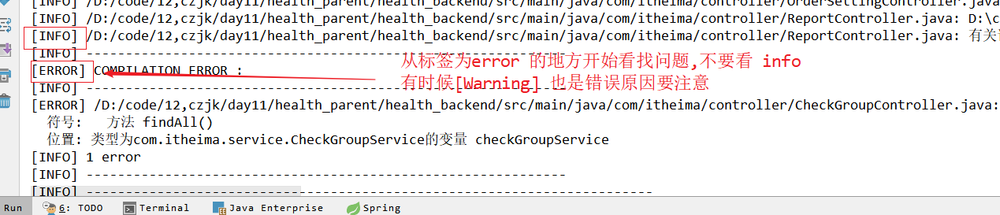
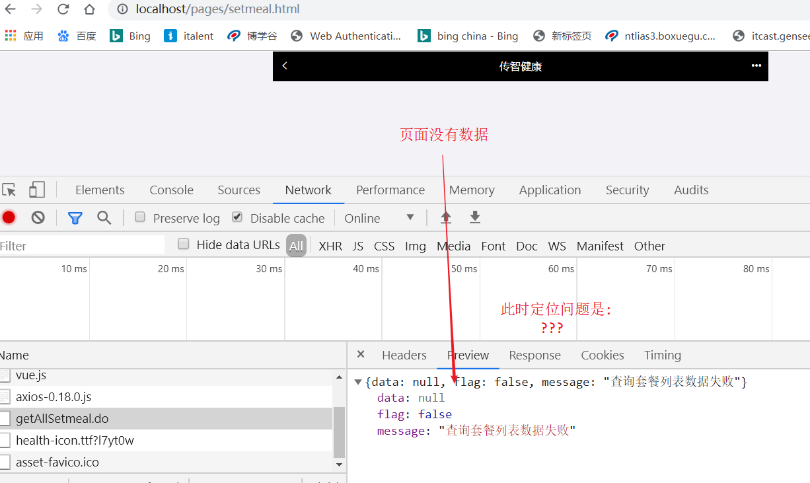

# 1 关于 数据库表结构的说明

```
1) 我之前在企业中的项目中的所有的表都有两个字段
   1) makeDate  --创建日期
   2) modifyDate -- 最后一次修改日期
2) 每个表都有一个同名的备份表 比如 t_checkitem  有个表叫 t_chekitem_bak
   如果是重要的数据,每次修改前存入备份表,未来查询历史记录用
```

# 2 sql 优化经验

Explain 分析sql 

 https://blog.csdn.net/shaoyp1234/article/details/79608156 

```
1) -- 如果一个表有主键  COUNT(*) 实际上是统计的 主键字段  ==COUNT(id)
  -- 如果一个表没有主键  COUNT(*) 实际上是统计的 是所有字段  ,效率较低
2) 索引
	2.1)创建索引
        优点:能够加快查询的效率
        缺点:占用空间,增加增删改的时间
      结论: 索引不是创建的越多越好,一般来讲,只是在常见的查询字段中创建索引才是我们需要的东西
     2.2)  增加索引的命中  
			like %张% 不走索引
			like %张 不走索引
			like 张% 走索引
		结论: like 使用时应该考虑索引的命中
     2.3) or  
     	如果使用 or 查询,如果 一个条件没有索引,则全部不走索引
     
     SELECT * FROM sys_user WHERE username='+username+@itcast.cn' OR  email='+username+@itcast.cn';

		结论: 尽量避免使用 or 查询,除非保证每个 where 条件中的字段都有索引
3) union /union all 
	union  和union all 都是讲两个 结果集"合并"
	union 讲计算结果合并后会去除重复记录 
	union all  讲计算结果合并后不会去除重复记录, 效率较高
    结论: 尽量避免集合运算,如果要使用尽可能的使用union all 
  ---------------
   SELECT * FROM sys_user WHERE username='zhangsan' 
 UNION  ALL
  SELECT * FROM sys_user WHERE username='zhangsan' 

4)大表关联查询
	in 语句子查询效率较低,可以改为 外连接查询
-------------------
    大表查询时尽量避免 内连接查询,会增加计算量,降效率
EXPLAIN
SELECT * FROM account WHERE uid IN (SELECT id FROM sys_user WHERE id<10)
EXPLAIN
SELECT * FROM sys_user u ,account a WHERE a.uid= u.id AND u.id<10
EXPLAIN
SELECT * FROM sys_user u LEFT JOIN account a ON a.uid=u.id WHERE u.id<10

5) char 和varchar 
	char 存储固定长度的数据 ,比如 char(8) ,如果我们存储一个 字母a,数据库实际上会存储a+7 个空格补齐
	varchar  存储可变长度的数据,比如 varchar(8) ,如果我们存储一个 字母a,磁盘上存储的就是一个a
	区别 char虽然浪费空间但是查询效率较高,一般,如果存储,性别等固定长度的字段可以考虑使用char
	(性别一般使用 int 等数字类型存储,效率更高)
	 varchar(8)  相比 于char,存储不固定长度的字段,节约空间, 效率稍低,但是随着算法的优化 varchar 的效率已经和char 差不多了
```

# 3 文档说明

```
产品模块
   1)会员管理 : 被体检人的基本信息
   		-- 会员档案
   		--会员统计
   		--会员体检报告
   2) 健康评估
       --体质测评
       --心里测评
       --风险测评
   3) 知识库 : 医疗基本数据信息维护
        评估建议/健康方案/运动项目库/膳食库/疾病库
   4) 体检预约
        预约列表/预约设置/检查项管理/套餐管理
   5) 健康干预
   		
   6) 系统设置
		菜单管理/权限设置/用户管理/
		题库管理/问卷管理
```

​		2) 模块功能介绍

​		3) 体检流程介绍

​		4) 需求文档说明

# 4 传智健康常见错误

 ## 4.1)有那些思想比较危险

0) 我刚写完代码,运行报错了,一定是我刚写的代码有问题

​	"骆驼被最后一根稻草压死后,问题一定是最后一根稻草的事" 这种理解肯定不行

​    有很多同学报错了,立马把错误关了,去看代码这种做法根本不是查找问题,只能叫猜

  <font color='red'>根据错误找问题! 根据错误找问题! 根据错误找问题! </font>

如果没有错误,则debug 找问题

1) 自我感觉: 我觉得dao层一定没有问题等,

​	 答:   我还觉得我是世界首富呢

2)  我明明记得配置文件已经修改过了/ 这个功能的代码我记得我写过了(写完了).

​	你只是把视频看了几遍,自以为自己功能已经实现了,实际上根本就没有写(喂!醒醒,大清都亡了)

3) 我已经看到了好几遍了,非常确定这里没有问题

```
研表究明，汉字的序顺并不一定能影阅响读，事证实明了也许你当看完这话句后，才发这现里的字全是都乱的
```

当你发现如果所有的其他地方都没有问题的时候,要把那些你认为一定没问题的代码重新怀疑一遍


程序员的日常

​	http://www.sohu.com/a/283974097_671058


## 4.2 编译不通过-- 根据控制台 错误找问题

 编译不通过控制台一定回报错误,找到ERROR 地方 根据错误信息判断




原因1)
   interface ,或者common  层 开发了新的方法,新的接口,但是没有安装 导致编译不通过

原因2)

​	代码的某一行导入了 不该导入的包(可能这个包根本就没有用到)

   此时控制台会报告那个类的哪一行可能import了错误的类,找到修改就好了

原因3)  pom 文件导入报错 

​    我们从PDF 文档中copy  过来的坐标有时候有特殊不可见字符字符 ,

  

  碰到这类问题我们要记住: 不要从pdf 中复制坐标,从老师的代码中复制

## 4.3)  静态网页报错,效果不显示

我们写完一个页面,发现页面不显示,完全没有效果

方法1) 根据错误查找问题

打开开发者模式,我们可以看到错误,根据错误先把错误调试出来


方法2) 二分法

  把代码删除一半,如果依旧没有效果 再删除一半,

如果正常了则错误一定是我们删除的部分有问题

 二分法一定程度上能加快我们查问题的速度,节约时间


## 4.4) 服务无法启动 --zookeeper 没有启动

如果服务启动是报错,此时应该根据错误日志定位问题

找到我们能看懂的关键词

服务启动异常


我们看到 关键词中zookeeper ,conection错误 关键词,此时应该排查一下zookeeper 启动是否正常

## 4.5 )服务提供者启动报错 Wrong namespace

​		

服务端启动的时候我们发现控制台报错, 此时我们 看到了关键词   Wrong namespace

思考namespace 是我们在哪里学习的? **mybatis** 

此时应该根据后边的错误消息定位是那个xml 文件报错了, 如果能读懂错误消息最好,读不懂的话

看看那些词是自己认识的,然后定位问题 


# 查找问题思路

当服务正常启动,我们的代码依旧有问题,此时我们应该思考,我们的问题出现在哪儿了

我们是前后端分离开发,后端又分服务的提供者和消费者,

查找问题第一步:


​	初步判断 问题出现在 前端 HTML页面,还是服务端 

   是服务提供者有问题,还是消费者有问题

第二步:

​	根据找到的错误日志,查找问题,/或者分析错误,或者debug 调试代码

## 4.6) result map  找不到

当我们尝试访问一个路径时如果包如下错误,思考问题出现在哪里?


现象是前端没有效果, 

第一步: 打开浏览器控制台

​	1)我们发现控制台有一个错误, 但是经核实不是这个错误(我们十分确信我们写的代码没有问题)


第二步:

​	   2) 我们定位问题是出现在前端还是后端

​	    我们查看发送的请求,我们发现,请求我们发送了出去,但是服务端告诉我们报错了


于是我们定位问题出现在 了java 代码

如下错误又是出现在服务的消费者还是服务的提供者呢?


可以看到关键词中有mybatis ,错误可以定位出现在服务提供者

在仔细看错误 : result map  

我们应该回忆起来 mybatis xml 中有resultMap 和resultType  ,此处应该是错误把 resultType 写成了resultMap


## 4.6) 404 错误

​	404 错误是路径找不到,这类错误,我们应该先定位问题是服务器端错误还是客户端错误,缩小范围

### 原因1 ) 拼写错误,有空格

分析如下问题 产生的原因


仔细查看我们发现我们的路径中多了一个 20% ,此时问题出现在了前端页面上

为啥, 看我们的代码,我们发现多了一个空格


### 原因2) 拼写错误,字母错误,大小写不一致等

​	

这个问题比较不好看,乍一看没有问题,仔细看路径,发现我们的 Order 中的O 写成了 零

原因3) 配置写的不对

   1) web.xml 可能没有配置

   2) 方法上我们使用的是RestController 注解,但是我们看到的却是  Controller 注解

  3) web.xml 中曾经脑袋一抽,故意不写成.do  请求 就是要跟老师不一样. 结果把自己改动的地方忘了

下图就是我们使用   Controller 注解 而没有使用 RestController  导致的

  4)  包扫描不对 ,有些同学的java  代码故意不跟老师的一样,想自己一步步写完,但是写到配置文件的时候不知道为啥有放弃了自己的坚持,直接copy 老师的代码,结果 包扫描没改.....


## 4.7) 空指针 




第一步:

​	我们可以定位问题不是html , 而是 java 代码有问题,我们

第二步

​	此时应该查看控制台, 查看 消费者控制台 ,看到空指针异常


<font color='red'>空指针一定是一个"."之前紧跟着的对象为空</font>

 第一步:

​	 定位哪一行代码为空

第二步: 定位那个对象为空

第三步:

​	分析为啥为空

原因:

​     1) 如果是 servcie 对象,可能是没有 @Reference ,或者 @Reference 注解导入包错误了

​      2)如果是 Controller层的参数问题,则有可能是 前端传递的参数和我们Controller 层接收的参数不一致

## 4.8)  No provider available


这个错误的意思是找不到服务, 

找不到.有两种 1) 找的地方有问题 2) 被找的服务找不到

其实这里是服务端的服务找不到,此时我们应该查看服务端

1) 启动是否正常?  是否有错误新消息 ? 如果有错误则请根据错误消息查询日志

2) 是否忘记加注解了

3) @Service  注解上是否忘记了 interfaceclass 配置?

## 4.9) Debug 

如果上述问题 都没能解决您的问题,则需要用debug  分析问题

总结:

​	第一步定位是html 问题还是 java代码问题

​    第二步: 根据错误分析

​    第三步: 如果没有错误测debug  分析

